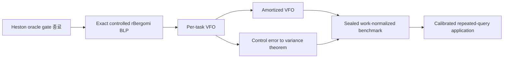
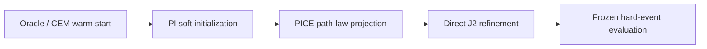

# Neural Path-Integral Rare-Event Engine: 통합 실행계획 v3

> **Execution endpoint (2026-07-14): STOPPED AT G3.** G1 and G2 passed. The
> matched terminal VFO ablation and the one permitted path-dependent redesign both
> failed the prospective memory/work gate. The VFO memory-superiority claim is
> retired, and dependent G4/G7/G8 execution is not authorized under this plan. See
> `docs/phase_reviews/G3_VFO_PATH_PIVOT_FINAL_2026-07-14.md`.

Status: active execution plan<br>
Version: 3.0<br>
Date: 2026-07-14<br>
Repository: Neural_Path_Integral<br>
Supersedes for forward execution: [PATH_INTEGRAL_RESEARCH_PLAN_V2.md](PATH_INTEGRAL_RESEARCH_PLAN_V2.md)<br>
Candidate design reference: [PATH_INTEGRAL_MODEL_CANDIDATES_AND_SELECTION.md](PATH_INTEGRAL_MODEL_CANDIDATES_AND_SELECTION.md)

---

## 0. 문서의 역할과 최종 결정

이 문서는 Plan v2, 차세대 모델 후보 문서와 세 차례의 외부 검토에서 실제로 반영할
가치가 있는 지적만 통합한 **실행 중심 계획**이다. 기존 문서의 수학적 상세와 후보
아이디어는 보존하되, 앞으로의 구현·증명·실험 우선순위는 본 문서를 따른다.

### 0.1 주모델

주모델은 다음 하나로 고정한다.

> **VFO: task- and kernel-conditioned Volterra–Föllmer Operator**

VFO는 rough-volatility의 알려진 Volterra memory와 payoff가 만드는 residual memory를
분리하여 independent Brownian basis의 two-driver importance-sampling control을
생성한다.

### 0.2 핵심 논문 경로



### 0.3 조건부 확장

| 확장 | 시작 조건 | core paper 필수 여부 |
|---|---|---:|
| MR-VPIC | grid transfer 실패 또는 ML correction variance 병목 확인 | 아니요 |
| DVDN | direct control의 시간 일관성·학습 안정성 문제 확인 | 아니요 |
| CAPT | drift proposal residual의 안정적인 non-Gaussian/multimodal 증거 | 아니요 |
| MSVB | 독립 seed에서 복수 rare-path mode 재현 | 아니요 |
| UPMC | 첫 논문 이후 여러 stochastic family로 확장 | 아니요 |

### 0.4 명시적 제외

- 후보 6개를 모두 구현하지 않는다.
- Heston을 논문의 신규 기여로 확장하지 않는다.
- `Foundation Model` 유행을 논문 framing으로 사용하지 않는다.
- VFO가 RNN보다 좋다고 실험 전에 가정하지 않는다.
- 성공확률이나 저명 저널 게재확률을 숫자로 제시하지 않는다.
- 안정적이고 동등한 문제 설정이 없는 Koopman baseline을 억지로 구현하지 않는다.
- risk-neutral pricing 결과를 physical crash probability로 해석하지 않는다.

---

## 1. 외부 검토 반영 결정

### 1.1 반영

| 검토 지적 | v3 변경 |
|---|---|
| 문서가 너무 크고 후보가 많아 실행 우선순위가 흐림 | core VFO와 optional extension을 분리 |
| 성공 가능성 수치에 근거가 없음 | 모든 성공확률 삭제 |
| break-even 기준값 필요 | primary `M* <= 25`, query grid 사전 지정 |
| continuous Girsanov만 있고 BLP discrete 식이 부족 | discrete two-driver likelihood와 memory shift 명시 |
| VFO branch gradient 경쟁 | residual gate와 staged freeze/unfreeze 도입 |
| error term 독립성 가정이 부당할 수 있음 | drift-error 합과 pathwise norm bound로 변경 |
| MR projection 정의가 불명확 | conditional time-average projection으로 고정 |
| MLMC 개별 level 최적화만으로 부족 | correction second moment를 primary objective에 포함 |
| DVDN 초기 `Z/Psi` 폭발 | positive floor, warm-up, release gate 추가 |
| off-policy DVDN martingale 좌표 문제 | target Brownian reconstruction 의무화 |
| CAPT inverse 비용 누락 | analytic-inverse spline만 허용, logdet 비용 포함 |
| MSVB expert density 계산 절차 누락 | canonical target path에서 expert별 residual 복원식 추가 |
| 7개 loss weight tuning 전략 없음 | 순차 objective와 제한된 auxiliary grid 사용 |
| timeline·compute budget 없음 | core/optional 일정과 자원 stop budget 추가 |
| turbocharging 적용 조건 불명확 | payoff별 baseline applicability matrix 추가 |
| rho martingale 분석이 phase에 없음 | controlled rBergomi gate 안에 포함 |
| OOD fallback이 추상적 | defensive VFO/base mixture와 alarm threshold 정의 |
| 2026 rough-vol path-integral 논문 충돌 | M0 novelty audit 항목으로 승격 |

### 1.2 조건부 반영

| 제안 | 결정 |
|---|---|
| PPDE와의 연결을 강화 | DVDN/이론 설명에 사용하되 novelty claim으로 사용하지 않음 |
| Koopman importance-sampling 비교 | toy/Heston에서 안정적 동일 구현이 있을 때만 supplementary |
| 금융 외 시스템으로 확장 | ML venue를 목표로 별도 후속 연구에서 수행 |
| CAPT/MSVB를 혁신적 본모델로 개발 | VFO failure mechanism이 관측될 때만 수행 |

### 1.3 반영하지 않음

| 주장 | 이유 |
|---|---|
| 저명 저널 게재 가능성이 매우 높음 | 현재는 구현·정리·sealed evidence가 없음 |
| VFO가 RNN보다 높은 정확도를 제공할 것 | 검증해야 할 가설이지 전제할 사실이 아님 |
| 최신 trend와 일치하므로 novelty가 있음 | trend alignment는 독창성 증거가 아님 |
| 출처가 많으므로 검토가 신뢰할 만함 | source-to-claim 대응과 1차 문헌 여부가 중요 |

---

## 2. 연구 질문과 prospective contribution

### 2.1 Core research question

> payoff-tilted optimal Brownian path law를 rough-volatility의 structural memory,
> residual path memory와 금융 task의 함수인 causal two-driver controller로 근사할
> 수 있는가? 그리고 이 근사가 exact discrete likelihood를 유지하면서 강한 baseline보다
> 동일 총 계산비용당 더 작은 rare-event estimation error를 제공하는가?

### 2.2 Core RQ

| ID | 질문 |
|---|---|
| RQ1 | discrete controlled rBergomi BLP와 likelihood가 정확한가? |
| RQ2 | structural/residual VFO가 Markov, SOE-only, generic memory보다 유효한가? |
| RQ3 | PI/PICE curriculum이 direct `J2` 단독 학습보다 안정적인가? |
| RQ4 | controller approximation error와 `D2`/relative variance를 정량적으로 연결할 수 있는가? |
| RQ5 | amortized VFO가 held-out task에서 per-task 성능과 실무 break-even을 유지하는가? |

### 2.3 Optional RQ

| ID | 시작 gate | 질문 |
|---|---|---|
| RQ6 | grid dependence 확인 | multiresolution consistency가 grid transfer와 ML correction을 개선하는가? |
| RQ7 | direct control 불안정 | desirability martingale consistency가 안정성과 효율을 개선하는가? |
| RQ8 | drift expressivity 한계 | nonlinear transport 또는 path-law mixture가 필요한가? |

### 2.4 Prospective contribution

아래 문장은 결과가 나오기 전에는 초록의 확정 주장으로 사용하지 않는다.

1. independent Brownian basis에서 exact discrete likelihood를 갖는 controlled
   rBergomi BLP construction
2. known Volterra memory와 payoff-induced residual memory를 분리한 VFO
3. model/payoff task에 조건화된 amortized rare-path proposal
4. control approximation error에서 `D2` 또는 relative variance로 가는 quantitative
   theorem
5. training-inclusive work와 held-out task를 포함한 sealed benchmark

### 2.5 주장하지 않을 것

- path integral의 금융 최초 적용
- rough volatility의 path-integral 최초 표현
- PICE, Girsanov, Boué–Dupuis 또는 Föllmer drift 자체의 신규성
- SOE/Markovian approximation 자체의 신규성
- PPDE/Neural RDE 자체의 신규성
- finite grid 결과의 continuous-time unbiasedness
- soft target control과 hard conditional law의 동일성
- branch별 control decomposition의 식별가능성

---

## 3. 측도와 discrete controlled-BLP contract

### 3.1 Canonical sampling space

target measure를 `P`, proposal을 `Q_theta`라 한다. likelihood와 divergence는 state
path만이 아니라 independent Brownian drivers와 BLP auxiliary Gaussian variables를
포함한 augmented discrete path space에서 정의한다.

bounded nonnegative task payoff를 `G_zeta`라 하면:

$$
\mu_\zeta=E_P[G_\zeta],
\qquad
L_\theta=\frac{dP}{dQ_\theta}.
$$

최종 estimator는 self-normalization을 사용하지 않는다.

$$
\widehat\mu_\zeta
=
\frac1n\sum_{m=1}^nG_\zeta(X^{(m)})L_\theta^{(m)},
\qquad X^{(m)}\sim Q_\theta.
$$

### 3.2 Independent Brownian basis

첫 번째 Brownian driver `W1`이 rough variance를 구동하고 spot Brownian은:

$$
\Delta B_i^P
=
\rho\Delta W_i^{P,1}
+\sqrt{1-\rho^2}\Delta W_i^{P,2}.
$$

proposal에서 adapted piecewise-constant control을 사용한다.

$$
u_i=\pi_\theta(\mathcal H_{t_i},\zeta)\in\mathbb R^2,
\qquad u_i\in\mathcal F_{t_i}.
$$

target-coordinate Brownian increment는:

$$
\Delta W_i^{P,j}
=
\Delta W_i^{Q,j}+u_i^{(j)}\Delta t_i,
\qquad
\Delta W_i^{Q,j}\sim N(0,\Delta t_i).
$$

### 3.3 Discrete likelihood

nonuniform grid에서도 다음 식을 사용한다.

$$
\log L_\theta
=
-\sum_{i=0}^{N-1}u_i^\top\Delta W_i^Q
-\frac12\sum_{i=0}^{N-1}\|u_i\|^2\Delta t_i.
$$

동일 path를 target coordinate로 복원한 뒤 candidate controller `v`의 residual은:

$$
\Delta W_i^{Q_v}
=
\Delta W_i^P-v_i\Delta t_i.
$$

off-policy PICE, mixture density와 policy comparison은 이 reconstructed residual을
사용한다. behavior Brownian increment를 candidate residual로 재사용하지 않는다.

### 3.4 Controlled spot update

log-Euler spot update는 target increment를 사용해 다음처럼 구현한다.

$$
\begin{aligned}
\Delta\log S_i
&=
\left(r_i-q_i-\frac12V_i\right)\Delta t_i\\
&\quad+
\sqrt{V_i}\left[
\rho(\Delta W_i^{Q,1}+u_i^{(1)}\Delta t_i)
+\sqrt{1-\rho^2}(\Delta W_i^{Q,2}+u_i^{(2)}\Delta t_i)
\right].
\end{aligned}
$$

이를 Q-drift correction 형태와 target-coordinate state-map 형태로 각각 독립 구현해
small-grid pathwise equality를 검사한다.

### 3.5 Controlled Volterra memory

piecewise-constant drift에서 BLP kernel functional의 target-coordinate shift는:

$$
I_{i,k}^{P}
=
I_{i,k}^{Q}
+u_k^{(1)}A_{i,k},
\qquad
A_{i,k}
=
\int_{t_k}^{t_{k+1}}K_H(t_i-s)ds.
$$

recent singular cell과 historical cells 모두 target BLP operator와 동일한 coefficient를
사용한다. Brownian bridge component 자체는 drift shift로 variance가 바뀌지 않으며,
deterministic mean correction 때문에 별도의 likelihood를 추가하지 않는다.

### 3.6 Correctness scope

`E_Q[GL]=E_P[G]`는 선언한 finite-grid BLP target에 대한 주장이다. continuous
rBergomi 가격에 대해서는:

- time-step refinement
- BLP discretization convergence
- barrier monitoring bias
- optional kernel approximation bias

를 별도로 보고한다.

### 3.7 Martingale regime

main risk-neutral experiment는 `rho <= 0`로 제한한다. primary grid는:

$$
\rho\in\{-0.9,-0.7,-0.5\}.
$$

Phase V3-2에서 각 parameter regime에 대해 discounted spot mean과 upper-tail
contribution을 검사한다. `rho > 0`은 strict-local-martingale 가능성을 별도 분석한
후속 연구로 제외한다.

---

## 4. VFO architecture v3

### 4.1 Input

$$
\zeta=(H,\rho,\eta,\xi_0(\cdot),T,K,B,\text{payoff type},\text{rarity descriptor}).
$$

controller input은 현재 시점까지의 정보만 사용한다.

- normalized time and time-to-maturity
- log spot, variance and forward-variance summary
- event progress: moneyness, barrier distance, running extrema, drawdown
- structural Volterra state
- residual causal state
- task embedding

### 4.2 Structural memory

target dynamics는 BLP를 유지하고 controller feature에는 fixed SOE bank를 먼저
사용한다.

$$
K_H(r)\approx\sum_{k=1}^m w_k(H)e^{-\lambda_k(H)r},
\qquad w_k\ge0,\quad\lambda_k>0.
$$

SOE approximation error는 feature error이며 target pricing bias로 표현하지 않는다.
lifted target simulator를 별도 ablation에 사용할 때만 model bias를 보고한다.

### 4.3 Residual memory

residual state는 known Volterra state와 event state가 설명하지 못한 payoff-dependent
history를 표현한다.

$$
R_{i+1}=F_{\theta,R}
(R_i,\Delta W_i^Q,S_i,V_i,M_i^{\mathrm{Volterra}},d_i^{\mathrm{event}},e_\zeta).
$$

첫 구현은 small GRU 또는 causal state-space cell 하나만 사용한다. architecture search를
주요 연구로 만들지 않는다.

### 4.4 Additive-gated control

$$
u_i
=
u_i^{\mathrm{inst}}
+g_Vu_i^{\mathrm{Volterra}}
+g_Ru_i^{\mathrm{res}},
$$

여기서 `g_R`은 0에서 시작한다. 세 branch의 합은 해석을 위한 설계이고 decomposition의
유일성이나 statistical identifiability를 주장하지 않는다.

### 4.5 Two-driver head

$$
u_i^{(j)}=u_{\max,j}\tanh(a_i^{(j)}),
\qquad j=1,2.
$$

bounded control은 proposal 안정화를 위한 restriction이다. hard zero-variance law를
정확히 표현한다는 뜻이 아니다. `u_max`와 action-energy sensitivity를 보고한다.

### 4.6 Branch competition 대응

branch gradient 경쟁과 residual takeover를 막기 위해 다음 순서를 고정한다.

| Stage | Trainable | Frozen | 종료 조건 |
|---|---|---|---|
| B0 instantaneous | instant head | structural, residual | Heston/Markov warm start 안정화 |
| B1 structural | instant + structural | residual, `g_R=0` | structural ablation 개선 또는 plateau |
| B2 residual | residual + `g_R` | instant + structural | selection `J2` 개선 |
| B3 joint refine | 전부, structural LR=`0.1 x residual LR` | 없음 | frozen selection metric 최적 |

추가 규칙:

- branch output RMS와 action energy를 별도 기록한다.
- shared trunk에 대한 branch별 gradient norm을 기록한다.
- residual branch가 전체 control energy의 90% 이상을 지속적으로 차지하면 takeover
  alarm을 발생시킨다.
- takeover가 발생하면 residual width를 한 번 축소하고 다시 평가한다.
- orthogonality penalty는 pilot evidence 없이 사용하지 않는다.

### 4.7 Task conditioning

첫 구현은 FiLM을 사용한다.

$$
h_i'=\gamma(e_\zeta)\odot h_i+\beta(e_\zeta).
$$

hypernetwork와 foundation-style architecture는 core 범위에서 제외한다.

---

## 5. 학습 objective와 hyperparameter 원칙

### 5.1 Seven-loss joint optimization 금지

PI, PICE, `J2`, martingale, control consistency, RG consistency와 action regularization을
처음부터 동시에 최적화하지 않는다. core VFO는 다음 순차 objective를 사용한다.



### 5.2 Stage별 primary objective

| Stage | Primary objective | 허용 auxiliary |
|---|---|---|
| O0 | oracle alignment 또는 CEM fit | action cap |
| O1 | PI soft loss | action energy |
| O2 | PICE reverse-KL projection | small action regularizer |
| O3 | `log J2` | optional frozen-target PICE anchor |
| O4 | 없음; evaluation only | 없음 |

PI와 PICE는 initializer/projector이며 최종 efficiency 판단은 raw hard-event estimator의
second moment와 total work로 한다.

### 5.3 Auxiliary scaling

primary coefficient는 항상 1이다. auxiliary loss는 EMA로 무차원화한다.

$$
\widetilde{\mathcal L}_j
=
\frac{\mathcal L_j}
{\operatorname{EMA}(|\mathcal L_j|)+\epsilon_{scale}}.
$$

auxiliary coefficient 후보는 stage마다 최대 세 개만 사용한다.

$$
\lambda_{aux}\in\{0,0.1,1.0\}.
$$

selection seed에서 한 번 선택한 후 audit/evaluation seed를 보며 변경하지 않는다.

### 5.4 Gradient conflict rule

공유 parameter에 대한 primary와 auxiliary gradient cosine을 기록한다.

$$
c_t
=
\frac{g_{primary}^\top g_{aux}}
{\|g_{primary}\|\|g_{aux}\|+\epsilon}.
$$

200 update의 median이 `-0.2`보다 작으면 합산 loss를 중단하고 alternating update로
전환한다. PI/PICE와 `J2`가 지속적으로 충돌하면 PI/PICE는 초기화 단계로만 축소한다.

### 5.5 Hard-event score와 off-policy rule

- indicator를 pathwise 미분하지 않는다.
- final estimator weight는 clipping하지 않는다.
- PICE self-normalization은 training에만 사용한다.
- behavior sample을 사용할 때 target path와 candidate Brownian residual을 복원한다.
- stale sample에 candidate likelihood를 target weight로 중복 적용하지 않는다.

---

## 6. 이론 프로그램 v3

### 6.1 T0 — Discrete unbiasedness

adapted bounded control과 declared BLP target에 대해:

$$
E_{Q_\theta}[G L_\theta]=E_P[G].
$$

증명은 discrete Gaussian density ratio와 triangular causal state map을 기준으로 한다.
continuous Girsanov 정리를 그대로 인용하는 것으로 끝내지 않는다.

### 6.2 T1 — Relative variance identity

$$
\frac{dQ^\star}{dP}=\frac{G}{\mu}.
$$

필요한 절대연속성과 적분가능성 아래:

$$
\frac{\operatorname{Var}_{Q_\theta}(GL_\theta)}{\mu^2}
=
\chi^2(Q^\star\Vert Q_\theta)
=
\exp(D_2(Q^\star\Vert Q_\theta))-1.
$$

이 identity는 기존 결과이며 novelty로 주장하지 않는다.

### 6.3 T2 — Control error to `D2`

optimal drift와 learned drift 차이를:

$$
e_t=u_t^\star-u_t^\theta
$$

라 하자. `Q*` 아래에서 필요한 exponential-martingale 조건이 성립하면 검토할 첫
bound 후보는:

$$
D_2(Q^\star\Vert Q_\theta)
\le
\frac12\log E_{Q^\star}
\left[
\exp\left(3\int_0^T\|e_t\|^2dt\right)
\right].
$$

이 식은 v3의 proof route이며 아직 증명 완료 claim이 아니다. `2e`에 대한 stochastic
exponential이 true martingale인지와 discrete analogue를 먼저 확인한다.

### 6.4 Error decomposition without independence

kernel, memory, task와 optimization error가 독립이라고 가정하지 않는다. intermediate
controller를 도입한다.

$$
u^\star
\rightarrow u^{K}
\rightarrow u^{M}
\rightarrow u^{\zeta}
\rightarrow u^{\theta}.
$$

전체 error를 telescoping sum으로 쓴다.

$$
e=e_K+e_M+e_\zeta+e_{opt}.
$$

독립성 대신 pathwise inequality를 사용한다.

$$
\|e\|^2
\le
4\left(
\|e_K\|^2+
\|e_M\|^2+
\|e_\zeta\|^2+
\|e_{opt}\|^2
\right).
$$

exponential expectation을 각 항으로 분리하려면 Hölder 조건과 moment assumption을
명시한다. joint training을 이유로 독립 error decomposition을 주장하지 않는다.

### 6.5 Minimum theorem bar

core 논문은 다음 중 하나 이상의 비자명한 결과가 필요하다.

1. discrete controlled-BLP likelihood와 unbiasedness theorem
2. control-energy approximation에서 `D2`/relative variance로 가는 bound
3. finite-rank Volterra feature error가 estimator efficiency에 미치는 quantitative
   corollary

uniform amortized-task theorem은 stretch이며 core acceptance condition이 아니다.

### 6.6 PPDE connection의 위치

positive desirability:

$$
\Psi(t,\omega)=E_P[G\mid\mathcal F_t](\omega)
$$

는 적절한 조건에서 PPDE/functional Itô 또는 martingale representation과 연결된다.
이 연결은 VFO의 이론적 해석에 사용하지만, PPDE solver를 새로 만들었다고 주장하지
않는다.

---

## 7. Optional extension A — Multiresolution

### 7.1 시작 gate

다음 중 하나가 확인될 때만 두-level pilot을 시작한다.

- `N`에서 학습한 VFO의 `2N` work efficiency가 20% 이상 악화
- time-step refinement에서 control profile이 수렴하지 않음
- controlled MLMC correction variance가 uncontrolled coupling보다 악화

### 7.2 Projection 정의

fine step `delta`, coarse step `Delta=2 delta`에서 primary projection은 다음 adapted
conditional time average로 고정한다.

$$
\Pi_\ell u_i^{(\ell+1)}
=
E\left[
\frac{u_{2i}^{(\ell+1)}+u_{2i+1}^{(\ell+1)}}2
\middle|
\mathcal F_{t_i}^{(\ell)}
\right].
$$

training에서는 coarse prefix를 고정하고 `K_proj=8`개의 antithetic conditional fine
rollout으로 추정한다. projection sample은 stop-gradient target으로 사용한다. nested
rollout cost는 training work에 포함한다.

cheap baseline은 left-end injection `u_i^(ell)=u_2i^(ell+1)`으로 고정한다. learned
projection은 첫 pilot에서 사용하지 않는다.

### 7.3 Controlled MLMC objective

$$
Y_\ell=G_\ell L_\ell-G_{\ell-1}L_{\ell-1}.
$$

개별 level `J2`만 줄이지 않고 correction second moment를 primary로 포함한다.

$$
\mathcal L_{MR}
=
E[Y_\ell^2]
+\lambda_{RG}\|u^{(\ell)}-\widehat\Pi_\ell u^{(\ell+1)}\|^2.
$$

각 marginal proposal likelihood가 정확한지 별도 unit test한다.

### 7.4 MR kill criterion

두-level pilot 자원 한도 안에서:

- correction variance가 20% 이상 줄지 않거나
- projection training 비용을 포함한 total work가 개선되지 않으면

MR-VPIC를 core paper에서 제거한다.

---

## 8. Optional extension B — DVDN

### 8.1 시작 gate

- direct VFO가 seed마다 크게 다른 time profile에 수렴
- PI/PICE와 `J2` gradient conflict가 지속
- conditional desirability calibration이 실무 진단에 필요

중 하나가 확인될 때만 시작한다.

### 8.2 Stable parameterization

positive soft payoff `G_soft >= psi_min`를 사용하고:

$$
\Psi_i^\theta
=
\psi_{min}+\operatorname{softplus}(f_\theta(\cdot)),
$$

$$
u_i^{DVDN}
=
\frac{Z_i^\theta}{\Psi_i^\theta+\epsilon_\Psi}.
$$

초기값은 `Z=0`, `epsilon_Psi=psi_min`으로 둔다. `psi_min`은 soft target minimum과
일치시키고 sensitivity를 보고한다.

### 8.3 Warm-up

| Stage | 내용 |
|---|---|
| D0 | control output 비활성, terminal desirability fit |
| D1 | martingale residual 학습, `Z` warm-up |
| D2 | `Z/Psi` control release, action cap 적용 |
| D3 | direct VFO와 consistency 또는 `J2` refinement |

control release 조건:

- no NaN/Inf
- lower-tail `Psi`가 floor에 과도하게 몰리지 않음
- martingale residual이 constant predictor보다 개선
- validation action energy가 사전 cap 이내

### 8.4 Off-policy martingale coordinate

proposal sample에서 martingale residual을 계산할 때:

$$
\Delta W_i^P=\Delta W_i^Q+u_i\Delta t_i
$$

를 먼저 복원한다. `W^Q`를 그대로 사용해 target `P` martingale을 학습하지 않는다.

### 8.5 DVDN kill criterion

동일 자원에서 direct VFO 대비 seed dispersion, event-contribution ESS 또는 `J2` 중
어느 것도 개선하지 못하면 diagnostic appendix로 축소한다.

---

## 9. Deferred extension contract

### 9.1 CAPT

CAPT가 필요해지면 첫 architecture는 analytic piecewise inverse와 exact log-determinant를
갖는 monotone rational-quadratic spline으로 제한한다. numerical root-finding이 필요한
flow는 첫 버전에서 사용하지 않는다.

work ledger에는 다음을 포함한다.

- forward transform
- inverse transform
- bin search
- log-determinant
- proposal density evaluation

CAPT claim은 fixed discrete Gaussian innovation target에 한정한다. covariance/scale을
바꾸는 continuous flow를 Girsanov proposal로 표현하지 않는다.

### 9.2 MSVB expert density reconstruction

canonical target increment `Delta W^P`가 주어지면 각 expert `k`에 대해 prefix를
순차적으로 재생한다.

$$
u_{k,i}=\pi_k(\mathcal H_i^P,\zeta),
\qquad
\Delta W_i^{Q_k}=\Delta W_i^P-u_{k,i}\Delta t_i.
$$

target-coordinate density는:

$$
\log\frac{dQ_k}{dP}
=
\sum_i u_{k,i}^\top\Delta W_i^P
-\frac12\sum_i\|u_{k,i}\|^2\Delta t_i.
$$

Primary balance-mixture likelihood는 모든 expert density를 평가한다.

$$
\frac{dP}{dQ_{mix}}
=
\left[
\sum_k\pi_k\frac{dQ_k}{dP}
\right]^{-1}.
$$

Execution erratum (2026-07-15): randomized expert label을 보존한
`G dP/dQ_K` estimator도 unbiased이므로 이를 수학적으로 금지하거나 biased라고 부르는
것은 옳지 않다. 다만 위 marginal-mixture balance estimator와는 다른 multiple-IS
weighting scheme이며 분산이 더 클 수 있다. Primary method가 balance weighting이면 모든
expert density-evaluation 비용을 total work에 포함하고, component-wise estimator는
별도 unbiased ablation으로 보고한다.

---

## 10. OOD와 defensive fallback

### 10.1 Safe proposal

VFO proposal과 base target을 혼합한다.

$$
Q_{safe}
=(1-\epsilon_{safe})Q_{VFO}
+\epsilon_{safe}P,
\qquad
\epsilon_{safe}=0.05.
$$

canonical path에서 `r=dQ_VFO/dP`를 평가하면:

$$
\frac{dQ_{safe}}{dP}
=(1-\epsilon_{safe})r+\epsilon_{safe},
$$

$$
L_{safe}
=
\frac1{(1-\epsilon_{safe})r+\epsilon_{safe}}
\le
\frac1{\epsilon_{safe}}.
$$

bounded payoff에서 contribution의 catastrophic upper tail을 제한하면서 exact mixture
weight를 유지한다. 이는 weight clipping이 아니다.

### 10.2 Alarm threshold

pilot 후 sealed protocol 전에 한 번만 고정한다. 초기값은 다음이다.

- likelihood normalization z-score absolute value `> 3`
- event-contribution ESS ratio `< 0.5%`
- top 1% samples의 absolute contribution share `> 50%`
- action energy 또는 log-weight가 float64 finite range를 위협

alarm 발생 시 순서:

1. frozen VFO 대신 `Q_safe` 사용
2. 그래도 alarm이면 per-task CEM/constant defensive proposal
3. 최종 fallback은 pure target `P`

fallback 사용 여부와 비용을 결과에 포함한다.

---

## 11. Experiment protocol

### 11.1 Primary task family

| Task | 역할 | Monitoring |
|---|---|---|
| deep-OTM terminal digital | analytic/conditional baseline과 rarity scaling | terminal |
| down barrier hit | genuine path dependence | discretely monitored main |
| drawdown event | residual memory 필요성 | discretely monitored main |

continuous barrier claim은 bridge correction이 구현된 별도 실험에서만 사용한다.

### 11.2 Parameter grid

primary candidates:

$$
H\in\{0.05,0.10,0.20\},
\qquad
\rho\in\{-0.9,-0.7,-0.5\},
$$

$$
T\in\{0.25,1.0,2.0\},
\qquad
P(G>0)\in\{10^{-2},10^{-3},10^{-4}\}.
$$

threshold/barrier는 controller 학습과 분리된 pilot seed에서 rarity band를 맞춘 뒤
model selection 전에 고정한다. `1e-4`가 reference uncertainty 때문에 안정적으로
설정되지 않으면 해당 cell은 exploratory로 표시하고 더 큰 reference budget을 사용한다.

### 11.3 Three primary regimes

전체 grid를 모두 주결과로 사용하지 않는다. profiling 이후 model training 전에 다음
성격의 세 regime를 정확한 숫자로 preregister한다.

1. standard rough terminal tail
2. strongly rough/high-leverage path-dependent tail
3. longer-memory path-dependent tail

memory claim은 세 regime 중 적어도 두 개에서 paired improvement가 필요하다.

### 11.4 Baseline applicability

| Baseline | Terminal digital | Barrier/drawdown | 필수 여부 |
|---|---:|---:|---|
| crude MC | O | O | 필수 |
| antithetic | O | O | 필수 |
| conditional/turbocharging | O | 조건부 | terminal에서 필수 |
| CEM constant drift | O | O | 필수 |
| Markov affine/MLP | O | O | 필수 |
| direct `J2` neural IS | O | O | 필수 |
| PICE feedback | O | O | 필수 |
| SOE-only controller | O | O | 필수 |
| GRU/TCN memory | O | O | 필수 |
| Adaptive Multilevel Splitting | 조건부 | O | binary path event에서 필수 |
| Koopman/FBSDE | toy/Heston | 구현이 정확할 때만 | supplementary |
| flow proposal | CAPT gate 이후 | CAPT gate 이후 | optional |

turbocharging은 conditional Gaussian decomposition이 정확히 적용되는 terminal payoff에
필수다. path-dependent payoff에 동일 decomposition이 성립하지 않으면 결과를 본 뒤
제외하는 것이 아니라 protocol freeze 전에 `N/A` 사유를 문서화한다.

### 11.5 Statistical protocol

- train/selection/audit/sealed-evaluation seed 완전 분리
- final evaluation 최소 20 independent seeds
- method 간 common random numbers를 사용한 paired comparison
- primary endpoint는 seed-level paired log work-efficiency ratio
- confidence interval과 negative results 공개
- timing은 warm-up 후 최소 10회 반복
- checkpoint, config와 code hash 저장
- sealed seed를 본 뒤 tuning하면 해당 결과는 exploratory로 강등

### 11.6 Core metrics

- raw estimator mean, SE and confidence interval
- reported bias z-score
- relative variance and variance-reduction factor
- likelihood ESS와 event-contribution ESS
- top contribution share와 log-weight quantiles
- control action energy
- per-path inference time
- training-inclusive total work
- held-out task degradation
- grid-transfer degradation
- theorem assumption proxy

---

## 12. Work and break-even definition

### 12.1 Online work efficiency

$$
\mathrm{VRF}_{work}
=
\frac{\sigma_b^2c_b}{\sigma_a^2c_a}.
$$

`c`는 simulation, controller inference, memory update, likelihood, flow inverse 또는
mixture density evaluation을 모두 포함한다.

### 12.2 Training-inclusive time

target relative standard error를 `epsilon_rel`이라 하면:

$$
T_a(M,\epsilon_{rel})
=
T_{train,a}
+\sum_{j=1}^M N_{a,j}(\epsilon_{rel})c_{a,j}.
$$

### 12.3 Primary break-even gate

$$
M^\star
=
\min\{M:T_{amortized}(M)<T_{best\ baseline}(M)\}.
$$

primary 기준:

- `epsilon_rel=10%`
- sensitivity: `epsilon_rel=5%`
- query grid: `M in {1, 5, 10, 25, 50, 100}`
- practical amortization claim: `M* <= 25`

`M*>25`이면 inference 최적화를 한 번 수행한다. 여전히 실패하면 practical
amortization claim을 제거하고 per-task VFO paper로 축소한다.

### 12.4 Initial go threshold

sealed protocol 전에 고정한다.

- correctness: absolute reported bias z-score `<= 3`
- memory: primary 3 regime 중 2개 이상에서 paired 95% CI 개선
- work: best non-memory baseline 대비 work-VRF lower CI `> 1.10`
- amortization: held-out median log-efficiency가 per-task의 80% 이상
- break-even: `M* <= 25`

`1.10`은 연구 지속을 위한 최소 gate이지 top-journal claim의 충분조건이 아니다.
학술적 주장은 rarity가 증가할 때 개선이 확대되는지와 실제 effect size를 함께 본다.

---

## 13. Timeline and compute stop budget

### 13.1 Core timeline from current state

| Phase | 기간 | 주요 산출물 | Provisional GPU-hour cap |
|---|---:|---|---:|
| V3-0 review/claim freeze | 1주 | novelty audit, protocol v3 | 0 |
| V3-1 finish Heston gate | 2–3주 | PI/PICE/`J2` oracle benchmark | 50 |
| V3-2 controlled rBergomi | 4–6주 | exact BLP law and tests | 100 |
| V3-3 per-task VFO | 6–8주 | branch ablation and memory gate | 600 |
| V3-4 amortized VFO | 4–6주 | held-out tasks and break-even | 500 |
| V3-T theorem work | 10–16주 병행 | T0 and T2 attempt | 0–100 |
| V3-5 sealed benchmark | 5–6주 | frozen 20+ seed tables | 800 |
| V3-6 calibrated application | 3–4주 | repeated-query study | 200 |
| V3-7 paper/reproduction | 5–7주 | manuscript and clean run | 0 |

Core 예상 기간은 약 30–40주다. proof 난도와 reference simulation 비용에 따라
달라질 수 있다.

### 13.2 Optional timeline

| Extension | 기간 | GPU-hour cap |
|---|---:|---:|
| MR two-level pilot | 4–6주 | 400 |
| DVDN pilot | 3–5주 | 300 |
| CAPT prototype | 5–8주 | 500 |
| MSVB prototype | 5–8주 | 500 |

Core와 MR/DVDN까지 포함한 flagship은 약 42–56주 범위다. CAPT와 MSVB를 같은 첫
논문에 동시에 포함하지 않는다.

### 13.3 Resource accounting

- GPU-hour는 profiling 때 선언한 reference GPU 기준으로 기록한다.
- core provisional cap은 2,250 GPU-hours다.
- reference MC와 CPU timing cap은 5,000 CPU core-hours다.
- raw artifact storage cap은 500 GB다.
- phase cap을 소진하고도 gate에 도달하지 못하면 추가 compute 전에 scope review를
  수행한다.
- hardware가 바뀌면 FLOP 추정이 아니라 실제 wall-clock과 energy-independent
  work proxy를 함께 기록한다.

위 cap은 목표 사용량이 아니라 표류를 막기 위한 stop budget이다. V3-0 profiling 후
sealed 결과를 보기 전에 한 번만 조정할 수 있다.

---

## 14. Phase gates and deliverables

### G0 — Novelty and claim freeze

필수:

- 2026 direct competitors full-text audit
- PPDE/Neural RDE/PICE/SOE/flow/MLMC boundary table
- claim/no-claim 문장 freeze
- primary regimes와 baseline applicability freeze

2026 Saraf working paper의 현재 accessible abstract는 Feynman functional-integral
European pricing, jump/rough action, transition-density approximation과 ATM skew를
다룬다. accessible material에서는 Föllmer control, adaptive IS, exact proposal
likelihood 또는 work-normalized rare-event estimator가 확인되지 않았다. 따라서 현재
판단은 **용어 충돌은 직접적이지만 방법론 충돌은 제한적**이다. 다만 full text를 확보해
확인하기 전에는 `first rough path-integral`과 같은 표현을 금지한다.

### G1 — Heston verification exit

Execution status (2026-07-14): **PASSED and frozen** under
`g1-two-driver-heston-feedback-confirmatory-v1`. See
`docs/phase_reviews/G1_TWO_DRIVER_FEEDBACK_CONFIRMATORY_2026-07-14.md`.

통과 조건:

- 2D controller가 oracle direction을 회복
- PI/PICE/`J2` objective 차이를 재현
- time-step refinement 완료
- frozen Heston benchmark 기록

통과 후 Heston architecture 확장을 중단한다.

### G2 — Controlled rBergomi law

Execution status (2026-07-14): **PASSED** for the declared finite-grid BLP law under
`g2-controlled-rbergomi-law-confirmatory-v2-global-tests`. Confirmatory v1 remains a
recorded statistical-gate failure. See
`docs/phase_reviews/G2_CONTROLLED_RBERGOMI_LAW_2026-07-14.md`.

통과 조건:

- null-control pathwise identity
- Q-drift와 target-coordinate implementation equality
- BLP memory shift/recent-cell tests
- `E_Q[L]=1` normalization
- hard/soft fixed-control estimate agreement
- `rho<=0` discounted spot diagnostic
- all paths finite over primary parameter range

하나라도 실패하면 VFO 성능 실험을 금지한다.

### G3 — VFO memory

Execution status (2026-07-14): **FAILED; STOP GATE ACTIVATED.** The terminal-event
matched pilot failed, and the one permitted task/representation redesign was executed
on a discretely monitored down-barrier event. The structural-only work ratio versus a
training-matched instant controller was `1.00068` (timing-noise scale), while full VFO
was worse at `0.85334`. The memory-superiority claim is retired. See
`docs/phase_reviews/G3_VFO_MATCHED_ABLATION_2026-07-14.md` and
`docs/phase_reviews/G3_VFO_PATH_PIVOT_FINAL_2026-07-14.md`.

통과 조건:

- future-prefix invariance test
- structural branch ablation
- residual takeover alarm 미발생 또는 해결
- primary 3 regime 중 2개에서 paired improvement
- total-work improvement가 timing noise보다 큼

한 번의 residual redesign 후에도 실패하면 memory-superiority claim을 폐기한다.

### G4 — Amortization

통과 조건:

- held-out task median efficiency 80% 이상
- task leakage 없음
- `M*<=25`
- OOD fallback이 exact mixture likelihood로 작동

실패하면 per-task VFO paper로 축소한다.

### G5 — Theory

통과 조건:

- T0 discrete proof 완료
- T2 또는 finite-rank memory corollary 중 하나 완료
- proof assumption을 numerical diagnostics와 매핑
- 외부 수학 검토

T2 실패 시 standard Girsanov restatement만 남기지 않고 discrete-BLP theorem과
empirical control-error relation으로 scope를 낮춘다. top theory journal target도 낮춘다.

### G6 — Optional extension

MR/DVDN/CAPT/MSVB는 각 section의 start/kill gate를 충족한 경우에만 시작한다.

### G7 — Sealed benchmark

통과 조건:

- protocol hash와 final config freeze
- 20+ final seeds
- primary/negative results 자동 재생성
- CPU/GPU work ledger
- baseline applicability deviation 없음
- fallback 사용 결과 포함

### G8 — Practical application

통과 조건:

- calibrated public/reproducible snapshot
- calibration uncertainty와 MC uncertainty 분리
- repeated-query `M*` curve
- failure/fallback demonstration

---

## 15. Implementation map

```text
src/path_integral/
  controllers/
    protocol.py
    markov.py
    vfo.py
    desirability.py          # optional
    multiresolution.py       # optional
  memory/
    soe_bank.py
    residual_state.py
    causal_projection.py     # optional
  rbergomi/
    controlled_blp.py
    reconstruction.py
    likelihood.py
  training/
    pi_trainer.py
    pice_trainer.py
    second_moment.py
    objective_scheduler.py
  evaluation/
    estimator.py
    diagnostics.py
    work_ledger.py
    fallback.py
```

### 15.1 Controller contract

```python
u, next_memory, diagnostics = controller.step(
    time_state=time_state,
    market_state=market_state,
    memory_state=memory_state,
    event_state=event_state,
    task=task,
)
```

- output shape: `[batch, 2]`
- prefix-only online API
- no full future path input
- branch diagnostics optional but standardized

### 15.2 Proposal contract

각 proposal은 다음을 구현한다.

- `sample_proposal_noise`
- `reconstruct_target_noise`
- `replay_policy_on_target_path`
- `log_dP_dQ`
- `support_declaration`
- `work_components`

### 15.3 Required tests

#### Measure tests

- Gaussian sign oracle
- null-control `log L=0`
- `E_Q[L]=1`
- off-policy candidate residual reconstruction
- defensive mixture density normalization

#### rBergomi tests

- base/controlled null path identity
- same BLP coefficient memory shift
- recent singular-cell mean correction
- two-driver reconstruction
- discounted spot diagnostic for all primary `rho`

#### Causality tests

- identical prefixes produce identical controls
- suffix perturbation cannot change earlier control
- MR projection uses only coarse prefix
- task split leakage test

#### Training tests

- branch freeze/unfreeze correctness
- residual gate starts at zero
- objective scheduler activates one primary objective
- gradient conflict alarm
- DVDN control release gate if enabled

---

## 16. Risk register and pivot

| 위험 | 조기 신호 | 대응 | 최종 pivot |
|---|---|---|---|
| Heston oracle recovery 실패 | sign/direction mismatch | objective/reconstruction 수정 | PI/PICE novelty 중단 |
| controlled BLP 오류 | normalization/reconstruction 실패 | independent implementation | 성능실험 연기 |
| branch takeover | residual energy >90% | width/LR 1회 축소 | additive interpretation 제거 |
| memory 효과 없음 | Markov/GRU와 동률 | task·representation 1회 변경 | memory claim 폐기 |
| `J2`와 PICE 충돌 | gradient cosine < -0.2 | alternating stages | PICE initializer로 축소 |
| action/weight collapse | ESS/top-share alarm | defensive mixture | CEM 또는 base fallback |
| amortization 실패 | held-out collapse, `M*>25` | local fine-tune 1회 | per-task paper |
| T2 proof 실패 | exponential moment 확보 불가 | discrete/finite-rank theorem | theory venue 하향 |
| MR correction 악화 | `Var(Y_l)` 증가 | joint correction objective | MR 제거 |
| DVDN ratio explosion | `Psi` floor mass, high action | warm-up/floor/cap | DVDN 제거 |
| CAPT 비용 과다 | inverse/logdet 지배 | analytic inverse only | CAPT 제거 |
| MSVB density 비용 과다 | expert replay 지배 | expert 수 축소 | single VFO 유지 |
| real calibration 공개 불가 | license restriction | public synthetic snapshot | empirical claim 축소 |

---

## 17. Publication decision rule

### 17.1 Top specialist theory journal 도전 조건

모두 필요하다.

- 비자명한 quantitative theorem
- exact discrete/continuous claim separation
- strong rough-volatility result
- meaningful financial insight
- best baseline 대비 robust work-normalized improvement
- reproducible sealed evidence

### 17.2 Strong computational/financial journal 조건

- exact controlled rBergomi implementation
- VFO 또는 per-task controller의 material efficiency improvement
- comprehensive baseline and ablation
- training-inclusive work analysis
- calibrated/reproducible application

### 17.3 ML top conference 조건

별도 후속 연구로만 고려한다.

- rBergomi 밖의 복수 non-Markovian systems
- broadly reusable operator-learning novelty
- resolution/generalization theorem
- 대규모 empirical comparison

finance-only 결과를 Foundation Model로 포장하지 않는다.

### 17.4 No-go

다음 중 하나라도 남으면 저명 이론저널 claim을 하지 않는다.

- standard Girsanov/PICE 재서술 외에 theorem이 없음
- VFO가 strong memory baseline을 일관되게 이기지 못함
- work gain이 timing noise 수준
- amortization이 total cost를 줄이지 못함
- continuous/discrete bias가 분리되지 않음
- novelty가 2026 direct literature와 충돌

---

## 18. Core Definition of Done

### Mathematics

- [ ] discrete two-driver BLP likelihood specification과 proof
- [ ] T0 unbiasedness theorem
- [ ] T2 control-error bound 또는 finite-rank quantitative fallback
- [ ] theorem assumption과 experiment diagnostic mapping

### Correctness

- [x] Heston oracle exit gate
- [x] controlled rBergomi null identity
- [x] target/proposal path reconstruction
- [x] likelihood normalization
- [x] rho martingale diagnostics
- [x] time-step refinement

### VFO

- [x] structural SOE branch (implemented; superiority gate failed)
- [x] gated residual branch (implemented; material contribution not observed)
- [x] staged branch training
- [x] two-driver head
- [x] per-task VFO development prototype (negative G3 result)
- [ ] amortized VFO
- [ ] OOD defensive fallback

### Experiments

- [ ] primary task/regime freeze
- [ ] baseline applicability freeze
- [ ] Markov/SOE/GRU/PICE/direct-J2 comparisons
- [ ] terminal turbocharging baseline
- [ ] path-event AMS baseline
- [ ] 20+ sealed seeds
- [ ] work ledger and `M*` curve
- [ ] negative results and fallback results

### Reproduction

- [ ] config/checkpoint/code hash
- [ ] public calibration or synthetic snapshot
- [ ] one-command main table regeneration
- [ ] clean-room reproduction

MR-VPIC, DVDN, CAPT, MSVB와 UPMC는 core Definition of Done이 아니다.

---

## 19. Novelty watch list

논문 제출 전 최소 다음 직접 경계를 다시 검토한다.

1. PICE and adaptive path-integral importance sampling<br>
   <https://link.springer.com/article/10.1007/s10955-016-1446-7>
2. Neural importance sampling for option pricing<br>
   <https://link.springer.com/article/10.1007/s00780-024-00549-x>
3. Neural RDE non-Markovian control<br>
   <https://arxiv.org/abs/2306.14258>
4. Neural RDE path-dependent PDE<br>
   <https://arxiv.org/abs/2306.01123>
5. Markovian approximation of stochastic Volterra equations<br>
   <https://arxiv.org/abs/2108.05048>
6. Fully non-Markovian off-model control and reweighting<br>
   <https://arxiv.org/abs/2604.13147>
7. Rough-volatility variance reduction and low-rank control variates<br>
   <https://papers.ssrn.com/sol3/papers.cfm?abstract_id=5912782>
8. Formal Feynman path-integral rough-volatility pricing<br>
   <https://papers.ssrn.com/sol3/papers.cfm?abstract_id=6764698>
9. Turbocharging Monte Carlo for rough Bergomi<br>
   <https://www.tandfonline.com/doi/abs/10.1080/14697688.2018.1459812>
10. Rough Bergomi martingale property<br>
    <https://arxiv.org/abs/1811.10935>
11. MLMC for rough Bergomi VIX<br>
    <https://arxiv.org/abs/2105.05356>
12. Adaptive multilevel splitting for rare-event derivatives<br>
    <https://arxiv.org/abs/2510.23461>

---

## 20. 즉시 다음 작업

우선순위는 다음 네 개로 고정한다.

1. ~~Heston feedback PI/PICE/`J2` trainer와 oracle recovery를 완성한다.~~ 완료
2. ~~Heston gate를 동결하고 추가 refinement를 중단한다.~~ 완료
3. ~~independent-basis two-driver controlled rBergomi BLP와 exact reconstruction을
   구현한다.~~ 완료
4. ~~correctness gate 통과 후에만 VFO structural branch를 연결한다.~~ 완료
5. ~~terminal 실패 후 허용된 1회의 path-dependent redesign을 실행한다.~~ 실패;
   memory-superiority claim 폐기 및 G4/G7/G8 중단

첫 VFO 구현 전에 MR-VPIC, DVDN, CAPT 또는 MSVB 코드를 작성하지 않는다.

---

## 21. 최종 연구 원칙

> 새로운 모델의 가치는 이름이나 복잡성에서 나오지 않는다. declared discrete path
> law에서 정확한 likelihood를 유지하고, rough memory를 사용한 causal control이
> payoff-tilted law를 더 잘 근사하며, 그 근사 개선이 theorem과 work-normalized
> estimator evidence로 연결될 때만 VFO는 논문 기여가 된다.
