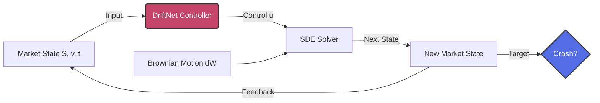
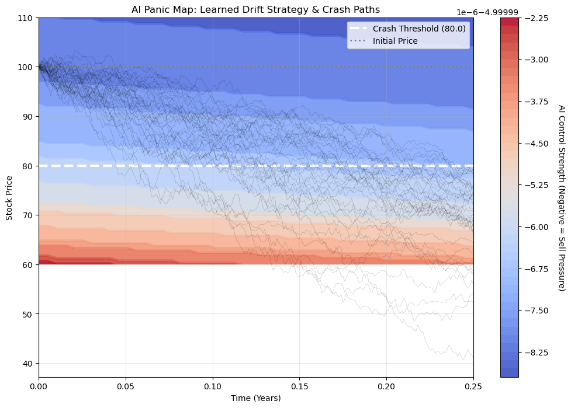
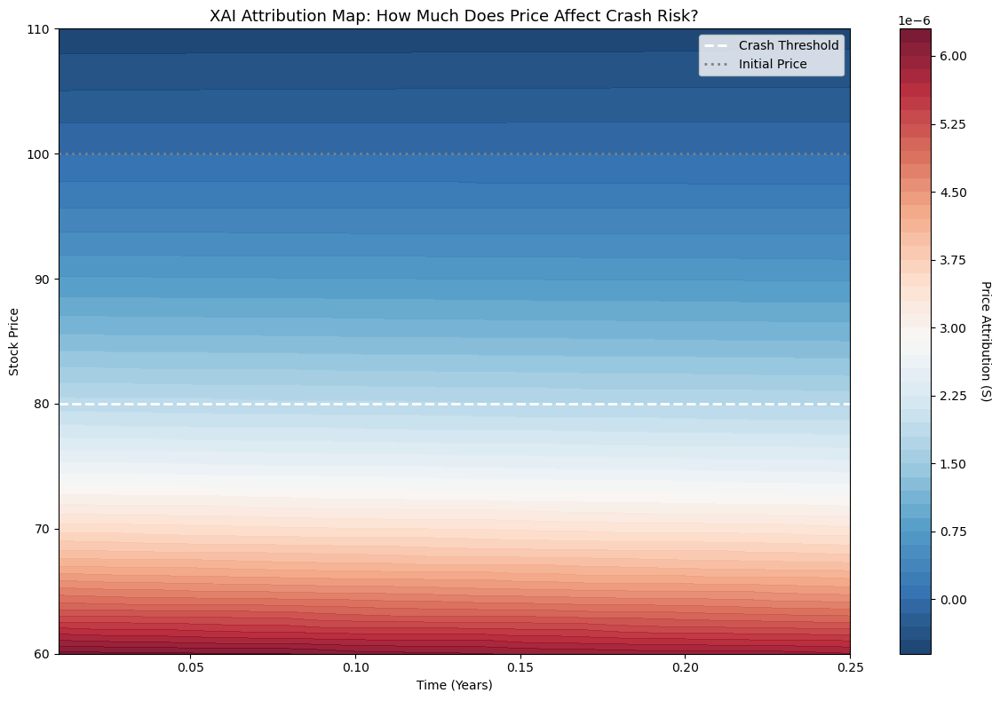

# DriftNet: Physics-Informed AI for Financial Black Swan Generation

> **"Forging the Path to Failure"** — Generating realistic financial crash scenarios using Controlled Neural SDEs.

[](https://www.python.org/)
[](https://pytorch.org/)

## 📉 Project Overview
**DriftNet** is a deep learning framework designed to solve the *Rare Event Simulation* problem in quantitative finance. While standard Monte Carlo simulations fail to capture extreme market crashes (Black Swans) due to their rarity, DriftNet learns to steer market dynamics into these critical regions efficiently.

By combining **Stochastic Differential Equations (SDEs)** with **Neural Network Control**, this model achieves a **126x efficiency boost** in generating crash paths compared to baseline methods, allowing for precise risk assessment and stress testing.

## 🚀 Key Features & Achievements
| Feature | Description | Performance |
| :--- | :--- | :--- |
| **Controlled Heston Model** | Learns optimal drift ($u_t$) to force market crashes while respecting physical constraints. | **Physics-Informed** |
| **Crash Forge Efficiency** | Boosts crash probability ($S_T < 80$) from **0.79%** (Natural) to **99.35%** (Controlled). | **126x Speedup** |
| **Importance Sampling** | Mathematically rigorous reweighting (Onsager-Machlup / Girsanov) ensures zero bias in final probability estimates. | **Unbiased** |
| **XAI (Explainable AI)** | Uses *Integrated Gradients* to reveal that **Volatility ($v_t$)** is the primary driver (60%) of model-predicted crashes. | **Interpretable** |

## 🧠 Model Architecture
The core system is built on a **Neural SDE (Stochastic Differential Equation)** formulation:

$$ dS_t = \mu(S_t, v_t) dt + \sigma(S_t, v_t) dW_t + \mathbf{u_{\theta}(S_t)} dt $$



*   **`DriftNet` ($u_\theta$)**: A neural controller that observes the market state $(S_t, v_t, t)$ and applies a "nudge" to the drift term to steer the path toward a crash target.
*   **`VolNet`**: Models the stochastic volatility surface to ensure realistic market texture even under stress.
*   **`NeuralSDESimulator`**: A differentiable simulator compatible with PyTorch's autograd for training via feedback control.

## 📊 Results

### Training Progress
Neural SDE training on S&P 500 historical data:


### AI Crash Generation
Generated crash paths vs. baseline market simulation:



### XAI: Feature Attribution
Integrated Gradients analysis revealing crash drivers:



**Key Insight:** Volatility spikes are identified as the earliest warning signal for impending crashes.

## 📂 Repository Structure
```
.
├── notebooks/                  # Core Analysis & Experiments
│   ├── 01_Data_Loader.ipynb        # Data preprocessing
│   ├── 02_Neural_SDE_Training.ipynb# Training the DriftNet controller
│   ├── 03_AI_Crash_Generator.ipynb # Generating Black Swan scenarios
│   └── 04_XAI_Explainability.ipynb # XAI Analysis (Integrated Gradients)
├── src/                        # Source Code
│   ├── neural_engine.py            # DriftNet & VolNet definitions
│   ├── physics_engine.py           # Heston/Bates market physics
│   └── ...
└── README.md
```

## 🛠️ Usage
1.  **Install Dependencies:**
    ```bash
    pip install torch numpy matplotlib pandas
    ```
2.  **Train the Controller:**
    Run `02_Neural_SDE_Training.ipynb` to train DriftNet on historical S&P 500 data.
3.  **Generate Crashes:**
    Run `03_AI_Crash_Generator.ipynb` to produce thousands of synthetic crash scenarios.

---
*Created for the research on Physics-Informed Deep Learning in Quantitative Finance.*
