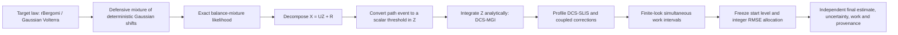

# Hybrid DCS-MGI for Rare Events under Rough Volatility

[](https://github.com/YoungJun0814/Neural_Path_Intergral/actions/workflows/ci.yml)
[](https://www.python.org/)
[](#research-status)

> A research implementation of exact finite-grid rare-event estimation using
> defensive importance sampling, Gaussian control-span marginalization, and
> multilevel Monte Carlo (MLMC) for rough Bergomi and Gaussian Volterra models.

## Research status

The active method is **Hybrid DCS-MGI**:

> **D**efensive **C**ontrol-**S**pan **M**arginalized **G**aussian **I**ntegration
> with a preprocessing-inclusive choice between single-level importance sampling
> and every admissible multilevel start.

The V5 finite-grid infrastructure is implemented: pathwise threshold diagnostics,
finite-look simultaneous variance intervals, an uncertainty-aware crossover,
pilot-frozen achieved-RMSE allocation, resource censoring, durable resume, fresh CEM
baseline contracts, independent references, and an independent result audit. Its
development smoke checks pass. This does **not** mean the V5 research protocol has
passed: terminal and barrier model-level rates remain conditional, formal selector
and reference qualifications have not run, and there is no untouched V5
confirmation or Linux reproduction.

The earlier 640-cell M7 V3 run completed and passes its integrity audit, but its
strict frozen headline **failed** because one recovered Windows checkpoint
`PermissionError` violates the predeclared no-failure gate. The frozen V4
one-factor crossover qualification later passed its declared gates and independent
audit. Neither artifact may be relabelled as V5 achieved-RMSE confirmation.

The complete local regression suite passed **393/393 tests on 2026-07-22**.

This repository is **not yet a finished journal submission**. The present estimator
targets a declared finest discrete grid rather than a continuously monitored event,
M7 lacks the strongest single-level comparator in its frozen matrix, and its three
regimes changed H, eta, and rho together. V4 therefore adds margin-localized threshold
theory, single-level/MLMC crossover logic, strong baselines, and one-factor-at-a-time
qualification. V4 selects DCS-SLIS in 90/135 seed-runs and an earlier multilevel start
in 45/135, so neither endpoint is uniformly preferred. Development, recovered, and
qualification evidence must not be quoted as untouched confirmation.

Start with:

- [V11 research and implementation plan](CORRECTION_FOCUSED_DCS_MGI_MLMC_PLAN_V11.md)
- [G11 implementation and error audit](docs/audits/G11_IMPLEMENTATION_AND_ERROR_AUDIT_2026-07-19.md)
- [Theorem statements](docs/theory/G11_THEOREMS.md) and [proof audit](docs/theory/G11_PROOF_AUDIT.md)
- [M7 freeze-readiness review](docs/audits/G11_M7_FREEZE_READINESS_2026-07-19.md)
- [M7 local execution and resource protocol](docs/audits/G11_M7_LOCAL_EXECUTION_PROTOCOL_2026-07-19.md)
- [M7 V3 confirmatory decision](docs/audits/G11_M7_CONFIRMATORY_DECISION_2026-07-22.md)
- [V4 threshold-stability theory](docs/theory/G11_MARGIN_LOCALIZED_THRESHOLD_STABILITY.md)
- [V4 crossover qualification protocol](docs/plans/G11_V4_PAPER_EXTENSION_PROTOCOL_2026-07-22.md)
- [V4 crossover qualification decision](docs/audits/G11_V4_CROSSOVER_QUALIFICATION_DECISION_2026-07-22.md)
- [V5 submission-grade implementation plan](docs/plans/G11_V5_SUBMISSION_GRADE_IMPLEMENTATION_PLAN_2026-07-22.md)
- [V5 theorem and assumption ledger](docs/theory/G11_V5_THEOREMS.md)
- [V5 proof/implementation audit](docs/theory/G11_V5_PROOF_AUDIT.md)
- [V5 freeze-readiness audit](docs/audits/G11_V5_FREEZE_READINESS.md)
- [V5 reproducible literature search](docs/literature/G11_V5_SEARCH_LOG.md)
- [Current model explained in Korean](docs/CURRENT_MODEL_AND_IMPLEMENTATION_GUIDE_KO.md)
- [Novelty matrix](docs/literature/G11_NOVELTY_MATRIX.md) and [baseline scope](docs/literature/G11_BASELINE_SCOPE.md)

## Why this problem matters

Rare downside probabilities under rough volatility can be too expensive for ordinary
Monte Carlo. Importance sampling can make the event appear more often, but that alone
does not guarantee an accurate or efficient estimator: the likelihood ratio can have
heavy tails, discontinuous path events can create slowly decaying MLMC corrections,
and proposal-training cost can erase an apparent speedup.

This project addresses those failure modes with four constraints:

1. retain an exact balance-mixture likelihood and ordinary, non-self-normalized sample
   means;
2. include a positive-weight natural component so the defensive likelihood is
   pathwise bounded;
3. analytically integrate the Gaussian coordinate that drives the event and proposal
   control span; and
4. couple fine and coarse paths with the same fine proposal, label, control,
   likelihood, and Gaussian coordinate.

## Method at a glance


```mermaid
flowchart LR
    A["Target law: rBergomi / Gaussian Volterra"] --> B["Defensive mixture of deterministic Gaussian shifts"]
    B --> C["Exact balance-mixture likelihood"]
    C --> D["Decompose X = UZ + R"]
    D --> E["Convert path event to a scalar threshold in Z"]
    E --> F["Integrate Z analytically: DCS-MGI"]
    F --> G["Profile DCS-SLIS and coupled corrections"]
    G --> H["Finite-look simultaneous work intervals"]
    H --> I["Freeze start level and integer RMSE allocation"]
    I --> J["Independent final estimate, uncertainty, work and provenance"]
```

At MLMC level \(\ell\), the standardized Gaussian input under the target law is

\[
X_\ell \sim P_\ell = \mathcal N(0,I).
\]

The proposal is a defensive mixture of deterministic shifts,

\[
Q_\ell = \sum_j \pi_{\ell,j}\,\mathcal N(m_{\ell,j},I),
\qquad m_{\ell,0}=0,\quad \pi_{\ell,0}=\delta_\ell>0,
\]

with exact balance likelihood

\[
L_\ell(x)
=
\left[
\sum_j \pi_{\ell,j}
\exp\!\left(m_{\ell,j}^{\mathsf T}x-\tfrac12\lVert m_{\ell,j}\rVert^2\right)
\right]^{-1}.
\]

An orthonormal matrix \(U_\ell\) isolates the event-driving control span:

\[
X_\ell = U_\ell Z_\ell + R_\ell.
\]

For the implemented terminal, discrete-barrier, and hit-plus-occupation tasks, the
hard event is an exact scalar threshold event in \(Z_\ell\) conditional on the
residual \(R_\ell\). Integrating this coordinate analytically gives a
Rao--Blackwellized estimator with a bounded residual likelihood. Adjacent fine and
coarse quantities are evaluated inside one fine-level probability space, preserving
the finite-grid telescoping identity.

### What “path integral” and “neural” mean here

The current contribution is a **controlled path-measure estimator**, not a quantum
Feynman path integral. Quantum terminology is not used as a mathematical claim.

Likewise, the current rare-event proposal uses a fixed three-component deterministic
control schedule. A neural network could later amortize proposal generation across
tasks and parameters, but it is not part of the present exactness theorem and is not
the core G11 contribution. Earlier neural-controller experiments remain in the
repository as falsified or historical research tracks.

## Mathematical guarantees and boundaries

| Result | Current status | Exact scope |
|---|---|---|
| Gaussian-mixture control-span marginalization | Proved and oracle-tested | Finite-dimensional identity-covariance Gaussian shifts |
| Rao--Blackwell identity under the proposal | Proved and tested | Uses the derived proposal conditional law |
| Defensive likelihood bound | Proved and tested | Requires a positive-weight zero-mean mixture component; bound \(\le 1/\delta\) |
| MLMC telescoping | Proved and tested | Exact for a declared finest finite grid and normalized fine-to-coarse map |
| Scalar-threshold representation | Pathwise tested | Terminal, discrete barrier, and implemented hit-plus-occupation tasks |
| DCS correction rate | Conditional upper bound | \(O(h^{2r})\) if the coupled threshold error is \(O(h^r)\) in \(L^2\) |
| MLMC complexity | Conditional corollary | Requires separate bias, variance, and cost exponents |
| SLIS/MLMC crossover | Exact finite-profile calculation | Includes profiling/training work and the finest single level as a legal endpoint |
| Pilot-selected estimator | Conditionally unbiased | Final samples are independent and pilots never enter final means |
| Sequential work intervals | Finite-look familywise coverage | Defensive bounded observations only; not an anytime confidence sequence |
| Achieved-RMSE allocation | Implemented and oracle-tested | Uses frozen upper variances, integer rounding, and pre-sampling resource censoring |

The project does **not** currently claim:

- unbiased estimation of a continuously monitored barrier probability;
- a universal rough-Bergomi convergence-rate theorem;
- an empirically proven exponent equality rather than an upper bound;
- a neural-architecture contribution;
- a matched-RMSE speedup in cells where the baseline exhausted its resource budget;
- that conditional smoothing, common-likelihood MLMC, occupation-time importance
  sampling, or preprocessing-inclusive work accounting is new by itself.

## Development evidence

All numbers below are development evidence generated before M7 confirmatory freeze.

### Rate study

The M4 study used roughness values \(H\in\{0.07,0.12,0.30\}\), three event tasks,
12 independent seed clusters, 8,192 paths per level, and six adjacent levels. All
nine regime/task cells passed the declared common-window and rate-consistency gates.

| \(H\) | Threshold \(L^2\) exponent | Raw correction exponent | DCS correction exponent |
|---:|---:|---:|---:|
| 0.07 | 0.081--0.088 | 0.015--0.022 | 0.070--0.072 |
| 0.12 | 0.207--0.239 | 0.089--0.093 | 0.201--0.231 |
| 0.30 | 0.591--0.749 | 0.273--0.331 | 0.584--0.753 |

These observations are compatible with the conditional \(O(h^{2r})\) upper-bound
mechanism; they are not a universal or confirmatory exponent claim.

### Rare-event study

For the primary \(H=0.12\) regime, terminal, barrier, and non-degenerate
hit-plus-occupation events were calibrated at probabilities from \(10^{-3}\) through
\(10^{-6}\) on a fixed 128-step grid. All 12 independent validation estimates met the
declared probability and precision gates.

In the 12-cell rare-MLMC development matrix:

- DCS reached the empirical sampling-variance target in **11/12 cells**;
- raw defensive MLMC reached it in **3/12 cells**;
- the three cells where both methods reached matched RMSE had a geometric
  operation-work ratio of **43.85x** in favor of DCS; and
- the **4.29x** all-cell allocated-work ratio is diagnostic only, because it includes
  baseline cells that missed the target.

The 43.85x result is therefore not yet a general headline speedup. Confirmatory work
must predeclare how baseline resource censoring is reported.

### M7 V3 recovered evidence and strict decision

M7 V3 completed all 640 cells across 20 seed clusters. DCS attained its requested
empirical RMSE in 91.41% of cells; 254 matched-RMSE cells had a 16.52x geometric
raw/DCS operation-work ratio and a one-sided cluster lower bound of 14.70x. The strict
headline nevertheless failed because one checkpoint sharing violation was serialized
as an unexpected execution failure. The run was manually recovered from a validated
temporary checkpoint, so these numbers are recovered evidence rather than a passed
untouched confirmation.

Performance was not uniform. DCS attainment fell to 76.25% at probability `1e-6`,
and several hard matched groups favored raw. Also, the prior regime labels do not
identify an H effect because eta and rho changed with H. See the
[decision report](docs/audits/G11_M7_CONFIRMATORY_DECISION_2026-07-22.md) and
[machine-readable independent audit](results/g11_m7_result_audit_v1_2026-07-22.json).

### V4 crossover qualification

The clean frozen V4 run completed 27 one-factor-at-a-time cells and 135 independent
seed-runs. All 135 full-hierarchy DCS estimates were within four combined standard
errors of their independent references. At every evaluated RMSE, the profiled
minimum-work start was the finest DCS single level in 90 runs, full MLMC in 13, and an
intermediate start in 32. The H=0.30 OAT regime accounted for all 13 full-MLMC
selections; other regimes mostly selected DCS-SLIS. Training-inclusive CEM comparisons
on four base cells favored the selected DCS construction by 1.47x--1.89x at 20%
relative RMSE.

These are qualification profiles, not achieved-RMSE allocations. See the
[V4 decision report](docs/audits/G11_V4_CROSSOVER_QUALIFICATION_DECISION_2026-07-22.md),
[frozen result](results/g11_v4_crossover_qualification_v1_2026-07-22.json), and
[independent audit](results/g11_v4_crossover_audit_v1_2026-07-22.json).

Machine-readable outputs are stored under [`results/`](results/), including the
[strict artifact audit](results/g11_artifact_audit_v1_2026-07-19.json),
[rate audit](results/g11_threshold_rate_audit_v1_2026-07-19.json), and
[rare-MLMC development result](results/g11_rare_mlmc_development_v1_2026-07-19.json).

## Installation

Python 3.10 or 3.11 is recommended.

```bash
git clone https://github.com/YoungJun0814/Neural_Path_Intergral.git
cd Neural_Path_Intergral
python -m venv .venv
```

Activate the environment, then install the project and development dependencies:

```bash
python -m pip install --upgrade pip
python -m pip install -e ".[dev]"
```

On Windows PowerShell, activation is typically:

```powershell
.\.venv\Scripts\Activate.ps1
```

## Reproducing the implemented checks

Run the complete unit and integration test suite:

```bash
python -m pytest -q
```

Run the laptop-safe V5 development chain (outputs are smoke evidence, not frozen
results):

```bash
python -m experiments.g11_v5_threshold_diagnostics \
  --config configs/g11_v5_threshold_diagnostics_development.yaml \
  --smoke --output results/g11_v5_threshold_diagnostics_local_smoke.json

python -m experiments.g11_v5_selector_qualification \
  --config configs/g11_v5_selector_qualification.yaml \
  --smoke --output results/g11_v5_selector_local_smoke.json

python -m experiments.g11_v5_confirmatory \
  --config configs/g11_v5_confirmatory_development.yaml \
  --smoke --output results/g11_v5_confirmatory_local_smoke.json

python -m experiments.g11_v5_result_audit \
  --result results/g11_v5_confirmatory_local_smoke.json \
  --config configs/g11_v5_confirmatory_development.yaml \
  --output results/g11_v5_confirmatory_local_audit.json
```

Run a fast Gaussian-oracle smoke check without overwriting the tracked result:

```bash
python -m experiments.g11_gaussian_oracle \
  --config configs/g11_gaussian_oracle.yaml \
  --smoke \
  --output results/g11_gaussian_oracle_local_smoke.json
```

Run the strict audit over the committed G11 artifacts:

```bash
python -m experiments.g11_artifact_audit \
  --manifest configs/g11_artifact_manifest.yaml \
  --output results/g11_artifact_audit_local.json
```

After checking out the frozen M7 tag in a clean worktree and setting all BLAS thread
variables to eight, validate the confirmatory protocol without allocating a random
seed:

```bash
python -m experiments.g11_m7_confirmatory \
  --config configs/g11_m7_confirmatory_v3.yaml \
  --preflight \
  --output /path/outside/worktree/g11_m7_preflight.json
```

The larger rate, rarity-calibration, and rare-MLMC experiments are intentionally
configuration driven:

```bash
python -m experiments.g11_threshold_rate_pilot \
  --config configs/g11_threshold_rate_pilot.yaml \
  --output results/g11_threshold_rate_local.json

python -m experiments.g11_rarity_calibration \
  --config configs/g11_rarity_calibration.yaml \
  --output results/g11_rarity_calibration_local.json

python -m experiments.g11_mlmc_development \
  --config configs/g11_rare_mlmc_development.yaml \
  --output results/g11_rare_mlmc_development_local.json \
  --progress results/g11_rare_mlmc_development_local.progress.json
```

Audit the committed V4 qualification artifact:

```bash
python -m experiments.g11_v4_crossover_audit \
  --config configs/g11_v4_crossover_qualification.yaml \
  --result results/g11_v4_crossover_qualification_v1_2026-07-22.json \
  --output results/g11_v4_crossover_audit_local.json
```

These full configurations can be computationally expensive. They are development
protocols, not permission to inspect or tune against the future untouched M7 seed
namespace.

## Repository map

```text
.
|-- src/path_integral/            # Estimators, Gaussian identities, rBergomi and MLMC engines
|-- experiments/                  # Reproducible G11 experiment entry points
|-- configs/                      # Versioned experiment and artifact manifests
|-- tests/                        # Mathematical, numerical and provenance tests
|-- docs/theory/                  # Theorems and proof-level audit
|-- docs/audits/                  # Implementation, error and freeze-readiness audits
|-- docs/literature/              # Novelty boundary and baseline scope
|-- results/                      # Machine-readable development artifacts
|-- notebooks/                    # Earlier exploratory analyses
`-- CORRECTION_FOCUSED_DCS_MGI_MLMC_PLAN_V11.md
```

Key implementation modules:

- [`gaussian_span_marginalization.py`](src/path_integral/gaussian_span_marginalization.py): generic control-span identities;
- [`rbergomi_dcs_mlmc.py`](src/path_integral/rbergomi_dcs_mlmc.py): rBergomi DCS adapter and threshold construction;
- [`rbergomi_mlmc_sampler.py`](src/path_integral/rbergomi_mlmc_sampler.py): coupled raw/DCS MLMC sampling;
- [`mlmc.py`](src/path_integral/mlmc.py): independent pilot/final allocation and checkpointing;
- [`seed_ledger.py`](src/path_integral/seed_ledger.py): role-separated deterministic seeds;
- [`provenance.py`](src/path_integral/provenance.py): configuration and artifact provenance;
- [`threshold_stability.py`](src/path_integral/threshold_stability.py): localized threshold and moment bounds;
- [`multilevel_crossover.py`](src/path_integral/multilevel_crossover.py): preprocessing-inclusive SLIS/MLMC choice;
- [`stable_gaussian.py`](src/path_integral/stable_gaussian.py): audited Gaussian tail numerics.

## Research history

The repository preserves failed hypotheses because they constrain the current claims
and prevent selective reporting.

| Track | Main idea | Outcome |
|---|---|---|
| G7 | Controlled adjacent-grid MLMC | Exactness passed; total-work claim falsified |
| G8 | Coarse-conditioned Volterra bridge branching | Correction gain passed; end-to-end claim falsified |
| G9 | Monotone Gaussian Volterra smoothing | Exactness/correction gain passed; frozen headline failed |
| G10 | Control-span marginalized Gaussian integration | Finite-grid audits passed; 2x single-level headline failed |
| G11 M7 V3 | Correction-focused DCS-MGI-MLMC | 640 cells complete; performance sub-gates pass; strict headline fails on one recovered I/O incident |
| G11 V4 | Margin-localized Hybrid DCS-MGI | 27-cell frozen OAT qualification and independent audit pass; 90/135 SLIS, 45/135 multilevel |

Earlier neural VFO, mixture, and residual-controller tracks were tested against strong
baselines and stopped when their gates failed. See the phase reviews under
[`docs/phase_reviews/`](docs/phase_reviews/) and the
[post-G5 research backlog](RESEARCH_DIRECTION_BACKLOG_POST_G5_2026-07-16.md).

## What remains before a journal claim

The next publication-critical steps are:

1. freeze and execute actual achieved-RMSE allocations using the qualified hybrid;
2. use a strong task-tuned SLIS baseline on every future headline cell;
3. prove model-level coefficient, mesh-enrichment, and small-active-slope bounds, or
   keep the V4 rate theorem explicitly conditional;
4. freeze a new untouched achieved-RMSE seed namespace after qualification;
5. run a second independent environment reproduction;
6. add a continuous-time weak-bias study or keep every headline explicitly
   finite-grid; and
7. add a neural amortized proposal generator only if it reduces total calibration
   cost under an independently frozen gate.

Until those items are complete, the defensible description is **PhD-level research
prototype and strong working-paper core**, not a top-journal-ready final manuscript.

## Research integrity

- Evaluation seeds are never used for tuning after a frozen result is inspected.
- Pilot samples are independent of final MLMC samples.
- Raw estimators use ordinary means; self-normalization is prohibited.
- Proposal-calibration, pilot, failed-run, and final-sampling work must be accounted
  for in end-to-end comparisons.
- Negative gates and resource failures remain visible in the repository.

This code is for research and reproducibility. It is not investment advice, a trading
system, or a production risk engine.
