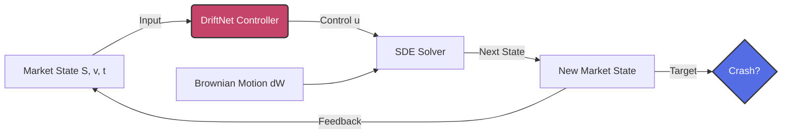
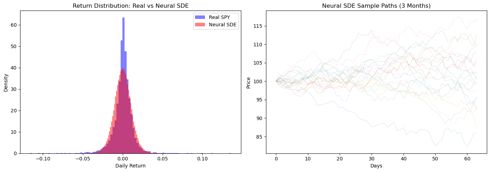
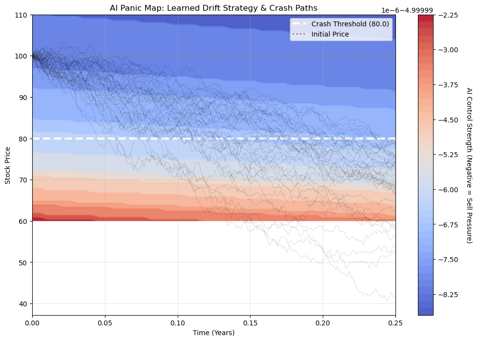
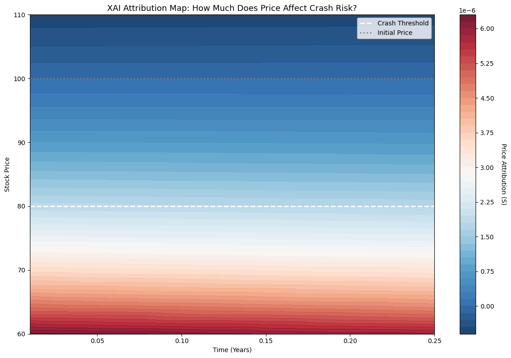

# DriftNet: Neural Importance Sampling for Rare Downside Events

> Research prototype for controlled-SDE importance sampling in quantitative finance.

[](https://www.python.org/)
[](https://pytorch.org/)

## 📉 Project Overview
**DriftNet** studies neural changes of measure for rare-event simulation in
quantitative finance. The controller steers stochastic-volatility paths toward
a target event, while a Girsanov likelihood ratio is used to recover
expectations under the chosen base measure.

The project is being rebuilt toward publication-grade validation. Earlier
notebooks reported large increases in the *frequency* of controlled crash paths;
that frequency ratio is not a variance-reduction factor or computational
speedup. Current claims are limited to results produced by the tested experiment
pipeline. See [`RESEARCH_CHARTER.md`](RESEARCH_CHARTER.md) and
[`PUBLICATION_GRADE_RESEARCH_PLAN.md`](PUBLICATION_GRADE_RESEARCH_PLAN.md).

The implementation-aligned equations are in
[`docs/mathematical_specification.md`](docs/mathematical_specification.md).
The current G2 gate decision is recorded in
[`docs/phase_reviews/G2_SMOKE_EXECUTION_2026-07-13.md`](docs/phase_reviews/G2_SMOKE_EXECUTION_2026-07-13.md).

For a Korean explanation of the current architecture and completed work, see
[`docs/CURRENT_MODEL_AND_IMPLEMENTATION_GUIDE_KO.md`](docs/CURRENT_MODEL_AND_IMPLEMENTATION_GUIDE_KO.md).
The ranked next-generation model candidates, mathematical constraints, and
selection gates are documented in
[`PATH_INTEGRAL_MODEL_CANDIDATES_AND_SELECTION.md`](PATH_INTEGRAL_MODEL_CANDIDATES_AND_SELECTION.md).
The active integrated execution plan is
[`PATH_INTEGRAL_RESEARCH_PLAN_V3.md`](PATH_INTEGRAL_RESEARCH_PLAN_V3.md).
The latest sealed confirmatory review is
[`docs/phase_reviews/G2_V3_CONFIRMATORY_REVIEW_2026-07-13.md`](docs/phase_reviews/G2_V3_CONFIRMATORY_REVIEW_2026-07-13.md).
The frozen two-driver Heston feedback gate is reviewed in
[`docs/phase_reviews/G1_TWO_DRIVER_FEEDBACK_CONFIRMATORY_2026-07-14.md`](docs/phase_reviews/G1_TWO_DRIVER_FEEDBACK_CONFIRMATORY_2026-07-14.md).
The controlled finite-grid rBergomi BLP law gate is reviewed in
[`docs/phase_reviews/G2_CONTROLLED_RBERGOMI_LAW_2026-07-14.md`](docs/phase_reviews/G2_CONTROLLED_RBERGOMI_LAW_2026-07-14.md).
The first training-matched VFO memory ablation and its required pivot are reviewed in
[`docs/phase_reviews/G3_VFO_MATCHED_ABLATION_2026-07-14.md`](docs/phase_reviews/G3_VFO_MATCHED_ABLATION_2026-07-14.md).
The final path-dependent VFO pivot and the resulting Plan-v3 stop decision are
documented in
[`docs/phase_reviews/G3_VFO_PATH_PIVOT_FINAL_2026-07-14.md`](docs/phase_reviews/G3_VFO_PATH_PIVOT_FINAL_2026-07-14.md).

Run the non-publication G2 smoke pipeline with:

```bash
python -m experiments.g2_heston_benchmark --smoke --quiet \
  --output results/g2_heston_score_gradient_smoke_2026-07-13.json \
  --checkpoint-dir results/checkpoints/g2_smoke
```

Omit `--smoke` only for the frozen full evaluation. Evaluation seeds must not
be used for tuning after the full result has been inspected.

Run the separate non-publication time-step refinement with:

```bash
python -m experiments.heston_tail_refinement --smoke --quiet \
  --output results/heston_tail_refinement_smoke_2026-07-13.json
```

## 🚀 Research Components
| Component | Description | Status |
| :--- | :--- | :--- |
| **Controlled Heston Model** | Applies adapted Brownian drift controls with the correlated-variance Girsanov correction. | Targeted tests available |
| **Rough Volatility** | Simulates non-Markovian rBergomi dynamics for memory-aware controls. | Under correctness rebuild |
| **Importance Sampling** | Reweights frozen controlled paths with $d\mathbb M/d\mathbb Q_\phi$. | Discretized-model validation in progress |
| **Amortized Control** | Conditions one controller on barriers, maturities, and model parameters. | Planned research contribution |

## 🧠 Model Architecture
The core system is built on a **Neural SDE (Stochastic Differential Equation)** formulation:

$$ dS_t = \mu(S_t, v_t) dt + \sigma(S_t, v_t) dW_t + \mathbf{u_{\theta}(S_t)} dt $$


```mermaid
graph LR
    A[Market State S, v, t] -->|Input| B(DriftNet Controller)
    B -->|Control u| C[SDE Solver]
    D[Brownian Motion dW] --> C
    C -->|Next State| E[New Market State]
    E -->|Feedback| A
    E -->|Target| F{Crash?}
    style B fill:#c44569,stroke:#333,stroke-width:2px,color:#fff
    style F fill:#546de5,stroke:#333,stroke-width:2px,color:#fff
```

*   **`DriftNet` ($u_\theta$)**: A neural controller that observes the market state $(S_t, v_t, t)$ and applies a "nudge" to the drift term to steer the path toward a crash target.
*   **`VolNet`**: Models the stochastic volatility surface to ensure realistic market texture even under stress.
*   **`NeuralSDESimulator`**: A differentiable simulator compatible with PyTorch's autograd for training via feedback control.

## 📊 Legacy Exploratory Results

The figures below are retained for research history. They were generated by
the exploratory notebooks and are not publication-grade estimator benchmarks.

### Training Progress
Neural SDE training on S&P 500 historical data:



> **Figure 1 (legacy):** An exploratory training-loss curve. Publication
> results will report the exact objective, independent evaluation error, and
> uncertainty across seeds.

### AI Crash Generation
Generated crash paths vs. baseline market simulation:



> **Figure 2 (legacy exploratory result):** Comparison of standard Monte Carlo
> paths (blue) and controlled paths (orange). A higher controlled event rate
> only shows that the proposal reaches the target more often; estimator
> efficiency must be established from likelihood-weighted variance and total
> compute.

### XAI: Feature Attribution
Integrated Gradients analysis revealing crash drivers:



> **Figure 3 (legacy exploratory result):** Integrated gradients for one
> selected controller state. This is not evidence that volatility has a stable
> population-level percentage contribution to market crashes.

## 📂 Repository Structure
```
.
├── notebooks/                  # Core Analysis & Experiments
│   ├── 01_Data_Loader.ipynb        # Data preprocessing
│   ├── 02_Neural_SDE_Training.ipynb# Training the DriftNet controller
│   ├── 03_AI_Crash_Generator.ipynb # Legacy rare-downside scenarios
│   └── 04_XAI_Explainability.ipynb # XAI Analysis (Integrated Gradients)
├── src/                        # Source Code
│   ├── neural_engine.py            # DriftNet & VolNet definitions
│   ├── physics_engine.py           # Heston/Bates market physics
│   └── ...
└── README.md
```

## 🛠️ Usage
1.  **Install Dependencies:**
    ```bash
    pip install torch numpy matplotlib pandas
    ```
2.  **Train the Controller:**
    Run `02_Neural_SDE_Training.ipynb` to train DriftNet on historical S&P 500 data.
3.  **Generate Crashes:**
    Run `03_AI_Crash_Generator.ipynb` to produce thousands of synthetic crash scenarios.

---
*Research on structure-aware neural importance sampling in quantitative finance.*
