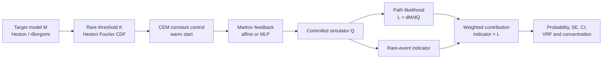
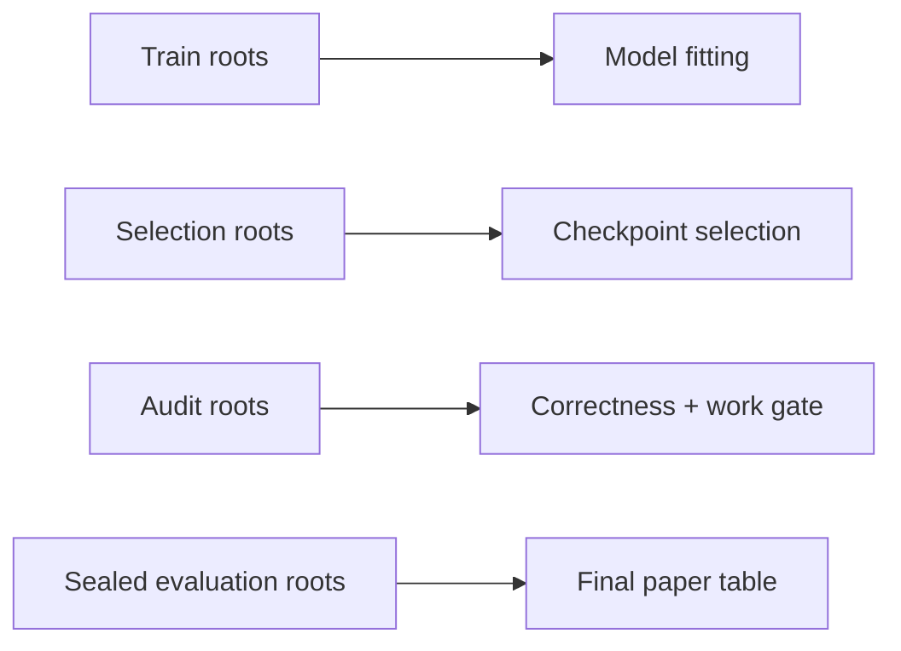

# 현재 모델과 구현 가이드

## 1. 한 문장 요약

현재 시스템은 **희귀한 주가 하락 경로를 일부러 자주 생성한 다음, 정확한
확률 가중치로 원래 시장에서의 발생확률을 복원하는 importance-sampling
엔진**이다.

쉽게 말하면 다음과 같다.

1. 일반 Monte Carlo는 \(10^{-6}\) 사건을 거의 만나지 못한다.
2. 제어된 simulator는 주가가 하락하도록 Brownian motion의 drift를 바꾼다.
3. 경로를 억지로 바꾼 만큼 likelihood \(L=dM/dQ\)로 보정한다.
4. `event × likelihood`의 평균을 내면 원래 measure의 확률을 추정할 수 있다.
5. 좋은 control은 정답을 바꾸지 않으면서 estimator 분산만 줄인다.

## 2. 전체 구조



현재 논문용 기준 경로는 `Heston → CEM → compact affine/MLP → likelihood
estimator`이다. rBergomi는 수치엔진 검증까지 완료됐지만 memory-aware control은
다음 연구 단계다.

## 3. 기준 시장 모델

### Heston

주가와 분산을 함께 움직인다.

$$
\begin{aligned}
dS_t &= \mu S_t\,dt+\sqrt{v_t}S_t\,dW_t^S,\\
dv_t &= \kappa(\theta-v_t)\,dt+\xi\sqrt{v_t}\,dW_t^v.
\end{aligned}
$$

- \(S_t\): 주가
- \(v_t\): 순간분산
- \(\kappa\): 분산이 장기 평균으로 돌아오는 속도
- \(\theta\): 장기 평균분산
- \(\xi\): volatility-of-volatility
- \(\rho\): 가격과 분산 shock의 상관계수

분산은 full-truncation Euler, 주가는 positive log-Euler로 계산한다. 주가에
사후 floor를 씌워 가짜 left-tail mass가 생기지 않도록 했다.

### rBergomi

rBergomi는 현재 변동성이 과거 Brownian shock 전체의 영향을 받는 rough
volatility 모델이다. BLP hybrid scheme, \(\sqrt{2H}\) normalization, discrete
Wick compensator를 구현했고 covariance와 \(E[V_t]=\xi_0\) 테스트를 통과한다.

현재는 base simulator 단계이며 neural memory controller는 아직 연결하지 않았다.

## 4. Measure를 바꾸는 방법

원래 target measure를 \(M\), 경로를 많이 생성하기 위한 proposal을 \(Q\)라고
한다. Brownian motion을 다음처럼 이동한다.

$$
dW_t^M=dW_t^Q+u_t\,dt.
$$

음의 \(u_t\)를 사용하면 하락 경로가 더 자주 나온다. Heston에서는 가격과
분산 Brownian이 상관돼 있으므로 variance drift도 함께 보정해야 한다.

$$
dv_t^Q=\left[\kappa(\theta-v_t)+\rho\xi\sqrt{v_t}u_t\right]dt
       +\xi\sqrt{v_t}\,dW_t^{v,Q}.
$$

경로 likelihood는

$$
\log L=-\sum_k u_k\Delta W_k^Q-\frac12\sum_k u_k^2\Delta t
$$

이다. 이 부호나 variance correction이 틀리면 estimator가 biased된다.

## 5. 현재 control 구조

### 5.1 CEM constant control

모든 시간과 상태에서 같은 \(u\)를 쓴다. 단순하지만 Heston terminal event에서
매우 강한 baseline이다. elite trajectory, likelihood, Brownian sufficient
statistic을 같은 경로에서 사용해 weighted maximum likelihood로 업데이트한다.

### 5.2 Compact affine feedback

현재 가장 실용적인 feedback 모델이다.

$$
u_\phi(t,S,v)=u_{max}\tanh\left[
w_S(S/K-1)+w_v(v/\theta-1)+w_t(t/T)+b
\right].
$$

학습 parameter는 세 weight와 bias뿐이다. CEM constant에서 정확히 시작한 뒤
상태별 보정만 학습한다. 평가할 때는 frozen 3계수 함수로 변환해 neural module
호출비를 제거한다.

### 5.3 MLP feedback

더 복잡한 nonlinear controller다. 입력은

$$
(\log(S/S_0),\log(S/K),\log(v/\theta),t/T)
$$

이고 SiLU MLP 뒤에 bounded tanh output을 사용한다. 표현력은 높지만 현재 CPU
Heston benchmark에서는 추가 분산 감소보다 추론비 증가가 더 컸다.

## 6. 학습 방법

### CEM warm start

처음부터 neural network로 \(10^{-6}\) event를 찾으면 event가 한 번도 나오지
않아 gradient가 사라질 수 있다. 먼저 CEM으로 사건을 충분히 자주 만드는
constant control을 찾는다.

### Hard-event score gradient

`S_T <= K` 같은 indicator는 경계에서 미분 불가능하다. 단순 autograd로
indicator를 미분하면 이론적으로 잘못된 gradient가 된다. 현재 구현은
likelihood-ratio gradient를 사용한다.

$$
\nabla J=-E_Q[1_A L^2\nabla\log q_\phi].
$$

동일 경로의 Q-Brownian increment를 저장하고, state와 contribution은 detach한
뒤 control parameter만 미분한다.

### Seed stream

train seed는 하나의 고정 batch가 아니라 random stream의 root다. epoch마다
서로 다른 deterministic sub-seed를 생성한다. 따라서 재현 가능하면서도 같은
Brownian path를 반복 암기하지 않는다.

## 7. 데이터 분리



- Train: gradient와 CEM fitting
- Selection: architecture/checkpoint 선택
- Audit: 선택 완료 후 한 번만 gate 확인
- Evaluation: 논문용 최종 결과에서만 사용

현재 v3 evaluation seed 11101–11120은 사용하지 않았다.

## 8. 무엇을 측정하는가

- Mean estimate: 추정 확률
- Standard error: estimator 불확실성
- Reported bias-z: 해석값과 차이를 reported SE로 표준화
- CI coverage: 해석값이 confidence interval 안에 들어오는 비율
- Contribution ESS: 실제 확률 추정에 기여한 유효 경로 수
- Top-1% contribution share: 소수 경로가 결과를 독점하는지 확인
- Online VRF: 분산과 경로당 wall-clock을 함께 고려
- End-to-end VRF: training cost까지 포함

단순히 controlled event가 몇 배 자주 발생했는지는 speedup이 아니다.

## 9. 현재까지 완료된 구현

- Heston/Bates/SVJJ full-truncation variance와 positive spot update
- rBergomi BLP hybrid scheme 및 discrete covariance/Wick normalization
- correlated-variance Girsanov correction
- Brownian-only control 아래 jump-law 보존
- Heston Fourier call/put/CDF/quantile reference
- same-trajectory CEM
- compact affine 및 MLP Markov controller
- hard-indicator score-function training
- log-domain likelihood/contribution diagnostics
- work-normalized VRF와 repeated CI report
- frozen protocol, seed split, checkpoint schema와 SHA-256
- CI의 Ruff, Mypy, Pytest 검증

## 10. 현재 성능을 어떻게 해석해야 하는가

Heston \(10^{-4}\) audit에서 compact affine은 CEM보다 단일경로 분산이 약 4%
낮았지만 추론비가 약 6% 높았다. 결과적으로 work efficiency는 거의 1이다.

이 결과는 실패라기보다 중요한 baseline 결론이다. Heston terminal event에서는
constant exponential tilt가 이미 충분히 강해 복잡한 feedback의 추가 이점이
작다. 논문 기여는 다음 중 하나에서 나와야 한다.

1. 과거 memory가 필요한 rBergomi
2. barrier/drawdown처럼 path-dependent event
3. 여러 \(K,T,H,\rho\) task를 하나의 모델이 처리하는 amortization

## 11. 현재 할 수 없는 주장

- neural이 CEM보다 확실히 빠르다는 주장
- \(10^{-5},10^{-6}\) v3 confirmatory 결과
- continuous barrier unbiasedness
- rough-volatility memory controller 우월성
- real-market calibrated out-of-sample 성능
- “Neural Path Integral”이라는 이름의 독립적인 path-integral theorem

## 12. 주요 파일

- `src/physics_engine.py`: Heston, jump, rBergomi simulator
- `src/evaluation/heston_reference.py`: 해석 Heston reference
- `src/training/cem.py`: constant-control CEM
- `src/training/markov_control.py`: affine/MLP controller와 score gradient
- `src/evaluation/likelihood.py`: weight/contribution diagnostics
- `experiments/g2_train_validate.py`: sealed selection/audit pipeline
- `configs/g2_heston_confirmatory_v3.yaml`: 현재 confirmatory protocol
- `docs/mathematical_specification.md`: 구현과 일치하는 수학 명세

## 13. 재현 명령

```bash
pytest -q
ruff check src tests experiments main.py train_driftnet.py
mypy src main.py train_driftnet.py experiments/g2_train_validate.py
```

v3 train/selection/audit는 다음 명령으로 재현한다. 이 명령은 evaluation seed를
사용하지 않는다.

```bash
python -m experiments.g2_train_validate --quiet \
  --protocol configs/g2_heston_confirmatory_v3.yaml \
  --probabilities 1e-4 \
  --output results/g2_v3_confirmatory_1e-4_2026-07-13.json
```
