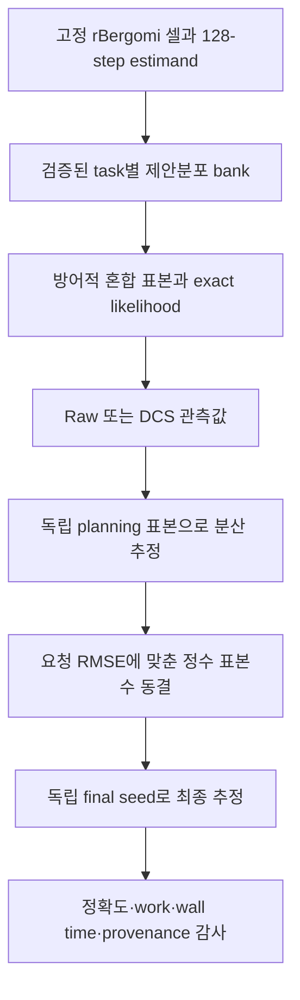

# 현재 모델과 구현 결과 가이드

작성일: 2026-07-24
현재 핵심 모델: **고정 제안분포 기반 DCS 경로적분 희귀사건 추정기**

## 1. 한 문장 설명

우리 모델은 rough Bergomi 같은 기억 의존 확률모형에서 아주 드문 금융
사건의 확률을 계산할 때, 사건을 잘 발생시키는 경로분포로 표본을 옮긴 뒤
정확한 likelihood로 보정하고, 남아 있는 핵심 가우시안 잡음 한 방향을
수치 표본 대신 해석적으로 적분하여 분산과 계산량을 줄이는 방법이다.

현재 확인된 핵심은 “새로운 신경망 구조”가 아니라 다음 결합이다.

1. 방어적 가우시안 혼합 importance sampling;
2. exact balance-mixture likelihood;
3. control-span 조건부 가우시안 적분(DCS-MGI);
4. 필요하면 fine/coarse 경로를 결합하는 MLMC; 그리고
5. 학습·계획·최종 표본 비용을 분리하지 않고 합산하는 평가 규약.

## 2. 쉬운 비유

희귀사건을 복권 당첨이라고 생각하자. 일반 Monte Carlo는 원래 확률대로
복권을 계속 사기 때문에 매우 많은 표본이 필요하다. Importance sampling은
당첨이 더 자주 나오는 판매점에서 복권을 사되, 그 판매점에서 샀다는 사실을
정확한 가중치로 보정한다.

Raw 추정기는 복권 번호의 마지막 한 자리까지 매번 무작위로 뽑는다. DCS는
나머지 번호가 주어졌을 때 마지막 한 자리가 당첨을 만드는 확률을 정규분포
CDF로 정확히 계산한다. 따라서 기대값은 같지만 불필요한 마지막 무작위성이
사라진다. 이것이 Rao--Blackwell 분산감소 메커니즘이다.

## 3. 우리가 계산하는 대상

현재 estimand는 연속시간 극한이 아니라 **미리 선언한 128-step 유한 격자에서의
확률**이다.

- 만기 가격이 임계값 아래인 사건;
- 관측 시점 중 한 번이라도 하단 barrier를 통과한 사건; 그리고
- 일부 개발 연구의 hit-plus-occupation 경로 사건.

그러므로 현재 결과를 “연속 감시 barrier 확률을 편향 없이 추정한다”고
표현하면 이론적으로 틀리다. 논문에서는 finite-grid estimand를 제목, 정리,
실험표에 일관되게 명시해야 한다.

## 4. 모델의 수학적 구조

### 4.1 목표 법칙과 방어적 제안분포

표준화된 가우시안 입력을 \(X\sim P=\mathcal N(0,I)\)라 하자. 실제 표본은
다음 혼합분포에서 생성한다.

\[
Q=\sum_{j=0}^{J-1}\pi_j\mathcal N(m_j,I),\qquad
m_0=0,\quad \pi_0=\delta>0.
\]

영 이동 성분을 양의 확률로 남기기 때문에 likelihood ratio가 경로별로
\(1/\delta\) 이하라는 방어적 상한을 갖는다. 선택된 혼합성분 하나의 밀도만
사용하지 않고 전체 혼합밀도를 사용한다.

\[
L(x)=\frac{dP}{dQ}(x)
=\left[
\sum_j\pi_j
\exp\!\left(m_j^\mathsf Tx-\frac12\lVert m_j\rVert^2\right)
\right]^{-1}.
\]

Self-normalized importance sampling은 쓰지 않는다. 최종 추정량은
\(L(X)f(X)\)의 일반 산술평균이다.

### 4.2 DCS-MGI

제안분포의 이동방향과 사건을 직접 움직이는 단위방향을 모아

\[
X=UZ+R
\]

로 분해한다. \(Z\)는 저차원 control-span 좌표이고 \(R\)은 직교 residual이다.
구현된 terminal과 discrete-barrier 사건은 \(R\)이 주어졌을 때

\[
\mathbf 1\{Z\le A(R)\}
\]

꼴의 스칼라 임계 사건으로 정확히 바뀐다. DCS는
\(L(UZ+R)\mathbf 1\{Z\le A(R)\}\)를 \(Z\)에 대해 해석적으로 적분한다.

\[
Y_{\mathrm{DCS}}(R)
=E_Q[Y_{\mathrm{raw}}(Z,R)\mid R].
\]

따라서

\[
E_Q[Y_{\mathrm{DCS}}]=E_Q[Y_{\mathrm{raw}}],
\qquad
\operatorname{Var}(Y_{\mathrm{DCS}})
\le \operatorname{Var}(Y_{\mathrm{raw}}).
\]

이 부등식은 구조적으로 정확하지만, 감소량이 항상 실무적으로 클 것까지
보장하지는 않는다. 그래서 동일 경로·동일 제안분포 paired probe로 감소량을
직접 측정했다.

### 4.3 MLMC

여러 격자를 사용할 때 fine 경로에서 coarse 경로를 일관되게 만들고, proposal,
label, likelihood와 control coordinate를 공유한다.

\[
E[Y_L]
=E[Y_{\ell_0}]
+\sum_{\ell=\ell_0+1}^{L}E[Y_\ell-Y_{\ell-1}].
\]

이 telescoping은 선언된 유한 격자에서 정확하다. V6 확인시험에서는 모든
경우가 finest-level DCS-SLIS를 선택했으므로, 현재 가장 강한 실증 결과의
핵심은 MLMC router가 아니라 DCS와 proposal 학습비 상각이다.

## 5. 현재 실행 파이프라인



현재 논문 헤드라인 후보는 router가 아니라
**mechanism-identified amortized DCS path-integral estimator**다.

- `mechanism-identified`: 동일 제안분포의 raw와 비교하여 DCS 자체 효과를
  분리했다.
- `amortized`: 여러 질의에 제안분포 학습비를 나누어 부담한다.
- `path-integral`: 경로 법칙 아래의 기대값을 조건부 적분한다는 뜻이다.
  Feynman 양자 경로적분을 구현했다는 뜻이 아니다.

## 6. V6가 증명한 것과 못한 것

64-cluster V6 확인시험에서 pure CEM 대비 정책의 training-inclusive 기하평균
work 비율은 2.3169배였고 one-sided 95% 하한은 2.3004배였다. Linux의 새 시드
재현에서도 2.3186배, 하한 2.3080배였다.

하지만 모든 route가 DCS-SLIS를 선택했고 proposal-training 비용을 제외하면
장점이 사라졌다. 따라서 V6는 다음만 지지한다.

> 동일한 task 계열을 반복 계산할 때, 미리 학습한 제안분포를 재사용하는
> DCS 방식이 매번 CEM을 다시 학습하는 것보다 유리하다.

V6만으로는 DCS 조건부 적분 자체가 raw 추정량보다 좋은지 분리하지 못했다.

## 7. V7 자격검증과 확인시험이 새로 증명한 것

V7은 같은 proposal, mixture weight, 셀, 목표 RMSE, 최종 표본 floor를 사용한
fixed raw와 fixed DCS를 비교했다. 18개 셀과 24개 독립 cluster에서 모든
사전 선언 gate와 독립 재계산 감사가 통과했다.

| Raw/DCS 지표 | 기하평균 비율 | one-sided 95% 하한 |
|---|---:|---:|
| 동일 경로 probe 분산 | 3.3977 | 3.3071 |
| production 실행 분산 | 3.5376 | 3.4359 |
| final sampling work | 3.4529 | 3.3287 |
| training 포함 전체 work | 1.9033 | 1.8551 |
| final wall time | 2.5088 | 2.4172 |

공통 512표본 floor에 걸린 방법은 없었다. 즉 표본 floor 때문에 생긴 가짜
비율이 아니다. V7은 V6에서 남았던 중요한 질문에 다음처럼 답한다.

> 제안분포 재사용 효과만 있는 것이 아니다. 동일 proposal에서도 DCS가
> 조건부 가우시안 잡음을 제거하여 약 3.5배의 분산감소를 만든다.

별도로 동결한 새로운 시드의 64-cluster confirmation도 완료됐다.

| Confirmation raw/DCS 지표 | 기하평균 비율 | one-sided 95% 하한 |
|---|---:|---:|
| 동일 경로 probe 분산 | 3.4415 | 3.3953 |
| production 실행 분산 | 3.5151 | 3.4548 |
| final sampling work | 3.3606 | 3.2975 |
| training 포함 전체 work | 1.8830 | 1.8573 |
| final wall time | 2.3553 | 2.3059 |

1,152개의 paired record, 2,304개의 fixed-estimator record, 독립 paired 감사,
독립 fixed 감사, resource supplement와 전체 종합 감사가 모두 통과했다.
따라서 이제 V7 효과는 qualification이 아니라 frozen new-seed confirmation으로
부를 수 있다. 단, frozen 18셀과 현재 proposal 범위를 벗어난 보편적 우월성은
여전히 주장할 수 없다.

## 8. 정확성과 통계적 주의점

V7 확인시험은 18셀 × 2방법 × 2종류, 총 72개 정확도 주장을 하나의 family로
묶고 Bonferroni FWER 0.05를 적용했다.

- 목표달성률: exact Clopper--Pearson 하한;
- RMSE: 고정 seed 50,000회 percentile bootstrap 상한;
- 최소 목표달성률 하한: 0.8053, 기준 0.60 초과;
- 최대 RMSE 상한/허용치: 0.7780, 기준 1 미만.

DCS에서는 총 1,152행 중 5행, raw에서는 1,152행 중 1행이 개별 표본 목표를
달성하지 못했다. 이는 숨기지 않는다. 사전에 정한 최종 판정은 개별 Boolean의
AND가 아니라 method-cell 단위 목표달성률과 RMSE 동시 gate였고, 그 72개 주장은
모두 통과했다.

## 9. 현재 이론적으로 확실한 것

| 주장 | 상태 | 범위 |
|---|---|---|
| exact balance-mixture likelihood | 증명·테스트 완료 | 동일 공분산 가우시안 이동 혼합 |
| 방어적 likelihood 상한 | 증명·테스트 완료 | 영 이동 성분의 양의 weight 필요 |
| DCS 조건부기대 identity | 증명·oracle test 완료 | 구현된 유한차원 threshold 사건 |
| Rao--Blackwell 분산 비증가 | 정확한 정리 | 제곱적분 가능성 아래 |
| 유한격자 MLMC telescoping | 증명·테스트 완료 | 선언된 fine-to-coarse map |
| terminal inverse-slope 음의 moment | 현재 방향족에서 증명 | 양의 piecewise 방향 |
| DCS correction rate | 조건부 상한 | threshold \(L^2\) rate 가정 필요 |
| 전체 MLMC complexity | 조건부 corollary | bias·variance·cost exponent 필요 |

## 10. 아직 열려 있는 이론 문제

1. discrete barrier의 mesh-enrichment와 small-slope 사건을 함께 제어하는
   model-level rate theorem;
2. 연속 감시 확률과 128-step estimand 사이의 weak-bias budget;
3. 더 넓은 \(H,\eta,\rho,T\) 영역에서 상수가 폭발하지 않는 조건;
4. occupation 사건의 rank-change 확률률;
5. 정리 문서에 대한 독립적인 외부 수학 검토.

이 항목을 증명하지 않은 상태에서 “rough Bergomi 전체에서 최적 complexity”나
“연속시간 unbiased”를 주장하면 오류다.

## 11. 기술적 안전장치

- adaptedness 위반을 막는 causal control schedule;
- mixture 전체를 사용하는 exact likelihood;
- pilot과 final seed 분리;
- mechanism probe, planning, final seed namespace 분리;
- 결과를 보기 전 config와 source commit 동결;
- 모든 expected record와 중복 seed 검사;
- checkpoint/resume 후 wall-time chunk 합산;
- raw-only fast path에서 DCS 실행 금지;
- production analyzer와 계산식을 공유하지 않는 JSON 독립 감사;
- 실패·censoring·hash drift 시 fail-closed 판정.

## 12. 현재 학술 수준의 객관적 평가

현재 상태는 **박사논문의 강한 핵심 장 또는 전문 금융수학·계산확률 저널의
working-paper core**로 볼 수 있다. 정확성 규약, 반증 우선 gate, 메커니즘
분리, 독립 감사가 일반적인 실험 프로젝트보다 강하다.

그러나 top-tier 저널 완성본은 아니다. 최소한 다음이 남았다.

1. 다른 OS·하드웨어에서 V7 confirmation을 새 시드로 재현;
2. task-tuned CEM, adaptive IS, 가능하면 flow/transport 계열과 동일한
   training-inclusive 비교;
3. barrier/mesh 이론 강화 또는 finite-grid 범위를 명확히 제한한 정리;
4. 외부 proof review;
5. 최신 선행연구를 재현 가능한 검색 로그와 novelty matrix로 갱신.

현재 결과만으로도 전문 저널 투고 가능성은 실질적으로 높아졌다. 위 항목과
명확한 새 정리가 결합되어야 Mathematical Finance 또는 동급의
최상위권을 현실적으로 논의할 수 있다.

## 13. 코드 위치

- `src/path_integral/rbergomi_mlmc_sampler.py`: raw, DCS, paired sampler;
- `src/path_integral/rao_blackwell.py`: paired moment와 orthogonality 진단;
- `experiments/g11_v7_mechanism_probe.py`: common-path mechanism probe;
- `experiments/g11_v7_mechanism_probe_audit.py`: 독립 probe 감사;
- `experiments/g11_v6_secondary_baselines.py`: fixed raw/DCS achieved-RMSE 실행;
- `experiments/g11_v7_mechanism_analysis.py`: 분산·work·wall-time 결합 분석;
- `experiments/g11_v7_accuracy_analysis.py`: 72-claim 정확도 분석;
- `experiments/g11_v7_qualification_audit.py`: 전체 패키지 독립 재계산 감사;
- `docs/theory/G11_V7_RAO_BLACKWELL_MECHANISM_CONTRACT.md`: 이론 계약;
- `docs/audits/G11_V7_MECHANISM_QUALIFICATION_V1_DECISION_2026-07-24.md`:
  자격검증 최종 판정.

## 14. 재현 명령

```bash
python -m pytest -q

python -m experiments.g11_v7_qualification_audit \
  --freeze <freeze.json> \
  --probe-config configs/g11_v7/mechanism_probe_qualification_v1.yaml \
  --fixed-config configs/g11_v7/fixed_estimators_qualification_v1.yaml \
  --analysis-config configs/g11_v7/mechanism_analysis_qualification_v1.yaml \
  --accuracy-config configs/g11_v7/accuracy_qualification_v1.yaml \
  --probe <probe.json> \
  --probe-audit <probe.audit.json> \
  --fixed <fixed.json> \
  --fixed-audit <fixed.audit.json> \
  --resources <fixed.resources.json> \
  --analysis <analysis.json> \
  --accuracy <accuracy.json> \
  --output <qualification.audit.json>
```

실제 논문 수치는 반드시 freeze receipt, source commit, artifact SHA-256과 함께
인용해야 한다.
