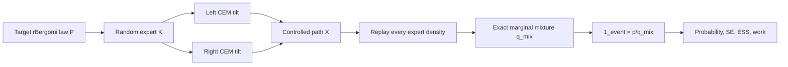

# 현재 모델과 구현 결과 가이드

Date: 2026-07-15

## 1. 결론부터

현재 가장 정확하고 실용적인 모델은 **neural network가 아니라, rBergomi의 두
Brownian driver를 mode별로 이동시키는 exact two-component CEM mixture**다.

Neural VFO, mode별 neural mixture, CEM-anchored residual까지 순서대로 강한
baseline과 비교했지만 모두 CEM mixture보다 효율이 낮았다. 따라서 현재 저장소는
“neural이 이겼다”는 프로젝트가 아니라 다음 두 결과를 가진 검증된 연구 기반이다.

1. controlled rough-volatility path와 exact mixture likelihood를 올바르게 계산한다.
2. 이 terminal two-tail 문제에서는 단순한 CEM mixture가 neural refinement보다
   낫다는 재현 가능한 falsification 결과를 갖는다.

## 2. 우리가 계산하는 문제

rBergomi에서 다음 희귀사건 확률을 계산한다.

$$
p=P(S_T\le 42\;\text{or}\;S_T\ge139),\qquad T=0.5.
$$

일반 Monte Carlo는 사건을 거의 만나지 못한다. Importance sampling은 Brownian
경로를 의도적으로 양쪽 tail로 보내고, 바뀐 확률법칙을 likelihood로 정확히
보정한다.



## 3. rBergomi와 제어 좌표

Rough variance는 과거 Brownian shock 전체를 Volterra kernel로 누적한다.

$$
V_t=\xi_0\exp\left(\eta Y_t-\tfrac12\eta^2t^{2H}\right),
\qquad
Y_t=\sqrt{2H}\int_0^t(t-s)^{H-1/2}dW_s^1.
$$

가격 Brownian은

$$
dB_t=\rho\,dW_t^1+\sqrt{1-\rho^2}\,dW_t^2
$$

이므로 제어는 독립 좌표 `(W1, W2)` 두 개에 적용한다. 첫 좌표는 rough variance와
가격에 동시에 영향을 주고, 둘째 좌표는 가격의 직교 shock을 제어한다.

현재 simulator는 다음을 검증했다.

- BLP hybrid discretization과 `sqrt(2H)` 정규화;
- discrete Wick compensator와 `E[V_t]=xi`;
- target-coordinate Brownian increment 기록;
- bounded adapted two-driver control;
- 같은 경로에서 likelihood replay;
- 제어 0일 때 기존 rBergomi law로의 exact reduction.

## 4. 현재 winning proposal

두 개의 constant expert를 사용한다.

| Expert | `(u1, u2)` | 역할 |
|---|---:|---|
| Left | `(3.8983, -1.6949)` | 낮은 terminal spot 경로 생성 |
| Right | `(0.1658, 3.0675)` | 높은 terminal spot 경로 생성 |

각 expert는 0.5 확률로 선택된다. 단순히 선택된 expert의 likelihood만 사용하는
대신, 생성된 경로에서 두 expert density를 모두 replay한다.

$$
\frac{q_{mix}(X)}{p(X)}
=\sum_{k=1}^2\alpha_k\frac{q_k(X)}{p(X)},
\qquad
\widehat p=\frac1N\sum_{n=1}^N
1_A(X_n)\frac{p(X_n)}{q_{mix}(X_n)}.
$$

`logsumexp`로 계산하므로 underflow에 강하고, balance likelihood는 component-only
estimator보다 극단적인 weight를 줄인다.

## 5. CEM은 무엇을 학습하는가

CEM은 neural network가 아니다. 희귀사건에 기여한 weighted Brownian increments를
사용하여 constant exponential tilt를 반복 갱신한다. 두-driver constant control의
weighted MLE는 본질적으로

$$
u^*\approx\frac{E_w[W_T]}{T}
$$

형태다. Left와 right를 별도로 학습하므로 multimodal 사건에서 평균이 0으로
상쇄되는 문제를 피한다.

## 6. 시도하고 중단한 neural 구조

### VFO memory branch

Volterra history를 별도 kernel feature로 처리하는 구조를 instantaneous feedback과
matched 비교했다. terminal task와 path-dependent pivot 모두에서 사전 gate를 넘지
못했다. 따라서 “rough memory를 넣으면 자동으로 유리하다”는 주장은 기각했다.

### Mode-specialized exact neural mixture

Left/right neural expert와 exact marginal likelihood를 구현했다. Natural MC와 single
neural controller는 이겼지만 strong two-driver CEM mixture보다 약 2.12배
비효율적이었다.

### CEM-anchored residual

마지막으로 CEM을 exact 초기값으로 보존하고 작은 feedback residual만 학습했다.

$$
u^{CAR}=\operatorname{clip}(u^{CEM}+2\tanh f_\theta, -6,6).
$$

초기에는 CEM과 경로·likelihood가 bitwise 동일하다. 하지만 학습 후 결과는 다음과
같다.

| 지표 | CEM mixture | Anchored residual |
|---|---:|---:|
| 단일경로 분산 | 6.075e-4 | 7.200e-4 |
| 경로당 비용 | 2.300e-5 | 3.769e-5 |
| online work | 1.382e-8 | 2.750e-8 |
| contribution ESS fraction | 0.01015 | 0.00923 |

Residual은 평균 분산이 18.5% 높고 추론비용이 63.8% 높았다. Work 기준 5/5
seed에서 패배했고 geometric work-VRF는 0.523이었다. 따라서 추가 neural
architecture search를 중단했다.

## 7. 이론적으로 보장되는 범위

현재 보장은 **구현된 유한 시간격자**에 대한 것이다.

- control은 현재와 과거 상태만 보는 adapted control이다.
- control은 bounded라 discrete exponential likelihood가 유한하다.
- 모든 expert density는 동일 target Brownian 좌표에서 replay된다.
- marginal mixture likelihood를 사용한 hard-event estimator는 선언된 proposal
  law 아래 unbiased다.
- 0 control과 1-component mixture reduction을 테스트한다.

아직 보장하지 않는 것은 다음과 같다.

- `dt -> 0` 연속시간 rare-event estimator의 수렴률;
- rough Volterra equation에 대한 새로운 Föllmer-drift 정리;
- 실제 시장 calibration error까지 포함한 out-of-sample 정확도;
- barrier monitoring bias가 제거된 continuous-barrier 결과;
- 다른 task에서 CEM이 항상 최적이라는 주장.

## 8. 결과를 읽는 법

Controlled event frequency가 커진 것만으로는 성공이 아니다. 반드시

$$
\text{online work}=\operatorname{Var}(Y)\times\text{seconds per path}
$$

를 비교한다. 학습비용이 있으면 반복 query 수에 따라 break-even도 계산한다.

G5에서 확률 추정은 natural MC와 `z=0.951` 차이였고 replay error는
`1.07e-14`였다. 즉 실패 원인은 bias나 density 오류가 아니라 **분산과 계산비용**이다.

## 9. 논문 수준에 대한 현재 판단

현재 결과만으로 “새 neural model이 rough volatility rare-event sampling을
개선한다”는 저명 저널 논문은 제출하면 안 된다. 핵심 neural 가설이 strong
baseline에 의해 반증됐기 때문이다.

그렇다고 연구 기반이 무의미한 것은 아니다. Exact mixture engine, Gaussian oracle,
rBergomi law tests, falsification protocol은 충분히 재사용 가치가 있다. 다음 논문은
네트워크를 더 튜닝하는 것이 아니라 아래 중 하나로 질문을 바꿔야 한다.

1. finite-grid Volterra system에서 multimodal exponential tilting의 오차·분산을
   분석하는 theorem-led 연구;
2. barrier, drawdown, occupation time처럼 terminal constant tilt가 구조적으로
   부족한 path-dependent 실무 문제.

둘 다 CEM mixture, exact marginal likelihood, training-inclusive work, sealed 20+
seed를 필수 baseline으로 유지해야 한다.

## 10. 주요 파일

- `src/physics_engine.py`: controlled rBergomi simulator
- `src/path_integral/rbergomi_mixture.py`: randomized expert simulation과 replay
- `src/path_integral/mixture.py`: exact marginal mixture density
- `src/path_integral/controllers/markov.py`: constant, lean, anchored controls
- `src/training/path_mixture.py`: PI/PICE/J2 training primitives
- `src/training/rbergomi_cem.py`: two-driver CEM
- `experiments/g4_gaussian_mixture_oracle.py`: analytic Gaussian oracle
- `experiments/g4_rbergomi_mixture.py`: neural/CEM mixture comparison
- `experiments/g5_cem_anchored_residual.py`: final residual stop gate
- `docs/phase_reviews/G5_CEM_ANCHORED_RESIDUAL_2026-07-15.md`: 최종 검토서

## 11. 재현 명령

```bash
python -m experiments.g5_cem_anchored_residual \
  --config configs/g5_cem_anchored_residual.yaml \
  --output results/g5_cem_anchored_residual_development_2026-07-15.json

python -m pytest -q
python -m ruff check src tests experiments main.py train_driftnet.py
```
