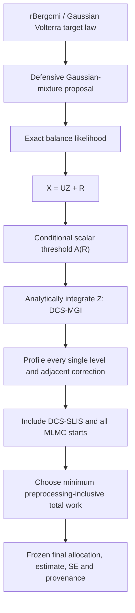

# 현재 모델과 구현 결과 가이드

Date: 2026-07-22

## 1. 결론부터

현재 모델은 신경망 자체가 아니라 **Margin-aware Hybrid DCS-MGI**다. 쉽게 말하면
rough Bergomi 경로에서 희귀사건을 일으키는 핵심 가우시안 방향을 찾아 그 방향은
수치 샘플링하지 않고 정확히 적분한 뒤, 남은 문제에 대해서는 단일레벨 중요도
샘플링과 여러 MLMC 시작점 중 총비용이 가장 작은 구성을 선택하는 모델이다.

이 선택은 사후 설명이 아니라 frozen V4 자격시험의 직접적인 결론이다. 135개
seed-run 중 90개는 가장 미세한 격자의 DCS 단일레벨 방식, 45개는 어떤 형태의
multilevel 방식이 더 낮은 예측 총비용을 보였다. 따라서 현재 근거로는 “항상 MLMC”도,
“항상 단일레벨”도 올바르지 않다.

## 2. 우리가 계산하는 문제

rBergomi와 같은 rough-volatility 모델에서 다음과 같은 매우 작은 확률을 계산한다.

- 만기 가격이 임계값 아래로 내려갈 확률;
- 관측 구간 중 한 번이라도 barrier를 통과할 확률; 그리고
- 개발 단계에서는 hit-plus-occupation 같은 경로 의존 사건.

목표 확률이 `1e-6`이면 일반 Monte Carlo는 8,192개 경로에서 사건을 한 번도 보지
못하는 경우가 흔하다. 사건을 더 자주 만들도록 Brownian 경로의 법칙을 이동시키되,
exact likelihood로 보정하여 원래 확률을 추정하는 것이 importance sampling이다.

현재 논문의 estimand는 **선언된 128-step 유한 시간격자의 확률**이다. 연속 감시
barrier 확률이나 `dt -> 0` 극한을 이미 해결했다고 주장하지 않는다.

## 3. 모델의 네 가지 핵심 부품

### 3.1 Defensive importance sampling

제안분포는 자연분포 성분과 두 개의 이동된 가우시안 성분을 섞는다. 자연분포의
비중 `delta > 0`을 유지하므로 target/proposal likelihood가 `1/delta`를 넘지 않는다.
선택된 component의 likelihood만 쓰지 않고 모든 component를 합한 exact
balance-mixture likelihood를 사용한다. self-normalization은 하지 않는다.

### 3.2 Control-span Gaussian integration, DCS-MGI

표준 가우시안 입력을

`X = U Z + R`

로 분해한다. `Z`는 사건과 proposal control을 직접 움직이는 저차원 좌표이고 `R`은
직교 residual이다. terminal과 discrete barrier 사건은 `R`이 주어지면

`1{Z <= A(R)}`

형태의 스칼라 threshold 사건으로 정확히 바뀐다. 따라서 `Z`를 Monte Carlo로 뽑지
않고 조건부 정규 CDF로 적분한다. 이는 근사적인 soft-event 대체가 아니라 선언된
유한 격자 사건에 대한 정확한 Rao--Blackwellization이다.

### 3.3 Coupled multilevel corrections

격자 `8, 16, 32, 64, 128` step에서 인접한 fine/coarse 값을 같은 fine 확률공간,
proposal, label, likelihood와 가우시안 좌표로 계산한다. 그 결과

`E[Y_L] = E[Y_l0] + sum E[Y_l - Y_(l-1)]`

의 telescoping identity가 유한 격자에서 정확히 유지된다.

### 3.4 Total-work crossover

시작 레벨 `l0`마다 연속 최적할당의 online-work 계수

`K_l0 = (sqrt(V_l0 C_l0) + sum_(l>l0) sqrt(V_delta,l C_delta,l))^2`

를 계산한다. 요청 sampling variance가 `epsilon^2`일 때 비교량은

`W_l0 = P_profile + K_l0 / epsilon^2`

다. 가장 미세한 시작 `l0=L`은 DCS-SLIS이므로 항상 후보에 포함한다. proposal 학습,
profile, tuning 비용은 한 번씩만 포함한다. 사건을 보지 못해 baseline의 경험분산이
0이 된 경우에는 그 방법을 0비용 승자로 만들지 않고 **사용 불가**로 처리한다.

## 4. 전체 구조



현재까지는 `J` 직전의 qualification까지 끝났다. 즉 어떤 구성을 최종 실험에 사용할지
선택하는 profile 연구는 완료됐지만, 그 선택으로 목표 RMSE를 실제 달성하는 대규모
untouched confirmation은 아직 남아 있다.

## 5. V4에서 실제로 확인된 것

V4는 base `(H, eta, rho)=(0.12, 1.1, -0.6)`에서 한 번에 한 파라미터만 바꾼
27개 cell을 사용했다. 각 cell은 5개 독립 seed, level/method당 8,192개 profile
경로, 상대 RMSE 10%, 20%, 30%를 평가했다.

| 결과 | 값 |
|---|---:|
| cell / seed-run | 27 / 135 |
| 독립 reference의 4 combined SE 이내 | 135 / 135 |
| DCS-SLIS 선택 | 90 / 135 |
| full MLMC 선택 | 13 / 135 |
| 중간 MLMC 시작 선택 | 32 / 135 |
| reference 최대 absolute z | 2.466 |

H만 0.30으로 바꾼 smoother regime에서 20개 run 중 13개가 full MLMC를 선택했다.
다른 regime은 주로 DCS-SLIS를 선택했다. 이는 smoother path에서 correction decay가
MLMC 비용을 정당화할 수 있다는 유력한 메커니즘 증거다. 두 H 값과 제한된 event를
본 결과이므로 H에 대한 보편 정리는 아니다.

base 네 cell에서 학습비용을 포함한 CEM-SLIS와 비교했을 때, 상대 RMSE 20%의
CEM/best-DCS 기하평균 총비용 비율은 1.47x--1.89x였다. CEM이 없는 나머지 cell까지
이 결과를 확장해서 주장하면 안 된다.

## 6. M7 실패와 V4 통과를 함께 읽는 법

M7 V3는 640개 cell을 모두 계산했고 DCS target attainment 91.41%, 254개
matched-RMSE cell에서 raw/DCS work ratio 16.52x를 얻었다. 그러나 한 Windows
checkpoint `PermissionError`가 사전 선언된 no-failure gate에 남았고 임시 파일에서
수동 복구했으므로 strict headline은 실패다. 이 수치는 recovered evidence이지
untouched confirmation이 아니다.

또한 M7의 low/base/high regime은 H, eta, rho를 동시에 바꿨다. V4는 이 confounding을
one-factor-at-a-time 설계로 제거했고, strongest single-level comparator와 base CEM을
추가했다. V4의 pass는 M7 strict fail을 소급해서 pass로 바꾸지 않는다.

## 7. 선택한 이론과 보장 범위

V4에 맞는 이론은 **margin-localized threshold stability**다. fine/coarse threshold의
분모가 `kappa` 이상인 good event에서는 numerator error, denominator error,
mesh/rank enrichment defect로 threshold 차이를 제한한다. 분모가 작아지는 bad event는
버리지 않고 확률항으로 moment bound에 남긴다.

그 결과 defensive likelihood 아래에서 DCS correction의 second moment는 good-event
threshold defect에 대해 quadratic bound를, raw correction은 linear bound를 갖는다.
이 정리는 결정론적 비율 부등식, max/min aggregation, bad-event split 수준에서 증명·구현·
테스트됐다.

아직 증명하지 않은 model-level 항목은 다음과 같다.

- rBergomi coefficient error와 small active slope의 수렴률;
- rare threshold에 충분히 균일한 barrier mesh-enrichment rate;
- occupation 사건의 grid-dependent rank-change rate;
- continuous-monitoring weak-bias rate; 그리고
- 모든 파라미터와 사건에서의 uniform superiority.

따라서 현재 rate 정리는 명시적인 조건부 정리이지 경험적 regression을 증명으로
포장한 것이 아니다.

## 8. 여기서 “path integral”과 “neural”의 의미

현재 모델은 Feynman 양자 경로적분을 사용하지 않는다. 경로 전체 위의 확률측도 변환,
조건부 적분, multilevel telescoping을 사용한다는 의미의 path-measure estimator다.
검증되지 않은 양자 용어를 추가하면 수학적 정합성과 논문 신뢰도가 오히려 나빠진다.

신경망 기반 VFO와 residual controller는 저장소의 연구 역사에서 강한 baseline에
패배하여 중단됐다. 향후 neural component를 넣는다면 여러 파라미터·event에 대해
proposal을 amortize하여 **학습비용 포함 총비용**을 줄이는 경우에만 정당하다. 현재
exactness theorem과 V4 성과를 neural contribution이라고 부르면 안 된다.

## 9. 지금 논문 수준은 어디인가

현재는 **박사급 연구 프로토타입이자 강한 working-paper core**다. exactness,
falsification discipline, 독립 감사, 강한 baseline 일부, 새로운 localized analysis를
갖췄다. 하지만 top-tier journal의 최종 논문이라고 부르기에는 다음이 부족하다.

1. profile로 예측한 비용이 아니라 실제 achieved-RMSE allocation;
2. headline cell당 10--20개 이상의 독립 cluster;
3. 모든 headline cell의 task-tuned SLIS/CEM 또는 frozen amortized baseline;
4. 독립 머신에서의 주 결과 재현;
5. 실제 wall time과 operation proxy의 동시 보고;
6. continuous-time bias budget 또는 제목부터 결론까지 일관된 finite-grid 범위; 그리고
7. terminal부터 시작하는 rBergomi model-level rate theorem.

이 항목을 새 seed namespace로 사전 동결해 성공하면 SIAM Journal on Financial
Mathematics나 강한 computational/quantitative finance journal에 경쟁력 있는 논문이
될 가능성이 있다. 더 높은 수학 저널을 목표로 한다면 model-level rate와 weak-bias
이론이 핵심이고, ML/AI venue를 목표로 한다면 amortized neural proposal이 강한
baseline을 training-inclusive work로 이겨야 한다.

## 10. 주요 파일과 재현

- `src/path_integral/threshold_stability.py`: localized threshold/moment bound
- `src/path_integral/multilevel_crossover.py`: SLIS/MLMC total-work 선택
- `src/path_integral/rbergomi_dcs_mlmc.py`: rBergomi DCS threshold adapter
- `src/path_integral/rbergomi_mlmc_sampler.py`: coupled sampler
- `experiments/g11_v4_crossover_qualification.py`: frozen V4 실행기
- `experiments/g11_v4_crossover_audit.py`: 독립 결과 재계산 감사기
- `docs/theory/G11_MARGIN_LOCALIZED_THRESHOLD_STABILITY.md`: 이론
- `docs/audits/G11_V4_CROSSOVER_QUALIFICATION_DECISION_2026-07-22.md`: 최종 해석

```bash
python -m pytest -q

python -m experiments.g11_v4_crossover_audit \
  --config configs/g11_v4_crossover_qualification.yaml \
  --result results/g11_v4_crossover_qualification_v1_2026-07-22.json \
  --output results/g11_v4_crossover_audit_local.json
```
