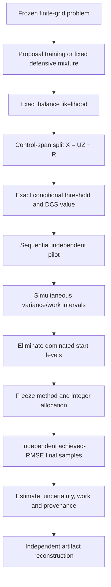

# G11 V5 Submission-Grade Implementation Plan

Date: 2026-07-22

Status: implementation-ready design; **not yet frozen**

Parent evidence:

- M7 V3: 640-cell recovered confirmatory evidence; strict headline failed
- V4: 27-cell parameter-separated crossover qualification passed and independently audited

Target model:

> **Margin-aware Hybrid DCS-MGI with uncertainty-aware sequential crossover and
> achieved-RMSE execution**

## 0. Executive decision

V5 must not be another architecture search. The current exact finite-grid estimator
is already mathematically coherent. The remaining blockers are:

1. the rough-Bergomi model-level threshold-rate theorem is incomplete;
2. V4 predicted work from fixed profiles but did not execute the requested RMSE;
3. the crossover decision ignores uncertainty in estimated variances;
4. CEM was trained on only four base cells;
5. operation work lacks an independent hardware reproduction;
6. the main estimand is a fixed 128-step grid; and
7. novelty remains provisional against the closest smoothing and hierarchical-IS
   literature.

V5 resolves these blockers in a strict order: **claim boundary -> theory diagnostics
-> model theorem -> robust selector -> achieved-RMSE engine -> strong baselines ->
reference construction -> qualification -> untouched confirmation -> independent
reproduction -> manuscript audit**.

No research plan can guarantee that an unknown theorem is true or that a frozen
experiment will be positive. “Error-free” therefore means that every assumption,
estimand, random-data dependency, failure mode, and negative result is visible and
auditable. Failed gates narrow the claim; they are never retuned away.

## 1. Publication objective and claim ladder

### 1.1 Primary submission claim

The primary paper will target **finite-grid rare-event probabilities under Gaussian
rough-Volterra dynamics**. Its candidate contribution is the combination of:

1. exact marginalization of the event-driving deterministic proposal-control span;
2. an exact residual balance-mixture likelihood with a defensive pathwise bound;
3. a common-coordinate scalar-threshold correction;
4. margin-localized rough-Volterra threshold analysis; and
5. an uncertainty-aware choice between DCS-SLIS and admissible DCS-MLMC starts,
   followed by an independently evaluated achieved-RMSE run.

The paper will not claim that conditional smoothing, common-likelihood MLIS, standard
MLMC allocation, balance mixtures, or preprocessing-inclusive crossover is novel in
isolation.

### 1.2 Claim tiers

| Tier | Required result | Allowed claim |
|---|---|---|
| S0 | existing V4 evidence | PhD-level research prototype and qualification result |
| S1 | achieved-RMSE, complete baselines, independent reproduction | submission-grade finite-grid computational paper |
| S2 | terminal model-level rate theorem | theorem-led rough-Volterra finite-grid paper |
| S3 | barrier active-time and mesh theorem | theorem-led terminal and discrete-barrier paper |
| S4 | continuous-target bias theorem/study | continuous-time extension |

S1 is mandatory. S2 is the minimum target for a strong mathematical-finance or
numerical-analysis submission. S3 materially strengthens the paper. S4 is optional:
if it does not pass, the title, abstract, theorems, tables, and conclusions must all
say “finite-grid” or “discretely monitored.”

### 1.3 Scope decisions

- **Primary tasks:** terminal downside and discretely monitored downside barrier.
- **Primary probabilities:** approximately `1e-4` and `1e-6`.
- **Primary model:** rBergomi with one-factor-at-a-time changes in `H`, `eta`, and
  `rho`.
- **Occupation:** supplementary only until the grid-dependent rank-change theorem
  passes.
- **Neural proposal:** excluded from V5. It may return only as a separately frozen
  amortization study after S1, and only if training-inclusive total work improves.
- **Quantum/Feynman language:** prohibited; the method is a controlled probability
  path-measure estimator.

## 2. Limitation-to-resolution matrix

| Current limitation | Root cause | V5 resolution | Pass evidence | Failure action |
|---|---|---|---|---|
| V4 work is predicted | fixed 8,192-path profiles only | execute integer allocations with independent final samples | achieved-RMSE artifact | no speedup claim |
| crossover is noisy | plug-in variance minimum and optimizer's curse | simultaneous intervals and sequential candidate elimination | selector coverage/regret oracle | choose DCS-SLIS default or enlarge pilot |
| only five V4 repeats | qualification budget | 20 primary algorithm clusters; power analysis before freeze | frozen sample-size report | increase before freeze only |
| CEM only on base | laptop qualification scope | fresh task-tuned CEM training in every primary cell and cluster | complete training/evaluation ledger | cell cannot enter headline |
| crude MC has zero-hit pilots | rarity exceeds pilot resolution | analytic cost projection plus capped execution; zero hit is censored, never zero cost | cap and exact binomial interval | report lower bound only |
| operation proxy only | hardware constants ignored | operation and wall-time ledgers; randomized benchmark order | two-environment reproduction | restrict claim to operation work |
| one laptop environment | external-validity gap | clean Windows CPU and independent Linux environment | cross-environment agreement | investigate before submission |
| fixed 128-step estimand | no continuous bias control | explicit finite-grid primary; separate continuous-target track | bias theorem/study or finite-grid wording | prohibit continuous claim |
| model-level rate conditional | denominator/active-index/mesh effects | terminal inverse-moment theorem, then barrier localization | proof audit plus diagnostics | retain conditional theorem |
| barrier performance weaker | early small slopes and new monitoring points | active-time localization and mesh-enrichment diagnostics | predeclared decay gates | terminal-only theorem headline |
| occupation rank changes | grid-dependent order statistic | explicit rank-coupling module and theorem | rank-defect rate gate | supplementary empirical result only |
| M7 parameter confounding | H, eta, rho changed together | OAT primary/secondary matrices | config audit | no causal parameter language |
| M7 checkpoint incident | Windows replace failure | durable atomic writer and fault-injection suite | crash/resume equivalence | no untouched run |
| novelty provisional | close prior work | reproducible search log and external expert challenge | signed claim ledger | narrow or abandon novelty claim |
| hybrid gain modest at loose RMSE | all levels profiled before selection | sequential profiling with early elimination | total selection-work reduction | report robustness, not speed |

## 3. Non-negotiable mathematical and experimental contracts

1. Every method estimates the **same declared estimand**.
2. Target/proposal likelihood orientation is `dP/dQ`, never its reciprocal.
3. All estimators use ordinary means. Self-normalization is forbidden in evaluation.
4. CEM may use normalized weights for proposal training only; final estimation remains
   ordinary importance sampling.
5. DCS and raw defensive estimators retain a positive natural component.
6. Exact DCS-MGI is restricted to deterministic proposal means whose price-driver
   shifts lie in one common, oriented positive rank-one span. Feedback controls or a
   higher-rank proposal require a new likelihood/marginalization theorem.
7. A fine/coarse correction owns one fine probability space and one common
   likelihood.
8. Pilot, selector, proposal training, reference, final, hardware benchmark, and
   audit seed namespaces are disjoint.
9. Data-dependent pilots and selected candidates are discarded from final means.
10. Optional stopping is allowed only in the pilot/selection phase. Final allocations
   are fixed before final samples are drawn.
11. A zero empirical variance or zero event count cannot produce zero projected work.
12. Shared problem-calibration work is reported separately; method-specific
    preprocessing is included exactly once.
13. Resource-censored methods are not included in matched-RMSE speedup ratios.
14. Wall-time, operation work, CPU time, retry work, and failed work remain separate
    ledger entries.
15. No artifact produced from a dirty worktree can be confirmatory.
16. No post-freeze threshold, cell, seed count, gate, or comparator may be changed.

## 4. V5 architecture

### 4.1 User-facing method contract

Inputs:

- rBergomi parameters and maturity;
- finite monitoring grid;
- terminal or barrier event definition;
- absolute sampling-SE target or nominal probability plus relative-RMSE target;
- resource cap; and
- reproducibility protocol ID.

Outputs:

- selected start level and reason;
- finite-grid probability estimate;
- standard error and confidence interval;
- design and empirical sampling variance;
- target-attainment status;
- training, selection, final, retry, wall and operation work;
- likelihood/weight diagnostics;
- resource-censoring status; and
- source, config, input, seed-ledger and result hashes.

## 5. Work package T: model-level theory

### 5.1 T0: freeze notation and target law

Write `docs/theory/G11_V5_THEOREMS.md` before adding production code. It must define:

- the target finite-dimensional Gaussian vector at every level;
- deterministic mixture shifts and weights;
- the orthonormal control span;
- the residual target and proposal laws;
- terminal and barrier threshold maps;
- embedded coarse indices and mesh enrichment;
- the random pilot sigma-field; and
- conditional versus unconditional unbiasedness after method selection.

Every theorem must state whether constants depend on `H`, `eta`, `rho`, rarity,
barrier distance, maturity, defensive weight, or level.

### 5.2 T1: terminal threshold theorem

For the terminal event, derive the affine representation

`log(S_T^ell) = a_ell(R_ell) + b_ell(R_ell) Z`, with `b_ell > 0`,

and threshold

`A_ell = (log(B) - a_ell) / b_ell`.

The proof must be decomposed into independently testable propositions:

1. **Direction regularity:** verify that the oriented positive control direction forms
   grid-compatible quadrature weights, for example uniform upper/lower bounds after
   the correct `sqrt(h)` scaling. Strict positivity on each finite grid alone is not
   a uniform-in-level bound.
2. **Coefficient coupling:** establish `L^p` bounds for `a_f-a_c` and `b_f-b_c`
   under the implemented BLP/FFT coupling.
3. **Uniform moments:** bound the numerator envelope and required positive moments.
4. **Small-slope control:** prove uniform negative moments or a lower-tail bound for
   `b_ell`. A deterministic lower bound must not be assumed.
5. **Localized ratio:** apply the existing `kappa`-good-event inequality.
6. **Optimized localization:** choose `kappa(h)` only after balancing good-event and
   bad-event terms; do not select it by fitted test performance.
7. **DCS moment rate:** derive an upper bound for the adjacent correction second
   moment.
8. **Bias corollary:** if a continuous terminal target is used, separately bound the
   discretization bias. Finite-grid exactness alone is not a weak-error theorem.

Potential proof route for the positive slope is to express it as a positive weighted
sum/integral of lognormal volatility factors and use Jensen or Gaussian exponential
moment bounds to control inverse moments. The proof must match the implemented
normalization and direction regularity; a bound for a different direction or
discretization is inadmissible.

**T1 gate:** pass only if every assumption is mapped to a runtime diagnostic or is
explicitly declared model-only. A regression of empirical slopes is supporting
evidence, never the proof.

### 5.3 T2: discrete-barrier active-time theorem

For a downside barrier below initial spot, the threshold is a maximum over monitoring
times. The proof must separate:

1. common-grid coefficient error;
2. fine-grid monitoring enrichment;
3. small slopes; and
4. changes in the maximizing time.

Introduce an active-time event

`A_tau = {the maximizing threshold occurs at time >= tau}`.

Required lemmas:

- an early-time exclusion bound using the positive initial log-distance to the
  barrier;
- inverse-moment or lower-tail control for slopes on `[tau,T]`;
- a modulus-of-continuity bound for the threshold candidate process;
- a bound for the new-monitoring-point enrichment defect; and
- a final good/bad-event moment decomposition.

The barrier threshold must never be treated as a fixed-cardinality maximum when the
fine grid contains additional monitoring points.

**T2 gate:** if active-time or enrichment rates cannot be proved, barrier results
remain achieved-RMSE computational evidence only. They may not inherit the terminal
rate theorem.

### 5.4 T3: occupation rank theorem, optional

Occupation uses a grid-dependent order statistic. Implement the rank map and its
coarse/fine discrepancy explicitly. A fixed-rank Lipschitz lemma is insufficient when
the number of monitoring points changes.

**T3 gate:** occupation enters the main paper only if the rank-change defect is
bounded and empirically non-degenerate across the primary parameter range. Otherwise
it remains a documented extension.

### 5.5 T4: selected-estimator unbiasedness

Let `S` be a start level selected using the pilot sigma-field. Each candidate
telescopes to the same finest-grid target. Prove

`E[hat p_S | pilot] = p_L`

when final samples are independent of the pilot. Then integrate over the pilot.

The proof must also cover a CEM proposal trained on a separate training sigma-field:
conditional on the frozen proposal, the exact likelihood estimator is unbiased.

### 5.6 T5: robust crossover oracle inequality

For each candidate start `s`, define true total work `W_s` and simultaneous pilot
intervals `[L_s,U_s]`. On the event that all intervals cover,

- eliminate `s` only if `L_s > U_best` or the predeclared tolerance variant;
- select the smallest upper bound after the final pilot look; and
- prove a finite-candidate regret bound for the selected method.

At minimum, if every plug-in work value has relative error at most `gamma < 1`, prove

`W_selected / min_s W_s <= (1+gamma)/(1-gamma)`.

This is a deterministic conditional guarantee. A probability statement requires
valid simultaneous intervals. Use a finite predeclared look schedule with Bonferroni
or a proved confidence-sequence construction; do not reuse a fixed-sample interval
after optional stopping.

### 5.7 T6: continuous-target track

Continuous-time claims are split by task:

- **Terminal:** combine coefficient convergence, threshold anti-concentration and
  conditional-CDF Lipschitz continuity.
- **Barrier:** additionally control continuous versus discrete monitoring. A
  fine-grid extrapolation alone is empirical evidence, not a proof.

If T6 fails, the primary estimand remains the fixed finite grid. This is a legitimate
practical problem, not a hidden deficiency, provided the scope is explicit everywhere.

## 6. Work package D: theorem diagnostics and instrumentation

Add `src/path_integral/rbergomi_threshold_diagnostics.py` with immutable records for:

- fine/coarse intercept and slope arrays;
- numerator and denominator errors;
- active barrier index/time;
- embedded-coarse and new-point maxima;
- mesh-enrichment defect;
- threshold difference;
- good-event indicators for a predeclared `kappa` grid; and
- full/residual likelihood maxima and reconstruction errors.

Add `experiments/g11_v5_threshold_diagnostics.py` to estimate, by level and seed:

- `E|D_n|^p`, `E|D_b|^p`;
- negative slope moments;
- `P(b_active < kappa)`;
- early-active probability;
- mesh-defect moments;
- DCS/raw correction moments and kurtosis; and
- fitted exponents with common level windows.

Diagnostics support falsification and proof targeting. They must not be used to
replace a missing proof.

Tests:

1. terminal has exactly one candidate and zero mesh defect;
2. barrier enrichment is nonnegative and reconstructs the full maximum;
3. active indices agree with brute-force threshold evaluation;
4. all good-event inequalities hold pathwise;
5. threshold reconstruction agrees bitwise with the estimator path; and
6. extended thresholds (`+/-inf`) are excluded from rate fits but remain valid events.

## 7. Work package S: uncertainty-aware sequential crossover

### 7.1 New module

Create `src/path_integral/robust_crossover.py` with:

- `BoundedMomentInterval`;
- `LevelProfileInterval`;
- `CandidateWorkInterval`;
- `SequentialCrossoverState`;
- `update_profile_intervals`;
- `candidate_work_intervals`;
- `eliminate_dominated_candidates`; and
- `freeze_crossover_decision`.

### 7.2 Pilot schedule

Use geometric looks such as `n = 2^k`, fixed in config. All looks use cumulative
statistics from the same pilot stream. The maximum number of looks, familywise error
level, minimum nonzero information, and maximum pilot work are frozen.

DCS single-level values lie in `[0,1/delta]`; common-likelihood DCS corrections lie in
`[-1/delta,1/delta]`. Use this boundedness to construct auditable moment or variance
intervals. Do not apply the same bounded interval to an undefended single-shift CEM
estimator.

The first implementation uses a conservative finite-sample construction rather than
assuming Gaussian profile noise. For `X in [-M,M]`, construct simultaneous Hoeffding
intervals for `mu=E[X]` and `m2=E[X^2]`, noting that `X^2 in [0,M^2]`. If their
intervals are `[L_mu,U_mu]` and `[L_2,U_2]`, use

`L_V = max(0, L_2 - max(|L_mu|,|U_mu|)^2)`

and

`U_V = max(0, min(M^2, U_2 - min_(u in [L_mu,U_mu]) u^2))`.

Clamp only to the mathematically valid variance range. Divide the familywise alpha
over moments, levels, methods and the finite look schedule before the run. A later
empirical-Bernstein replacement is allowed only after its optional-stopping coverage
is proved and oracle-tested.

Operation cost is deterministic from executed work units and can drive selection.
Wall time is too noisy for hard elimination; use it as a confirmatory practical
metric unless a valid timing interval is implemented.

### 7.3 Candidate elimination

At every look:

1. update simultaneous variance/work intervals;
2. calculate lower and upper total work for all surviving starts;
3. eliminate candidates whose lower bound exceeds the best upper bound by the frozen
   tolerance;
4. stop when one candidate remains, when all survivors are practically equivalent,
   or at the pilot cap; and
5. if uncertainty remains at the cap, choose the minimum upper-bound candidate with a
   declared tie-break favoring the simpler DCS-SLIS endpoint.

Every eliminated candidate and reason is serialized. Selection work is charged to
the chosen hybrid method.

### 7.4 Selector validation

Use Gaussian oracle cases where every candidate variance and cost is known. Include:

- SLIS clearly optimal;
- full MLMC clearly optimal;
- intermediate start optimal;
- nearly tied candidates;
- misleading small first look;
- zero observed corrections despite nonzero true variance; and
- preprocessing cost reversing the online optimum.

Qualification gate:

- simultaneous interval coverage at least the declared level in oracle simulation;
- no invalid elimination on the coverage event;
- median selection regret <= 10%;
- 90th percentile regret <= 25%; and
- sequential selection work below the fixed-all-level V4 profile work in at least
  75% of non-H=0.30 qualification runs.

The numerical percentages are design gates, not theoretical constants. They may be
changed only before the qualification config is frozen.

## 8. Work package A: achieved-RMSE allocation engine

### 8.1 API

Create `src/path_integral/hybrid_allocation.py` with:

- `HybridTarget`;
- `HybridPreparedRun`;
- `HybridCheckpoint`;
- `HybridResult`;
- `prepare_hybrid_run`; and
- `execute_hybrid_run`.

`prepare_hybrid_run` performs proposal training if required, sequential selection,
and discarded allocation pilots. It freezes:

- chosen method/start level;
- integer sample count per term;
- operation-work cap;
- final seed namespace; and
- checkpoint identity.

`execute_hybrid_run` may resume, but it may not revise selection or allocation after
seeing final samples.

Selection-pilot samples for surviving terms may be reused to estimate the selected
allocation because both operations occur in the same pre-final sigma-field. They are
recorded and charged once, never inserted into the final estimator. Samples spent on
eliminated candidates remain preprocessing work.

### 8.2 Allocation formula

For selected terms with variances `V_l`, costs `C_l`, and target sampling variance
`eps^2`, start with the continuous allocation

`n_l proportional to sqrt(V_l/C_l) * sum_j sqrt(V_j C_j) / eps^2`.

Then:

1. use simultaneous upper variance estimates or a frozen safety factor;
2. round upward to integer counts;
3. enforce minimum final samples per term;
4. recompute the design variance after rounding;
5. increase counts until the design target is met;
6. apply the resource cap before drawing final seeds; and
7. mark infeasible allocations as resource-censored rather than silently truncating.

### 8.3 Target definition

Use a predeclared absolute sampling-SE target

`eps = relative_RMSE * p_nominal`.

`p_nominal` is fixed by the experimental cell, not re-estimated from pilot or final
samples. Report achieved relative error again using the independent reference
probability. This prevents an unusually small pilot estimate from loosening its own
accuracy requirement.

### 8.4 Final inference

For each algorithm cluster report:

- estimate and termwise estimates;
- design and empirical sampling variance;
- standard error and confidence interval;
- reference z-score;
- requested and achieved relative sampling RMSE;
- target-attainment status;
- allocation and censoring status; and
- complete work ledger.

Across clusters report empirical RMSE against the independent reference, interval
coverage, work distributions, and failure frequency. Estimator-reported SE and
across-cluster RMSE must both be shown.

For DCS, report both the usual variance-based asymptotic interval and a conservative
bounded-contribution interval with error probability divided across independent
level terms. For pure single-shift CEM, the likelihood is not defensively bounded;
do not reuse the DCS finite-sample interval. Use predeclared independent evaluation
batches, asymptotic/batch intervals, tail diagnostics, and across-cluster coverage.
Every interval must be labeled as finite-sample or asymptotic.

## 9. Work package B: strong comparator suite

### 9.1 Mandatory matched estimators

| ID | Method | Mandatory scope | Cost treatment |
|---|---|---|---|
| B0 | analytic Gaussian/Black-Scholes oracle | unit/integration cases | not a performance baseline |
| B1 | crude finest-grid MC | feasible cells plus capped rare cells | zero hits censored; analytic projection shown |
| B2 | raw defensive SLIS/MLMC | all primary cells subject to cap | pilot and final work included |
| B3 | DCS-SLIS | all primary cells | full profile/allocation work included |
| B4 | fixed full DCS-MLMC | sentinel cells | full profile/allocation work included |
| B5 | V5 Hybrid DCS-MGI | all primary cells | training/selection/final/retry included |
| B6 | task-tuned piecewise CEM-SLIS | every primary cell and cluster | fresh training and evaluation work included |
| B7 | defensive CEM mixture | every primary cell if qualification passes | natural component and training included |
| B8 | published numerical-smoothing specialization | oracle/shared monotone tasks | equivalence stated where identical |

### 9.2 CEM protocol

For every primary cell and algorithm cluster:

1. allocate a fresh training seed;
2. train without evaluation data;
3. freeze the fitted control and its hash;
4. evaluate with an independent seed;
5. include failed iterations and training work;
6. record likelihood-tail, ESS, maximum contribution and normalization diagnostics;
7. retain pure single-shift CEM as the strong variance baseline; and
8. qualify a defensive CEM variant separately for robustness.

Twenty evaluation runs reusing one lucky trained proposal are not twenty independent
algorithm runs. Either retrain per cluster or use a hierarchical analysis whose top
level is the independent training replicate. V5 uses retraining per primary cluster.

### 9.3 Crude zero-event handling

For Bernoulli crude MC, the theoretical variance is `p(1-p)`. Use the nominal or
reference probability only for an explicitly labeled cost projection. In execution:

- a zero-hit pilot does not yield a variance estimate of zero for allocation;
- use an exact binomial upper interval or a frozen conservative bound;
- run only to the predeclared cap; and
- report the resulting work ratio as censored or a lower bound.

### 9.4 RQMC qualification, optional but recommended

Implement `src/path_integral/rqmc_balance_mixture.py` using independent scrambled
Sobol replicates. Stratify by mixture component and retain the full balance-mixture
denominator. Error bars come from independent scrambles, not points within one
scramble.

RQMC enters the paper only if:

- a Gaussian oracle confirms unbiasedness over scrambles;
- component weights and deterministic allocation are handled exactly;
- all setup/scramble work is counted; and
- it is evaluated on the same finite-grid estimand.

### 9.5 Closest published methods

The numerical-smoothing MLMC method is a mandatory conceptual comparator. On tasks
where both methods reduce to the same one-dimensional Gaussian CDF, state the
equivalence rather than presenting a duplicate implementation as an independent win.

The 2026 hierarchical occupation-time IS paper already contains SLIS/MLIS crossover,
common likelihood, and preprocessing-aware work. Reproduce one published benchmark
if feasible. A matched HJB comparison on non-Markovian rBergomi is required only if a
finite-dimensional Markovian lift is accurate enough and all lift/PDE costs are
included; otherwise document the model mismatch explicitly.

## 10. Work package R: independent reference probabilities

Create `experiments/g11_v5_reference.py` and
`configs/g11_v5_reference_development.yaml`.

### 10.1 Reference contract

For every primary cell, reference standard error must satisfy

`SE_reference <= 0.1 * min_requested_sampling_SE`.

The reference uses a seed namespace disjoint from all proposal training, selection,
and final runs. It is generated before final confirmation and stored with its own
source tag and audit.

### 10.2 Cross-checks

- `eta=0` rBergomi reduces to constant-volatility Black-Scholes terminal and barrier
  oracle cases.
- Actual rBergomi references use a high-accuracy DCS construction and an independent
  estimator cross-check on sentinel cells.
- Reference disagreement above four combined SE blocks the cell.
- A calibration miss is not repaired after final freeze; it is either excluded before
  freeze or retained with its actual probability and absolute-SE target.

### 10.3 Reference leakage prevention

Reference values may define absolute error budgets and assess final results. They may
not tune proposal controls, select a method using final seeds, remove an unfavorable
cell, or redefine success after the result is seen.

## 11. Experimental design

### 11.1 Primary headline matrix

Use three H regimes with eta and rho held fixed:

- `H=0.07`;
- `H=0.12` base; and
- `H=0.30`.

Cross with:

- terminal and discrete barrier;
- nominal probabilities `1e-4` and `1e-6`; and
- 20 independent algorithm clusters.

This gives 12 primary cells and 240 algorithm clusters per mandatory method at the
primary RMSE.

Primary relative RMSE: `20%` on all 12 cells.

Stress relative RMSE: `10%` on six predeclared sentinel cells:

1. base terminal `1e-4`;
2. base terminal `1e-6`;
3. base barrier `1e-4`;
4. base barrier `1e-6`;
5. H=0.07 barrier `1e-6`; and
6. H=0.30 barrier `1e-6`.

This provides actual multi-RMSE evidence without multiplying every expensive cell by
four.

### 11.2 Secondary OAT robustness matrix

At 20% RMSE, retain the valid V4 eta and rho cells with 10 independent clusters:

- `eta=0.8`, `eta=1.4`;
- `rho=-0.3`, `rho=-0.85`; and
- terminal/barrier at `1e-4` and valid `1e-6` cells.

Secondary results support robustness, not the primary superiority endpoint. The
invalid rho `-0.85` barrier `1e-6` calibration remains excluded unless a new
pre-final calibration protocol is completed and frozen before reference generation.

### 11.3 Sentinel all-start study

On the six RMSE sentinels, execute every DCS start `l0=0,...,L` with independent final
seeds. This validates actual selector regret. On other cells execute the selected
hybrid, DCS-SLIS, raw defensive, and CEM baselines.

### 11.4 Power and sample size

Implement `experiments/g11_v5_power_analysis.py` using only M7/V4 qualification data.
Freeze before final execution:

- the primary scalar endpoint;
- minimum scientifically meaningful work ratio;
- cluster count;
- one-sided alpha;
- expected power; and
- maximum resource budget.

If 20 clusters do not provide at least 80% projected power for the primary endpoint,
increase the count before freeze or weaken the proposed claim. Never change sample
size after inspecting final outcomes.

## 12. Statistical analysis plan

### 12.1 Primary endpoint

Fix the primary analysis set before the final tag. For cluster `k`, form an
equal-cell-weighted geometric mean of **total operation work**

`total_work_CEM / total_work_Hybrid`

over all 12 primary cells. Both methods are prepared against the same frozen absolute
sampling-variance target. No cell or cluster is dropped because of its observed
estimate, work ratio, or empirical target-attainment result. The primary headline
requires:

1. every predeclared CEM and Hybrid run completes its frozen allocation without
   resource censoring;
2. a one-sided 95% cluster-level lower confidence bound above `1.0`; and
3. a predeclared practically meaningful lower bound, proposed as `1.20`, if power
   analysis supports it.

Accuracy is a separate co-required gate: a favorable work ratio cannot survive a
failed accuracy gate. If censoring prevents the complete primary endpoint, the
headline fails and censored lower bounds are reported only as diagnostics. Do not
replace the frozen set with a post-hoc matched subset or impute a finite speedup.

Define

`R_k = (1/12) sum_cell log(total_work_CEM / total_work_Hybrid)`.

Unless the pre-final power analysis rejects it, the primary interval is the one-sided
Student-t lower interval for `E[R_k]`, exponentiated back to a geometric ratio. A
fixed-seed cluster bootstrap and a signed-rank analysis are sensitivity checks, not
replacement endpoints selected after inspection. If qualification evidence makes the
t-based endpoint untenable, choose and document a different endpoint before the final
tag.

### 12.2 Accuracy gates

- At least 95% of hybrid estimates must lie within four combined SE of the reference.
- Coverage on analytic-oracle experiments must be compatible with nominal 95% under
  an exact binomial interval. For rBergomi cells sharing an estimated reference,
  report a cluster-resampled coverage interval with reference uncertainty; do not
  call the pooled count an exact binomial experiment.
- For each primary cell, form the across-cluster empirical RMS error against the
  independent reference. Its predeclared one-sided 95% upper interval must not exceed
  `sqrt((1.25*eps)^2 + SE_reference^2)`; the `1.25` tolerance must be confirmed or
  replaced by power analysis before freeze.
- No serialized exactness or likelihood-normalization failure is allowed.

### 12.3 Selector gates

On all-start sentinels report:

- selected/realized-oracle work ratio;
- selection frequency by start level;
- selection preprocessing fraction;
- wrong-elimination frequency; and
- regret versus DCS-SLIS and full MLMC.

The realized oracle is diagnostic because it is chosen after observing evaluation
profiles. It is not an estimator available to a real user.

### 12.4 Multiplicity

There is one primary endpoint. Per-cell comparisons are secondary and use a frozen
Holm correction or simultaneous cluster bootstrap. Exploratory subgroup plots are
labeled exploratory. No subgroup becomes the headline after inspection.

### 12.5 Heavy-tail diagnostics

For every IS method record:

- empirical second and fourth moments where finite;
- contribution ESS;
- maximum likelihood and maximum absolute contribution;
- top 1% contribution share;
- kurtosis; and
- batch stability.

Diagnostics do not authorize trimming, Winsorization, or self-normalization of final
estimates.

## 13. Work and wall-time accounting

### 13.1 Ledger categories

Every method records:

1. shared problem setup;
2. proposal training;
3. crossover selection;
4. allocation pilot;
5. final sampling;
6. retries and failed work;
7. serialization/checkpoint work;
8. wall time;
9. process CPU time; and
10. peak memory.

Shared threshold calibration is reported but excluded symmetrically from method
ratios. Method-specific proposal training and selection are included.

### 13.2 Timing protocol

- pin thread counts and record environment variables;
- warm up each code path using a separate benchmark seed;
- randomize method execution order within a block;
- do not run competing methods concurrently;
- use identical hardware power settings;
- report median and distribution across blocks;
- record compilation/cache warm-up separately; and
- state the intended amortization scenario.

### 13.3 Two environments

Environment A is the current Windows laptop CPU. Environment B is a clean Linux
machine or container with a locked dependency manifest. GPU evidence is optional and
may enter only after CPU/GPU estimates agree within combined numerical tolerance and
GPU wall time improves by a predeclared factor.

## 14. Continuous-time and practical-use tracks

### 14.1 Safe finite-grid route

The primary application is a discretely monitored risk event. The API requires the
monitoring grid as part of the estimand. This route can reach S1/S2 without claiming
continuous monitoring.

### 14.2 Terminal continuous-target route

After T1, add a hierarchy with separately budgeted bias and sampling tolerances.
Estimate bias on levels beyond the final sampling grid using independent seeds. A
fitted slope is reported as evidence; a complexity theorem requires the proved weak
rate.

### 14.3 Barrier continuous-target route

Use `eta=0` Black-Scholes continuous-barrier formulas as the implementation oracle.
For rBergomi, separate path-simulation bias from discrete-monitoring bias. If no
rigorous bridge/localization result is established, continuous barrier remains an
empirical appendix and is absent from the main claim.

### 14.4 Practical interface

After the scientific gates pass, add a thin API/CLI that accepts a model, event,
monitoring grid, accuracy target and budget. It returns the complete scientific
result object. No trading, calibration, or investment-decision claim is made.

## 15. Reproducibility and artifact schemas

Add schemas:

- `npi.g11.v5-threshold-diagnostics.v1`;
- `npi.g11.v5-reference.v1`;
- `npi.g11.v5-selector-qualification.v1`;
- `npi.g11.v5-confirmatory.v1`;
- `npi.g11.v5-hardware-reproduction.v1`; and
- `npi.g11.v5-audit.v1`.

Every evidence artifact must contain:

- run class: smoke, development, qualification, confirmatory, reproduction, or audit;
- exact estimand and continuous-time claim flag;
- source commit, required tag and dirty-worktree status;
- config and normalized input hashes;
- environment and dtype;
- complete seed-ledger hash and role counts;
- work ledger;
- failures and censoring;
- predeclared gates; and
- result SHA-256.

The independent audit must reconstruct cell identities, seed ledgers, estimators,
allocations, target-attainment decisions, work ratios, confidence summaries and
gates without importing the production summary functions.

## 16. Test plan

### 16.1 Mathematical unit tests

- likelihood orientation and normalization;
- full versus residual mixture reconstruction;
- Rao--Blackwell equality and variance non-increase;
- finite-grid telescoping for every start level;
- terminal threshold reconstruction;
- barrier active-index and enrichment decomposition;
- localized ratio and moment inequalities;
- selected-estimator conditional unbiasedness on Gaussian oracles;
- robust crossover regret on covered intervals; and
- allocation rounding/design-variance correctness.

### 16.2 Numerical stability tests

- extreme normal tails and signed CDF differences;
- mixture log-sum-exp with extreme shifts;
- tiny defensive weight rejection;
- nearly zero slopes;
- `+/-inf` thresholds;
- zero-event and one-event pilots;
- very large allocations without integer overflow;
- float64 CPU/GPU agreement; and
- JSON rejection of NaN/Infinity.

### 16.3 Reproducibility and failure tests

- all seed roles pairwise disjoint;
- no final seed allocated during preflight;
- uninterrupted and crash/resume outputs identical;
- repeated checkpoint replacement under injected `PermissionError`;
- truncated/corrupt checkpoint rejection;
- wrong config/source/input hash rejection;
- completed cell not rerun on resume;
- chunk-size mismatch rejected after freeze; and
- audit detects a tampered estimate, allocation, work entry, gate and seed hash.

### 16.4 Oracle integration tests

- Gaussian digital probability;
- Gaussian mixture with analytic likelihood moments;
- `eta=0` terminal Black-Scholes digital probability;
- `eta=0` continuous and discrete barrier checks;
- linear Gaussian-Volterra threshold event; and
- small rBergomi cross-check against independent brute-force simulation.

No stochastic CI test may be flaky in CI. Use fixed seeds and tolerances chosen from
analytic or independently overpowered oracle runs, not from the implementation under
test.

## 17. Implementation file map

### New source modules

- `src/path_integral/rbergomi_threshold_diagnostics.py`
- `src/path_integral/robust_crossover.py`
- `src/path_integral/hybrid_allocation.py`
- `src/path_integral/rqmc_balance_mixture.py` if RQMC qualifies
- `src/path_integral/statistical_gates.py`

### New experiment entry points

- `experiments/g11_v5_threshold_diagnostics.py`
- `experiments/g11_v5_power_analysis.py`
- `experiments/g11_v5_reference.py`
- `experiments/g11_v5_selector_qualification.py`
- `experiments/g11_v5_baseline_qualification.py`
- `experiments/g11_v5_confirmatory.py`
- `experiments/g11_v5_hardware_reproduction.py`
- `experiments/g11_v5_result_audit.py`

### New configs

- development configs for each entry point;
- one immutable reference config;
- one selector-qualification config;
- one baseline-qualification config;
- one final confirmatory config; and
- one independent reproduction config.

### New documents

- `docs/theory/G11_V5_THEOREMS.md`
- `docs/theory/G11_V5_PROOF_AUDIT.md`
- `docs/literature/G11_V5_SEARCH_LOG.md`
- `docs/audits/G11_V5_FREEZE_READINESS.md`
- `docs/audits/G11_V5_CONFIRMATORY_DECISION.md`
- manuscript claim ledger and table provenance appendix.

## 18. Milestones, gates and stop rules

### M0: claim and literature boundary

Deliverables:

- reproducible database/search log;
- updated novelty matrix;
- theorem/claim ledger; and
- external expert questions.

Gate G0:

- no known source contains the full proposed combination;
- all component-level prior art is acknowledged; and
- a defensible one-sentence contribution remains.

Failure: narrow the contribution or stop the journal claim before expensive runs.

### M1: diagnostic instrumentation

Gate G1:

- all pathwise identities pass;
- terminal/barrier diagnostic fields reconstruct estimator thresholds; and
- no nonfinite unhandled case exists.

Failure: do not proceed to rate fitting or proofs.

### M2: terminal theorem

Gate G2:

- complete proof or an explicit conditional theorem with every unresolved assumption;
- proof audit independent of implementation authorship if possible; and
- diagnostics do not falsify required moment behavior.

Failure: retain finite-grid exactness but remove model-level rate claim.

### M3: barrier theorem

Gate G3:

- active-time, slope and mesh terms are all controlled; and
- empirical diagnostics are compatible across H and rarity.

Failure: barrier remains a computational application, not part of the rate theorem.

### M4: robust selector

Gate G4:

- oracle coverage and regret gates pass;
- optional-look correction is valid; and
- selection work is fully charged.

Failure: use a fixed predeclared start rule or DCS-SLIS in final confirmation.

### M5: baselines and references

Gate G5:

- every primary cell has an audited reference;
- every primary cell has a qualified CEM contract;
- zero-event crude behavior is valid; and
- published smoothing equivalence is documented.

Failure: cell cannot enter the headline matrix.

### M6: V5 qualification

Use development/qualification seeds only. Estimate final cost, power, caps and likely
censoring. Inspect results and finalize the confirmatory design.

Gate G6:

- projected final run fits the approved resource budget;
- at least 80% primary-endpoint power;
- no exactness failure;
- selector regret acceptable; and
- no baseline is structurally disadvantaged.

Failure: revise before freeze and rerun qualification with a new version.

### M7: freeze readiness

Gate G7 requires:

- clean commit and immutable tag;
- full tests and lint pass;
- preflight allocates no final seeds;
- config, source and input hashes verified;
- final seed namespace never previously instantiated;
- resource/censoring rules fixed; and
- decision report template written before results.

### M8: untouched achieved-RMSE confirmation

Run from a clean detached worktree. No code/config change is allowed. Resume only
through audited checkpoint logic.

Gate G8 separates:

- protocol completion;
- accuracy/coverage;
- primary work endpoint;
- selector performance;
- baseline censoring; and
- absence of unexpected failures.

One failed gate remains failed. Performance sub-gates may be reported separately.

### M9: independent reproduction

Gate G9:

- same frozen source/config on Linux;
- estimates agree within combined uncertainty;
- qualitative method ranking is stable; and
- wall-time discrepancies are explained.

Failure: operation-work claims may remain, hardware-efficiency claims do not.

### M10: manuscript audit

Gate G10:

- every number links to an artifact field;
- every theorem links to assumptions and tests;
- negative results and exclusions are visible;
- no development result is called confirmatory;
- finite-grid/continuous scope is consistent; and
- an external reader can reproduce the main table.

## 19. Resource policy

Development, unit tests, theorem diagnostics and small qualifications remain on the
current laptop. Before M7 freeze, `g11_v5_power_analysis.py` and the qualification
artifact must forecast:

- paths and operation work per method/cell;
- expected wall time using conservative measured throughput;
- disk/checkpoint size;
- peak memory; and
- maximum cost under censoring.

Run the final confirmation on the laptop only if conservative wall time and thermal
stability are acceptable. Otherwise use a 16--32 vCPU Linux instance with a locked
container. More hardware does not permit changing the frozen scientific protocol.

GPU use is an implementation choice, not a scientific contribution. It must pass
float64 agreement and include transfer/setup cost.

## 20. Proposed order of implementation

1. update literature search log and claim ledger;
2. write V5 theorem statements and proof-obligation table;
3. implement threshold diagnostics and tests;
4. attempt terminal proof and falsification diagnostics;
5. attempt barrier active-time/mesh proof;
6. implement robust sequential crossover and oracle tests;
7. implement achieved-RMSE preparation/execution/checkpointing;
8. expand CEM and crude baseline protocols;
9. build and audit independent references;
10. implement statistics, power and table-generation modules;
11. run selector and baseline qualification;
12. conduct freeze-readiness audit;
13. freeze and run untouched confirmation;
14. reproduce on an independent environment; and
15. write the paper only from audited artifacts.

Theory and instrumentation precede the expensive experiment. Final execution does
not begin while a headline theorem, baseline, target, or statistical endpoint remains
undefined.

### 20.1 Indicative critical path

These durations are planning ranges, not scientific deadlines:

| Block | Expected effort | Main uncertainty |
|---|---:|---|
| M0 claim/literature boundary | 2--4 working days | discovering closer prior art |
| M1 diagnostics | 4--7 days | exposing fine/coarse coefficient arrays cleanly |
| M2 terminal theorem | 2--4 weeks | uniform inverse-slope moments |
| M3 barrier theorem | 3--6 weeks | active-time and mesh-enrichment bounds |
| M4 robust selector | 1--2 weeks | interval conservatism and pilot cost |
| M5 baselines/references | 2--3 weeks plus compute | CEM training variance and `1e-6` reference cost |
| M6 qualification/power | 1--2 weeks plus compute | resource caps and censoring |
| M7--M8 freeze/confirmation | determined by frozen forecast | final path count |
| M9 independent reproduction | 3--7 days plus compute | hardware throughput |
| M10 manuscript/audit | 2--4 weeks | proof and reviewer-facing exposition |

The theory critical path dominates. If M2 or M3 is genuinely false, invoke its stop
rule instead of spending the upper end of the range trying to force the desired rate.

## 21. Definition of done

V5 is submission-grade only when all of the following are true:

- [ ] the novelty boundary is current through the submission cutoff;
- [ ] finite-grid exactness and selected-estimator unbiasedness are proved;
- [ ] terminal model-level assumptions are proved or visibly conditional;
- [ ] barrier claims match the active-time/mesh result actually obtained;
- [ ] the robust selector passes oracle coverage and regret gates;
- [ ] actual RMSE allocations, not profile projections, are executed;
- [ ] every primary cell has fresh CEM training and evaluation;
- [ ] crude zero-hit cases are censored honestly;
- [ ] 20 primary clusters and the stress-RMSE subset are complete;
- [ ] reference uncertainty is below the declared fraction of the error budget;
- [ ] total work includes method-specific preprocessing, failures and retries;
- [ ] Windows and Linux reproductions agree;
- [ ] the independent audit reconstructs all primary results;
- [ ] the complete test suite and artifact integrity checks pass; and
- [ ] manuscript claims do not exceed the theorem and experiment ledger.

If achieved-RMSE performance is negative but the theory and exact estimator remain
valid, publishability must be reassessed around a theorem/falsification contribution.
If novelty is not defensible, the project becomes an open reproducibility benchmark
rather than being overstated as a new method.

## 22. Known risks that remain after this plan

This plan controls research and implementation errors; it cannot make the following
facts disappear:

- rough-Bergomi weak error for discontinuous path events is genuinely difficult;
- inverse-slope and barrier active-time bounds may be too weak for useful complexity;
- CEM or RQMC may outperform the hybrid after complete accounting;
- selector savings may be smaller than selection cost at loose RMSE;
- continuous barrier monitoring may require a separate paper; and
- external novelty review may find a closer marginal-mixture result.

Each risk has a gate and a claim-narrowing response. Continuing despite a failed gate
without changing the claim is prohibited.

## 23. Primary-source boundary used by this plan

The plan was checked on 2026-07-22 against the following primary sources:

1. Giles, *Multilevel Monte Carlo Path Simulation* (2008): standard MLMC allocation
   and complexity, <https://doi.org/10.1287/opre.1070.0496>.
2. Bayer, Ben Hammouda, Tempone, *Multilevel Monte Carlo with Numerical Smoothing for
   Robust and Efficient Computation of Probabilities and Densities*: discontinuous
   payoff smoothing and MLMC, <https://arxiv.org/abs/2003.05708>.
3. Ben Amar, Ben Rached, Tempone, *Hierarchical Importance Sampling for Estimating
   Occupation Time for SDE Solutions*, v2 (2026): SLIS/MLIS crossover, common
   likelihood and preprocessing work, <https://arxiv.org/abs/2509.13950>.
4. Bennedsen, Lunde, Pakkanen, *Hybrid scheme for Brownian semistationary processes*:
   rough-process simulation, <https://doi.org/10.1007/s00780-017-0335-5>.
5. Neuenkirch, Shalaiko, *The Order Barrier for Strong Approximation of Rough
   Volatility Models*: strong-rate limitations, <https://arxiv.org/abs/1606.03854>.
6. Bourgey, De Marco, *Multilevel Monte Carlo simulation for VIX options in the rough
   Bergomi model*, revised 2025: rough-Bergomi MLMC prior art,
   <https://arxiv.org/abs/2105.05356>.
7. Bayer, Hall, Tempone, *Weak error rates for option pricing under linear rough
   volatility*: weak-rate results for a linear rough model and the distinction from
   nonlinear rBergomi, <https://arxiv.org/abs/2009.01219>.

The final literature audit must search beyond these sources and record databases,
queries, dates, inclusion criteria and excluded near matches.
