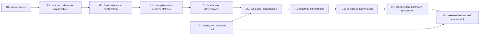

# G11 V8 Completion Implementation Plan

Date: 2026-07-31  
Status: implementation plan; no new performance claim or outcome freeze  
Primary target: a defensible top-journal candidate on exact defensive conditional
path integration for finite-grid rare events under rough volatility

This is the operative remaining-work plan. It supersedes the scheduling and
unfinished-phase sections of the 2026-07-25 V8 plan, while preserving all passed
P0--P6 claim, estimand, comparator, and statistical contracts unless a later
versioned audit explicitly replaces one.

## 0. Executive decision

The current research core is worth continuing, but the immediate bottleneck is not
a new neural architecture. The confirmed core is an exact-likelihood defensive
mixture estimator whose integrated control coordinate is analytically marginalized
by DCS. V7 already provides strong same-proposal Rao--Blackwell evidence. V8 must
add:

1. a reliable high-precision reference pipeline;
2. faithful implementations of the strongest external comparators;
3. a genuinely new quantitative or rough-model theorem;
4. frozen, training-inclusive qualification and confirmation; and
5. independent proof, code, and physical-hardware reproduction.

The critical path is:



The reference path and theory path may run in parallel. Qualification cannot begin
until both the reference and comparator implementations pass their own audits.

## 1. Current evidence and exact claim boundary

### 1.1 Completed or substantially completed

| Area | Current status | What it authorizes |
|---|---|---|
| V7 fixed raw versus DCS mechanism | qualification, confirmation, and separate Linux software-environment reproduction pass | same-proposal conditional-variance reduction on the frozen V7 scope |
| V8 P0 claim contract | development pass | finite-grid, training-inclusive research program |
| V8 P1 novelty audit | conditional pass | theory work, not submission novelty |
| V8 P2 finite-grid theorem stack | C0--C3 pass | exact finite-grid DCS identity and strictness conditions |
| V8 P3 rate/complexity audit | conditional pass with downgrade | finite-grid experiments; terminal conditional route |
| V8 P4 baseline framework | oracle/framework pass | implementation of real comparator algorithms |
| V8 P5 primary matrix | 24 cells fixed | threshold calibration and references |
| V8 P5 threshold manifest | clean, hash-bound pass | reference execution on the declared 128-step estimand |
| V8 P6 statistical design | planning pass | P7 falsification only |
| V8 P7 numerical calibration | development pass | conservative proposal candidate only |

### 1.2 Failed or blocked

| Item | Observed result | Consequence |
|---|---|---|
| P5 reference V1 | 37/48 method--cell estimates missed the 2% reference-SE contract | V1 cannot be used as the paper reference |
| P5 reference V2 | interrupted after at least 6.9 wall hours and 21.3 CPU hours without terminal output | `p5-reference-v2` is burned; no partial result may be interpreted |
| external comparator performance | not executed | no external superiority claim |
| barrier model-level rate | open | no unconditional barrier complexity theorem |
| continuous-monitoring weak bias | open | no continuous-barrier claim |
| independent physical hardware | open | Linux-on-the-same-laptop is not physical replication |
| external mathematical/code review | open | no submission-ready proof or software claim |

### 1.3 Claims that remain prohibited

- unbiased continuous-barrier estimation;
- universal optimality under rough Bergomi;
- an unconditional rough-Bergomi MLMC complexity theorem;
- superiority over all importance samplers;
- a neural-architecture contribution for the current DCS core;
- quantum or Feynman path-integral novelty;
- exact frequentist coverage for the nominal bootstrap RMSE bound; and
- top-journal readiness before external baselines, confirmation, and review pass.

## 2. Definition of completion

“Implementation complete” and “submission ready” are separate states.

### 2.1 Implementation complete

The repository contains:

- restart-safe sharded reference generation and independent aggregation;
- all required comparator algorithms behind the common P4 lifecycle;
- one generic train/plan/estimate/audit benchmark executor;
- fail-closed seed, cost, resource, accuracy, and result auditors;
- immutable qualification, freeze, confirmation, and reproduction protocols;
- theorem and claim ledgers that distinguish proved, conditional, empirical, and
  prohibited statements; and
- reproducible manuscript tables generated only from hashed artifacts.

### 2.2 Submission ready

All of the following must additionally be true:

1. the closest-work audit survives expert review;
2. at least one non-classical theoretical contribution survives proof review;
3. the primary DCS method meets all accuracy gates;
4. simultaneous training-inclusive work intervals pass against every predeclared
   primary comparator;
5. the 48-cluster untouched confirmation is complete and uncensored;
6. a different physical host reproduces the required algorithmic effect;
7. all high-severity proof and code-review findings are resolved; and
8. every manuscript value traces to an immutable artifact.

Failure of an item causes a scope downgrade; it must never be hidden by renaming a
development result.

## 3. Priority order

| Priority | Work package | Reason |
|---:|---|---|
| 0 | R0 research-state freeze | prevents accidental reuse of burned seeds or failed artifacts |
| 1 | R1 sharded/checkpointed reference infrastructure | current hard blocker |
| 2 | R2 fresh high-precision reference | required by every later accuracy claim |
| 3 | B1 faithful external baseline implementations | required to test novelty and practical value |
| 4 | D1 P7 falsification-first benchmark | cheapest place to reject weak methods or claims |
| 5 | T1 theorem and novelty closure | required before top-journal positioning |
| 6 | Q1 P8 independent qualification | estimates whether the frozen claim family is supportable |
| 7 | F1 P9 immutable freeze | prevents outcome-adaptive confirmation |
| 8 | C1 P10 confirmation | primary paper evidence |
| 9 | H1 P11 physical reproduction | robustness and artifact credibility |
| 10 | M1 P12--P14 review, paper, and submission | final claim/evidence package |

Each work package receives at most one end-of-phase commit, consistent with the P0
contract. A commit is created only after its implementation, phase audit, targeted
tests, full regression tests, lint, type checks, and `git diff --check` pass.

## 4. R0 — research-state freeze and migration ledger

### 4.1 Purpose

Create one canonical machine-readable status ledger before any new execution. It
must bind every completed, failed, interrupted, burned, or open artifact.

### 4.2 Proposed deliverables

- `configs/g11_v8/completion_status_ledger_v1.yaml`
- `experiments/g11_v8_completion_status_audit.py`
- `tests/test_g11_v8_completion_status_audit.py`
- `docs/audits/G11_V8_COMPLETION_BASELINE_2026-07-31.md`

### 4.3 Required ledger fields

- schema and protocol ID;
- source commit and dirty-worktree policy;
- P0--P7 artifact paths and SHA-256 values;
- exact status enum: `passed`, `conditional`, `failed`, `interrupted`, `open`;
- burned namespaces, including `p5-reference-v2`;
- authorized next actions;
- explicitly prohibited claims;
- unresolved theoretical obligations; and
- unresolved external-compute obligations.

### 4.4 Gate R0

Pass only if:

- all referenced files and hashes resolve;
- no failed artifact is labelled passed;
- no burned namespace is reusable;
- V1 and V2 reference receipts are present;
- performance authorization is false; and
- the Git worktree is clean when the ledger is frozen.

## 5. R1 — sharded, restart-safe reference infrastructure

### 5.1 Why this comes first

The V2 runner executes all 48 method--cell references in one process and emits a
terminal result only after all work finishes. A long interruption therefore loses
all completed computation. The statistical estimator is valid, but the execution
architecture is not suitable for the required workload.

### 5.2 Required architecture

Split reference generation into four immutable artifact levels:

```text
reference protocol
  -> independent pilot shards
  -> frozen allocation manifest
  -> fixed-size final chunks
  -> method-cell aggregate
  -> 24-cell reference package
```

No final contribution may influence its own final sample count.

### 5.3 Proposed modules

- `src/path_integral/reference_protocol.py`
  - schemas and validated dataclasses;
  - reference method roles;
  - pilot and final allocation contracts.
- `src/path_integral/reference_shards.py`
  - deterministic shard keys;
  - atomic chunk receipts;
  - sufficient-statistic serialization.
- `src/path_integral/reference_aggregation.py`
  - Chan/Welford combination of `(n, mean, M2)`;
  - exact-set and duplicate checks;
  - method agreement and normalization gates.
- `src/path_integral/resource_planner.py`
  - path, step, memory, wall-time, and storage forecasts;
  - refusal to launch an infeasible local job.
- `experiments/g11_v8_p5_reference_pilot.py`
- `experiments/g11_v8_p5_reference_freeze_allocation.py`
- `experiments/g11_v8_p5_reference_shard.py`
- `experiments/g11_v8_p5_reference_aggregate.py`
- `experiments/g11_v8_p5_reference_result_audit.py`

### 5.4 Artifact contracts

Before a new reference protocol is opened, create a new threshold-binding version
that binds the unchanged threshold-manifest hash to the new reference protocol,
allocation schema, and namespace. The executor must verify that its namespace equals
the namespace in that binding. Mutating the existing V1 binding or accepting the
current V1/V2 mismatch is prohibited.

New schemas must separate:

- `design_informed_by_prior_development_outcomes`; and
- `current_namespace_outcomes_inspected_before_freeze`.

The first field is true for a design motivated by the V1 failure. The second must be
false when its own final allocation and execution are frozen. A single ambiguous
`outcome_data_used` flag is insufficient for future freeze provenance.

#### Pilot shard

Each record must bind:

- protocol/config/threshold-manifest hashes;
- source commit and environment;
- cell, method, pilot replicate, and seed key;
- fixed requested path count;
- contribution and likelihood-weight sufficient statistics;
- path-positivity and nonfinite counters;
- elapsed wall/CPU time and peak memory; and
- completion state.

#### Allocation manifest

The allocation manifest is generated once from complete pilot shards. It stores:

- all expected pilot shard hashes;
- the predeclared variance statistic;
- allocation safety factor;
- exact integer final count per cell and method;
- resource-cap decision before final sampling;
- final chunk size and expected chunk IDs; and
- a new final namespace disjoint from pilot and all burned namespaces.

If any requested count exceeds the cap, the protocol fails before final execution.
It may not silently truncate the count and later call the result uncensored.

#### Final chunk

Each chunk stores:

- allocation-manifest hash;
- unique `(cell, method, chunk_id)` identity;
- exact path count;
- deterministic seed key;
- ordinary contribution `(n, mean, M2)`;
- likelihood normalization `(n, mean, M2)`;
- finite/positive-path checks;
- work and runtime fields; and
- an atomic completion marker.

A checkpoint is a completed immutable chunk, not an in-place mutable estimator.
An interrupted temporary file is never an accepted checkpoint. A retry may recreate
only that incomplete chunk with the same frozen count and seed; it may not overwrite
or append to an already completed chunk.

#### Aggregate

The aggregator must reject:

- missing or duplicate chunks;
- unexpected chunk IDs or path counts;
- mixed commits, configs, manifests, environments, or dtypes;
- any seed collision;
- nonfinite sufficient statistics;
- incomplete final counts;
- changed method rosters; and
- any threshold or estimand mismatch.

### 5.5 Statistical correctness

Let the independent pilot sigma-field be \(\mathcal P\), and let
\(N=N(\mathcal P)\) be the frozen final count. Conditional on \(\mathcal P\), the
final contributions \(Y_1,\dots,Y_N\) are independent of the pilot and identically
distributed under the declared proposal. Therefore

\[
E\!\left[\frac{1}{N}\sum_{i=1}^{N}Y_i\mid\mathcal P\right]=\theta,
\]

so the final mean remains unbiased unconditionally. This argument fails if final
outcomes are used to decide whether to stop, discard, or extend the same final
stream. R1 must make that operation impossible.

Sharded aggregation is algebraically equivalent to the unsharded ordinary mean and
unbiased sample variance. The implementation must use sufficient-statistic merging,
not an average of shard means with equal shard weights.

### 5.6 Required tests

- analytic Gaussian mean/variance oracle;
- sequential versus sharded sufficient-statistic equivalence;
- unequal chunk-size aggregation;
- resume after a simulated interruption;
- duplicate, missing, corrupted, and foreign-chunk rejection;
- pilot/final and method/method seed-disjointness;
- allocation count fixed before final generation;
- cap rejection before final sampling;
- likelihood normalization and positivity failure propagation;
- canonical JSON/hash stability;
- CPU smoke reproducibility; and
- no overwrite of an existing completed artifact.

### 5.7 Device policy

The first valid R1 implementation remains CPU/float64. A CUDA path is a separate
subphase and is not authorized by setting `device="cuda"` alone. GPU validation
requires:

- device-local generators rather than global RNG state;
- exact dtype and device propagation through controls, mixture labels, likelihoods,
  and CDF/quadrature operations;
- analytic oracle tests on both backends;
- distributional CPU/GPU agreement with independent namespaces;
- nonfinite/underflow stress tests at \(H=0.20\) and probability \(10^{-5}\);
- deterministic reproduction within each declared backend; and
- billed GPU cost and peak-memory accounting.

Bitwise equality between CPU and GPU is not required and must not be claimed.

### 5.8 Gate R1

R1 passes when all corruption tests pass and a deliberately interrupted multi-shard
smoke run resumes to exactly the same aggregate as an uninterrupted run. It does not
pass merely because one complete smoke execution finishes.

## 6. R2 — fresh reference development and qualification

### 6.1 Namespace policy

- `p5-reference` belongs to V1;
- `p5-reference-v2` is burned;
- R1 infrastructure smoke namespaces are disposable and never reused;
- the next development execution receives a new protocol and namespace;
- a later reference qualification receives another fresh namespace.

No V2 random stream may be restarted from zero.

The new reference protocol also requires:

- `p5_threshold_manifest_binding_v2.yaml`, preserving the calibrated threshold hash
  while binding the new protocol and namespace;
- a P6 compatibility receipt showing that its endpoint family and cluster counts are
  unchanged and that all new reference namespaces remain disjoint; and
- explicit reference-package hashes in every later P8/P9 execution config.

### 6.2 Execution sequence

1. Benchmark three prespecified representative cells:
   - moderate terminal;
   - rare terminal;
   - rare discrete barrier.
2. Measure paths/second, peak memory, chunk latency, and output size.
3. Produce a resource forecast for all 48 method--cell references.
4. Select hardware before opening the full pilot namespace.
5. Run all pilot shards.
6. Freeze the allocation manifest.
7. Fail before final sampling if the declared cap is insufficient.
8. Run final chunks in parallel.
9. Aggregate method-cell artifacts.
10. Run an independent result audit.

### 6.3 Hardware decision

The laptop is restricted to tests, smoke runs, and resource benchmarking. The
observed V2 interruption is enough evidence that it must not be used for another
monolithic full reference.

The CPU route is preferred first because the current estimator is CPU-validated.
A 32-vCPU, 128-GB external CPU node is a reasonable starting candidate, but it is not
approved until the R1 benchmark predicts an uncensored completion window. GPU use is
allowed only after the R1 GPU subphase passes.

### 6.4 Reference gates

For all 24 cells and both declared reference methods:

- full final sample count is present;
- no resource censoring;
- standard error is no larger than
  \(0.10\times0.20\times p_{\mathrm{nominal}}\);
- \(|z|\leq4\) for likelihood normalization;
- independent DCS/raw combined agreement \(z\leq4\);
- all paths and likelihood contributions are finite;
- all seed families are disjoint; and
- source, config, threshold, allocation, and environment hashes agree.

The strict two-method precision contract remains the default. Weakening the raw
crosscheck precision after seeing V1 is not permitted inside the existing P5
protocol. A role-separated reference design would require a new protocol, a new
statistical audit, and a full downstream reset.

### 6.5 Reference uncertainty downstream

The reference is not treated as truth with zero uncertainty. Downstream accuracy
analysis must either:

- combine independent method and reference standard errors analytically; or
- resample the common reference uncertainty once per bootstrap draw and propagate
  that shared draw across all clusters using that reference.

Resampling the same shared reference independently for every cluster would create
false information. The resulting bootstrap bound remains nominal, not exact.

### 6.6 Gate R2

The independently implemented auditor, not the executor, decides R2. Any failed
cell blocks performance qualification.

## 7. B1 — faithful strong-baseline implementations

### 7.1 Required method roster

| Role | Method | Primary status |
|---|---|---|
| proposed method | defensive conditional path integration | primary |
| mechanism control | fixed raw defensive IS | primary |
| adaptive competitor | task-tuned pure CEM | primary |
| closest published computation | numerical-smoothing RQMC | primary |
| sanity baseline | crude MC | secondary |
| variance baseline | antithetic MC | secondary |
| conditional comparator | conditional rough-Bergomi MC | secondary |
| safety ablation | defensive CEM | secondary |
| rare-event competitor | large-deviation subspace IS | secondary |
| flexible proposal | exact-likelihood coupling-flow IS | secondary |

P4 currently supplies lifecycle and density oracles. B1 must implement actual
task-tuned algorithms and production execution.

### 7.2 Proposed code structure

- `src/path_integral/baselines/crude_antithetic.py`
- `src/path_integral/baselines/conditional_rbergomi.py`
- `src/path_integral/baselines/cem.py`
- `src/path_integral/baselines/smoothing_rqmc.py`
- `src/path_integral/baselines/large_deviation_is.py`
- `src/path_integral/baselines/coupling_flow_is.py`
- `src/path_integral/benchmark_executor.py`
- `src/path_integral/benchmark_aggregation.py`
- `experiments/g11_v8_p7_baseline_falsification.py`
- `experiments/g11_v8_p7_baseline_audit.py`

### 7.3 Baseline-specific correctness requirements

#### Crude and antithetic MC

- no importance weight;
- antithetic pair means are inferential units;
- cost counts both paths in a pair;
- odd or incomplete pairs are rejected.

#### Conditional rough-Bergomi MC

- conditioning variable and remaining Gaussian dimension match the cited method;
- analytic conditioning is not silently replaced by DCS;
- CDF/quadrature calls are charged;
- same finite-grid payoff and model parameters are used.

#### Pure and defensive CEM

- elite quantile, smoothing, covariance regularization, and stopping rules are fixed
  before the evaluation stream;
- all training iterations and failed restarts are charged;
- the final estimator uses an exact likelihood and ordinary mean;
- defensive CEM retains a positive target component;
- covariance collapse or singular density is a recorded failure.

#### Smoothing RQMC

- independent randomized Sobol scrambles are inferential replicates;
- points within one scramble are not treated as independent;
- inverse-normal endpoint handling is documented and tested;
- smoothing and dimension ordering follow the declared published-style algorithm;
- total point count, scramble count, transforms, and CDF calls are charged.

#### Large-deviation IS

- the optimized action corresponds to the declared rough-Volterra discretization;
- the resulting drift has an exact Girsanov or Gaussian-shift likelihood;
- optimization, Hessian/subspace construction, and retries are charged;
- no oracle use of the final reference sample is allowed.

#### Coupling-flow IS

- forward map, inverse map, and log-Jacobian are exact and mutually checked;
- density support covers the target;
- training/validation/final streams are disjoint;
- weight clipping and self-normalization are prohibited;
- an entangling full-path flow is labelled baseline-only, never DCS.

### 7.4 Budget parity

Budget parity must be fixed by a declared policy, not by equal epoch counts. Report:

- algorithmic work units;
- path-step simulations;
- likelihood evaluations;
- conditional CDF/quadrature calls;
- optimizer steps and training samples;
- CPU/GPU seconds and peak memory;
- wall time on the same hardware when comparable; and
- actual billed cost for heterogeneous hardware.

DCS proposal-bank amortization must be reported over prespecified query counts
\(K\), including at least single-query and repeated-query regimes. The headline
cannot choose \(K\) after seeing which method wins.

For the fixed raw/DCS mechanism comparison, both methods inherit the same frozen
proposal-training ledger and the same predeclared cost-allocation rule. Shared
training cannot be charged to only one method or omitted from only one method.

Before D1, freeze a small logarithmic training-budget ladder shared by trained
methods. Report the complete cost--accuracy frontier. If one operating point is
needed for P8, its selection rule must be based on the predeclared resource contract
and development-only data, then frozen before P8. Unsuccessful budget points remain
charged and visible.

### 7.5 B1 tests and gate

Every baseline requires:

- analytic density-normalization oracle;
- mean-unbiasedness oracle on a tractable Gaussian event;
- seed-separation and frozen-proposal tests;
- cost-ledger conservation;
- failure/censoring receipt tests;
- deterministic smoke reproduction;
- corrupted proposal or Jacobian rejection; and
- common-interface lifecycle audit.

B1 passes only as an implementation gate. It makes no performance claim.

## 8. D1 — P7 falsification-first development

### 8.1 Development questions

1. Does DCS remain numerically exact across all 24 primary cells?
2. Does same-proposal variance reduction remain materially above the P6 boundary?
3. Does raw or DCS suffer weight-tail instability at \(10^{-5}\)?
4. Do CEM proposals collapse or overfit calibration seeds?
5. Is smoothing RQMC actually competitive at total work?
6. Do LD and flow methods retain exact likelihoods under task tuning?
7. Is DCS competitive for a single query, or only after amortization?
8. Does any method fail the achieved-RMSE resource budget?

### 8.2 Development matrix

Use a staged matrix:

- Stage A: one moderate and one rare cell per task;
- Stage B: all 24 primary cells with small independent clusters;
- Stage C: one-factor robustness and mesh diagnostics only for surviving claims.

This staging is a falsification tool, not a basis for deleting difficult primary
cells later.

### 8.3 Mandatory diagnostics

- effective sample size as a diagnostic only, never a self-normalized estimator;
- maximum and high quantiles of log weights;
- likelihood-normalization z-score;
- nonfinite and underflow counts;
- proposal-component occupancy;
- CEM covariance eigenvalues;
- flow inverse and Jacobian residuals;
- RQMC between-randomization variance;
- achieved standard error versus planned target;
- floor-binding and resource-censoring fractions;
- training, planning, final, and failed-retry work; and
- per-cell and aggregate raw/DCS conditional-variance decomposition.

### 8.4 Stop rules

- Any exactness or density failure stops the affected method.
- Any missing cost category invalidates a total-work comparison.
- More than the frozen resource-censoring allowance blocks progression.
- If DCS does not beat fixed raw on the mechanism gate, stop the V8 paper.
- If DCS does not beat both primary external comparators after total work, do not
  claim broad computational superiority.
- If only repeated-query amortization wins, make that regime explicit in the title,
  abstract, theorem statement, and experiments.

### 8.5 Gate D1

D1 produces a failure/continuation decision and a resource plan. Development
outcomes cannot be copied into P8, P9, or P10 artifacts.

## 9. T1 — novelty and theorem closure

This track runs in parallel with R1--D1.

### 9.1 Updated primary-source novelty audit

Repeat the reproducible search immediately before manuscript drafting. Cover at
least:

- rough-volatility conditional Monte Carlo;
- numerical smoothing with QMC/ASGQ/MLMC;
- rare-event IS under Volterra or non-Markovian dynamics;
- multiple/defensive importance sampling;
- state-dependent and large-deviation IS;
- exact-likelihood normalizing-flow rare-event sampling;
- Rao--Blackwellized or analytically marginalized generative estimators; and
- rough-volatility weak approximation and barrier discretization.

Every novelty claim needs a primary source, DOI or stable URL, version/date, exact
overlap, and non-overlap. Search-engine summaries are not evidence.

### 9.2 Required theorem stack

#### Already available but externally reviewable

- defensive-mixture exactness and likelihood bound;
- proposal-conditional DCS identity;
- exact variance decomposition;
- finite-grid threshold measurability and degeneracy handling; and
- localized finite-grid strictness.

#### New top-journal theorem target

The preferred target is a quantitative localized lower bound for

\[
\operatorname{Var}(Y_{\mathrm{raw}})
-\operatorname{Var}(Y_{\mathrm{DCS}})
=E[\operatorname{Var}(Y_{\mathrm{raw}}\mid R)].
\]

The theorem must identify a residual set of positive probability on which the
conditional contribution is nondegenerate and the likelihood is controlled. Any
constant must display its dependence on the defensive weight, control geometry,
threshold slope, model parameters, and rarity. A universal rarity-independent
constant must not be assumed.

#### Rough-model route

For terminal events, close the conditional threshold-rate assumptions if possible.
For discrete barriers, the decomposition must retain:

- coefficient error;
- active-time error; and
- fine-only barrier crossings.

A barrier rate requires anti-concentration/small-ball control for the discretized
minimum and an explicit rough-Volterra regularity argument. If that proof does not
close, barrier results remain finite-grid experiments.

#### Complexity route

State an end-to-end MLMC complexity result only when all three exponents are
available:

- weak bias \(\alpha\);
- correction variance \(\beta\); and
- sample cost \(\gamma\).

Empirical fitted slopes are evidence, not proofs of these exponents.

### 9.3 Theory falsification gates

- If the new result reduces to classical Rao--Blackwell without a new quantitative
  or rough-path statement, the strongest theory-led venue route closes.
- If only terminal theory closes, terminal becomes the theorem headline and barrier
  remains an application.
- If no model-level rate closes, use a finite-grid exactness plus computational
  paper and target a rigorous computational venue.
- Every proof must receive independent mathematical review before submission.

## 10. Q1 — P8 independent-seed qualification

### 10.1 Preconditions

Q1 is authorized only after:

- R2 reference gate passes;
- B1 implementation gate passes;
- D1 continuation decision passes;
- T1 has a defensible claim boundary;
- a resource forecast shows no expected censoring; and
- all development namespaces are closed.

### 10.2 Fixed design

- 32 new independent seed clusters;
- 24 primary cells;
- primary methods: DCS, fixed raw, pure CEM, smoothing RQMC;
- five P6 efficiency endpoints;
- 192 accuracy co-claims;
- cluster, never path, as inference unit;
- equal cell weight within cluster; and
- the existing P6 multiplicity split unless a fully versioned pre-Q1 redesign is
  externally justified.

### 10.3 Executor requirements

Implement a generic shardable lifecycle:

```text
train -> freeze proposal -> independent plan -> fixed final chunks
      -> method-cell-cluster aggregate -> cost audit -> accuracy audit
```

Each transition consumes a hash-bound artifact. Final execution cannot read training
or pilot outcomes except through the frozen proposal and allocation manifest.

### 10.4 Qualification analysis

- one-sided Student-t lower intervals on cluster log work ratios;
- Bonferroni control across five efficiency endpoints;
- Clopper--Pearson lower bound for exact attainment;
- nominal simultaneous bootstrap upper RMSE bound;
- common reference uncertainty propagated jointly;
- no path- or cell-level pseudoreplication;
- no post-outcome comparator selection; and
- incomplete or censored records retained as failures.

Every logged variance or work ratio must be finite and strictly positive. A zero,
negative, NaN, or infinite input is a failed record, not a value to which an epsilon
is silently added.

### 10.5 Gate Q1

P8 may only:

- authorize P9 unchanged;
- block the program; or
- authorize a new development cycle with new protocol/version/namespaces.

P8 may not re-estimate P10 cluster count, change endpoint thresholds, remove cells,
or switch the primary comparator based on results.

## 11. F1 — P9 outcome-blind confirmation freeze

### 11.1 Freeze manifest

Bind:

- clean source commit and signed tag;
- immutable container image digest;
- Python, PyTorch, CUDA/CPU, BLAS, compiler, and OS versions;
- P0/P5/P6 claim, matrix, threshold, and statistical hashes;
- R2 reference package;
- every trained proposal and hyperparameter;
- exact method roster and primary claim family;
- final sample/allocation rules;
- 48-cluster seed namespace and bootstrap namespace;
- expected shard/record set;
- work and wall-time caps;
- retry, censoring, and hardware-failure rules;
- aggregation and audit code hashes; and
- manuscript table schema.

### 11.2 Preflight

The preflight may validate files and resources but may not allocate any confirmation
seed or simulate an outcome. It must fail on a dirty worktree or untracked input.

### 11.3 Bug policy

A scientific bug after freeze requires:

- a new source commit;
- a new freeze version;
- a new confirmation namespace;
- preservation of the failed freeze; and
- a written impact analysis.

Infrastructure retry is permitted only when the frozen rule proves that no completed
or partially consumed statistical stream is reused.

## 12. C1 — P10 untouched confirmation

### 12.1 Execution

- 48 independent clusters;
- complete 24-cell primary matrix;
- all primary methods and prespecified secondary diagnostics;
- fixed resources and no record deletion;
- chunk-level checkpointing;
- independent reference, final, and bootstrap namespaces; and
- no live tuning based on partial results.

### 12.2 Required independent audits

1. record/schema audit;
2. source/config/hash audit;
3. seed-intersection audit;
4. path-count and allocation audit;
5. likelihood/density audit;
6. cost-ledger audit;
7. reference-uncertainty audit;
8. accuracy-family audit;
9. efficiency-family audit;
10. resource/censoring audit;
11. aggregate recomputation audit; and
12. claim-to-table audit.

The aggregate recomputation tool must be separate from the main analyzer and must
derive every headline number from raw immutable records.

### 12.3 Confirmation decision

The primary paper claim passes only if every frozen co-gate passes. Secondary
positive findings cannot rescue a failed primary family.

## 13. H1 — P11 independent physical reproduction

### 13.1 Requirements

- different physical CPU/GPU host;
- clean clone from the frozen tag;
- immutable environment or container;
- entirely new seed namespace;
- same estimand, thresholds, methods, budgets, and claims;
- no parameter retuning; and
- artifact hashes linked back to the canonical freeze.

### 13.2 Comparison

Algorithmic work and statistical effect are primary. Wall time is secondary and
hardware-specific. Report:

- effect difference in combined standard-error units;
- accuracy and resource gate replication;
- algorithmic work ratio;
- wall-time and billed-cost diagnostics; and
- environment differences.

Same-laptop Windows/Linux execution remains a software-environment reproduction and
must not be relabelled as H1.

## 14. M1 — P12--P14 external review, manuscript, and submission

### 14.1 Mathematical review checklist

- target/proposal absolute continuity;
- exact mixture likelihood;
- conditional-law cancellation;
- measurability and zero-slope/tie handling;
- strictness and localized constants;
- barrier active-time and fine-only crossing terms;
- weak bias and MLMC exponents;
- all uses of asymptotic notation; and
- correspondence between theorem assumptions and experiment configs.

### 14.2 Code review checklist

- simulator and coupling;
- DCS and raw contributions;
- all baseline densities;
- seed allocation and intersection;
- checkpoint/resume identity;
- shard aggregation;
- reference and common-uncertainty propagation;
- cost ledger;
- multiplicity and bootstrap implementation; and
- artifact/manuscript traceability.

### 14.3 Manuscript contribution limit

Use at most three headline contributions:

1. exact defensive conditional path integration and quantitative strictness;
2. rough-volatility specialization with an honestly scoped rate/complexity result;
3. frozen strong-baseline total-work evidence and reproducible artifact system.

### 14.4 Venue route

| Evidence obtained | Defensible route |
|---|---|
| new model-level theorem + external superiority + confirmation | strongest mathematical-finance route |
| conditional/finite-grid theory + strong computational advantage | rigorous computational financial-mathematics route |
| same-proposal gain only, external advantage fails | narrower variance-reduction/mechanism paper |
| novelty audit fails | stop the new-method claim; publish reproduction/negative result if valuable |

No plan can guarantee acceptance. The plan maximizes defensibility, not prestige by
assertion.

## 15. Cross-cutting engineering requirements

### 15.1 Seeds

Every seed is derived from:

```text
protocol / phase / method / cell / cluster / stage / shard / role
```

The complete ledger is canonicalized and hashed. Global `torch.manual_seed` is not
sufficient for concurrent workers; each worker receives explicit local generators.

### 15.2 Artifacts

- immutable, non-overwriting JSON or safe tensor-free formats where possible;
- atomic write-to-temporary-then-rename;
- schema version in every file;
- source/config/parent hashes;
- no pickle from untrusted sources;
- relative repository paths in portable manifests;
- explicit dtype, device, and numerical library versions; and
- complete failure receipts.

### 15.3 Numerical safety

- float64 for likelihoods and rare-event summaries;
- stable log-sum-exp for mixture densities;
- no likelihood clipping;
- no self-normalization;
- explicit finite and strict-positivity checks;
- stress tests for extreme controls and \(H=0.20\);
- stable Gaussian tails and inverse CDFs; and
- high-precision oracle checks on small problems.

### 15.4 Cost accounting

Count:

- threshold/reference calibration;
- proposal training and hyperparameter search;
- failed attempts and restarts;
- pilot and allocation planning;
- final sampling;
- CDF/quadrature and flow evaluations;
- checkpoint serialization;
- aggregation/audit work;
- CPU/GPU time, wall time, peak memory, storage, and billed cost.

Reference-generation cost is reported separately from per-query estimator cost, but
it is never erased from the reproducibility budget.

### 15.5 CI versus full experiments

CI runs:

- analytic/unit tests;
- corruption tests;
- two-cell smoke shards;
- deterministic aggregation tests; and
- config/hash audits.

CI must never run:

- full references;
- full baseline training;
- P8/P10/P11 statistical experiments; or
- any command that opens a frozen outcome namespace.

Large experiments run only from an explicit frozen artifact and declared compute
environment.

## 16. Phase-end technical and theoretical audit

Every phase answers all questions below. Any unresolved “yes” blocks the phase.

1. Did the estimand, grid, event, or model parameters change silently?
2. Was a target-law Gaussian substituted for the actual proposal conditional law?
3. Was any likelihood clipped, normalized by the sample, or omitted?
4. Did a final outcome influence its own sample count or stopping time?
5. Were pilots, references, methods, phases, shards, or retries given overlapping
   seeds?
6. Were unequal shard means aggregated with equal weights?
7. Were antithetic paths or RQMC points treated as independent replicates?
8. Were paths or cells used as inferential replicates instead of clusters?
9. Was common reference uncertainty replicated as if it were independent?
10. Were training, tuning, failures, retries, or accelerators omitted from work?
11. Was heterogeneous-hardware wall time used as the primary cross-method measure?
12. Did a flow destroy exact density evaluation or DCS tractability?
13. Was a conditional theorem described as unconditional?
14. Was a finite-grid barrier described as continuously monitored?
15. Was an empirical slope described as a proved asymptotic rate?
16. Was a failed, interrupted, or censored artifact deleted or relabelled?
17. Was a comparator, cell, query count, or endpoint selected after outcomes?
18. Does every claimed number trace to a hash-bound immutable artifact?

## 17. Required verification commands

At the end of each implementation phase:

```powershell
python -m pytest -q
ruff check src tests experiments main.py train_driftnet.py
mypy src experiments
git diff --check
git status --short
```

Additional phase-specific auditors must run from a clean source snapshot and write
their output outside the worktree first. A result becomes canonical only after its
source commit and all parent hashes are verified.

## 18. Resource and scheduling plan

### 18.1 Reference workload scale

The V2 pilot alone implied

\[
24\times2\times8\times32768=12{,}582{,}912
\]

pilot paths. The theoretical final cap was

\[
24\times2\times8{,}388{,}608=402{,}653{,}184
\]

paths at 128 time steps. R1 sharding is therefore mandatory.

### 18.2 Realistic schedule

| Work package | Expected elapsed research time |
|---|---:|
| R0 status ledger | 1--2 days |
| R1 reference infrastructure and corruption tests | 1--2 weeks |
| R2 external reference execution | 2 days--2 weeks after benchmark |
| B1 baseline algorithms and oracles | 4--8 weeks |
| D1 staged falsification | 2--4 weeks |
| T1 novelty/theory closure | 2--4 months, parallel |
| Q1 qualification | 1--3 compute weeks |
| F1 freeze | about 1 week |
| C1 confirmation | 1--4 compute weeks |
| H1 physical reproduction | 1--3 weeks |
| M1 review and manuscript | 1--2 months |

The remaining program is realistically four to eight months if the theorem and
external baselines survive. A failed gate shortens the schedule by narrowing or
stopping the claim; it does not justify weakening the gate.

## 19. Immediate implementation checklist

The next coding session should execute exactly this order:

1. create and audit the R0 completion-status ledger;
2. define R1 schemas and deterministic shard IDs;
3. implement pilot-shard writing and corruption tests;
4. implement allocation-manifest freezing;
5. implement fixed final chunks with atomic completion;
6. implement sufficient-statistic aggregation;
7. implement seed/exact-set/hash/resource auditors;
8. prove and test conditional unbiasedness of pilot-selected fixed \(N\);
9. demonstrate interrupted/resumed smoke equivalence;
10. benchmark three representative cells on the laptop;
11. produce an external CPU resource manifest;
12. run a fresh development reference with a new namespace;
13. qualify the reference with another fresh namespace;
14. only then begin production external-baseline training.

## 20. Final decision rule

The recommended direction remains DCS under exact defensive mixtures, not an added
quantum or vaguely neural layer. A new architecture should be introduced only when
it preserves exact likelihood, adaptedness, and conditional tractability and when it
beats the strongest baselines after total work.

The project becomes a credible top-journal candidate only if:

- T1 produces a genuinely non-classical theorem;
- R2 supplies reliable independent references;
- Q1 and C1 show simultaneous training-inclusive superiority against both pure CEM
  and smoothing RQMC;
- H1 reproduces the effect on another physical machine; and
- external reviewers accept the proof and implementation.

Until then the correct classification is:

> a strong PhD-level research program with a confirmed same-proposal mechanism,
> rigorous finite-grid foundations, and an incomplete external-competitiveness and
> model-level-theory case.
