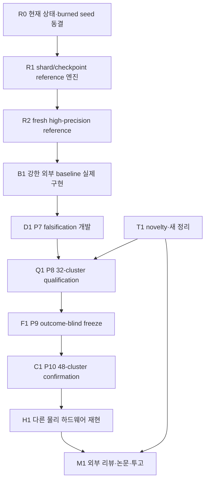

# G11 V8 최종 완성 구현계획

작성일: 2026-07-31  
상태: 구현계획 확정안, 신규 성능 주장 및 confirmation freeze 아님  
상세 기술 규격:
[`G11_V8_COMPLETION_IMPLEMENTATION_PLAN_2026-07-31.md`](G11_V8_COMPLETION_IMPLEMENTATION_PLAN_2026-07-31.md)

이 문서는 지금부터 적용할 잔여 작업 기준이다. 2026-07-25 V8 계획의 일정과
미완료 phase 부분을 대체하지만, 이미 통과한 P0--P6의 claim, estimand,
comparator, 통계 계약은 새 versioned audit이 명시적으로 대체하지 않는 한
유지한다.

## 1. 최종 목표

우리의 목표는 단순히 기존 모델보다 숫자가 조금 좋은 모델을 만드는 것이
아니다. 다음 세 가지를 동시에 만족하는 연구를 만드는 것이다.

1. **수학적으로 정확한 방법**
   - rough Bergomi의 사전 선언된 유한 격자 확률을 추정한다.
   - defensive mixture의 전체 밀도를 사용하는 정확한 likelihood ratio를 쓴다.
   - self-normalization, weight clipping, 결과 삭제를 사용하지 않는다.
   - DCS가 raw contribution의 proposal-conditional expectation이라는 사실을
     올바른 조건부분포 아래에서 증명한다.
2. **기존 강한 방법보다 실질적으로 유용한 방법**
   - fixed raw IS뿐 아니라 pure CEM과 numerical-smoothing RQMC를 사전 선언된
     핵심 비교군으로 둔다.
   - 학습, 튜닝, 실패한 실행, planning, final sampling을 전부 비용으로 센다.
   - 단일 질의와 반복 질의 상황을 분리한다.
3. **저명 학술지 심사를 견딜 수 있는 증거 체계**
   - 개발, qualification, freeze, confirmation, 독립 하드웨어 재현을 분리한다.
   - 수학 증명과 코드를 외부 전문가에게 검토받는다.
   - 논문의 모든 수치가 hash가 고정된 artifact로 추적 가능해야 한다.

현재 올바른 논문 방향은 다음과 같다.

> **Defensive Conditional Path Integration for Rare Events under Rough
> Volatility: Exactness, Complexity, and Amortized Efficiency**

현재 핵심은 새로운 neural network나 quantum model이 아니다. 확인된 강점은
정확한 defensive importance sampling과 조건부 경로 적분을 결합해 같은
proposal의 불필요한 조건부 분산을 제거한다는 점이다.

## 2. 현재 상태

### 2.1 완료된 것

| 단계 | 상태 | 의미 |
|---|---|---|
| V7 mechanism | qualification, confirmation, Linux 소프트웨어 환경 재현 통과 | 같은 proposal에서 DCS의 분산감소가 재현됨 |
| V8 P0 | 개발 계약 통과 | finite-grid와 금지 주장이 고정됨 |
| V8 P1 | 조건부 통과 | novelty가 아직 최종 확정된 것은 아님 |
| V8 P2 | finite-grid 정리 통과 | exactness와 조건부 평균 항등식이 정리됨 |
| V8 P3 | 범위 축소 조건부 통과 | barrier model rate와 전체 complexity는 미완료 |
| V8 P4 | baseline framework oracle 통과 | 실제 baseline 구현을 담을 공통 인터페이스가 있음 |
| V8 P5 | 24개 primary cell과 threshold hash 고정 | reference 대상 문제는 고정됨 |
| V8 P6 | 통계설계 통과 | 32-cluster qualification과 48-cluster confirmation 계획이 있음 |
| V8 P7 | 보수적 proposal calibration 개발 통과 | 성능 결과가 아니라 수치 안정성 후보임 |

### 2.2 실패하거나 막힌 것

- Reference V1은 48개 method-cell 중 37개가 목표 표준오차를 달성하지 못했다.
- Reference V2는 노트북에서 최소 6.9시간, 약 21.3 CPU 시간을 사용하고도
  terminal result를 만들지 못해 중단됐다.
- `p5-reference-v2` namespace는 사용된 것으로 간주하며 재사용하지 않는다.
- 외부 baseline의 실제 task-tuned 성능 결과가 없다.
- discrete barrier의 model-level rate와 continuous-monitoring weak bias가
  증명되지 않았다.
- 다른 물리적 하드웨어에서의 재현과 외부 증명·코드 검토가 없다.

따라서 현재는 **강한 박사급 연구 프로그램**이지만 최상위 저널 제출 준비가
끝난 상태는 아니다.

## 3. 전체 우선순위



최우선 blocker는 reference 실행 구조다. Reference가 없으면 이후 방법의
정확도나 RMSE를 정직하게 평가할 수 없다.

각 work package는 P0 계약에 따라 phase 종료 시 최대 한 번만 commit한다.
구현, phase audit, targeted test, 전체 regression, lint, type check,
`git diff --check`가 전부 통과한 뒤에만 commit한다.

## 4. R0 — 현재 연구 상태 동결

### 구현 파일

- `configs/g11_v8/completion_status_ledger_v1.yaml`
- `experiments/g11_v8_completion_status_audit.py`
- `tests/test_g11_v8_completion_status_audit.py`
- `docs/audits/G11_V8_COMPLETION_BASELINE_2026-07-31.md`

### 구현 내용

- P0부터 P7까지 모든 config, result, audit의 SHA-256을 기록한다.
- 각 항목을 `passed`, `conditional`, `failed`, `interrupted`, `open` 중 하나로
  분류한다.
- V1 실패와 V2 interruption을 성공 결과와 분리한다.
- `p5-reference-v2`를 포함한 burned namespace를 재사용 불가로 고정한다.
- 현재 허용된 다음 행동과 금지된 논문 주장을 기록한다.

### 통과 조건

- 파일과 hash가 모두 실제 저장소와 일치한다.
- 실패한 결과가 pass로 표시되지 않는다.
- 현재 performance claim은 반드시 false다.
- clean source에서 audit이 통과해야 한다.

## 5. R1 — reference 실행 인프라 재구현

### 5.1 해결해야 할 현재 문제

현재 V2 runner는 48개의 긴 계산을 하나의 프로세스에서 수행하고 마지막에만
JSON을 쓴다. 중간에 끊기면 완료된 계산까지 모두 잃는다. 추정식은 맞지만
실행 구조가 연구 규모에 적합하지 않다.

### 5.2 새 실행 구조

```text
독립 pilot shard
  -> allocation manifest 동결
  -> 고정 크기 final chunk
  -> method-cell aggregate
  -> 24-cell reference package
  -> 독립 result audit
```

### 5.3 구현 파일

- `src/path_integral/reference_protocol.py`
- `src/path_integral/reference_shards.py`
- `src/path_integral/reference_aggregation.py`
- `src/path_integral/resource_planner.py`
- `experiments/g11_v8_p5_reference_pilot.py`
- `experiments/g11_v8_p5_reference_freeze_allocation.py`
- `experiments/g11_v8_p5_reference_shard.py`
- `experiments/g11_v8_p5_reference_aggregate.py`
- `experiments/g11_v8_p5_reference_result_audit.py`
- 각 모듈에 대응하는 unit/corruption/integration test

### 5.4 필수 데이터 계약

Pilot shard는 다음을 저장한다.

- protocol, config, threshold manifest, source commit hash;
- cell, method, replicate, seed key;
- 사전 선언한 path 수;
- contribution과 likelihood weight의 `n`, `mean`, `M2`;
- nonfinite 및 nonpositive path 수;
- wall time, CPU time, peak memory;
- 완료 여부.

Allocation manifest는 모든 pilot이 끝난 후 한 번만 만든다.

- pilot artifact 전체 hash;
- 사용할 variance statistic과 safety factor;
- cell-method별 고정 final sample 수;
- resource cap을 넘는지 여부;
- final chunk ID 전체 목록;
- pilot, burned seed, future confirmation과 겹치지 않는 final namespace.

Final chunk는 정해진 sample 수와 seed로만 실행한다. 이미 완료된 chunk는
덮어쓰지 않는다. 미완성 temporary file만 동일한 고정 seed와 count로 다시
만들 수 있다.

Aggregator는 shard 평균의 단순 평균을 쓰면 안 된다. 서로 다른 chunk 크기를
정확히 반영하는 Chan/Welford sufficient-statistic merge를 사용한다.

### 5.5 반드시 수정할 hash-chain 문제

기존 threshold binding은 `p5-reference`를 가리키므로 새 namespace와 그대로
결합할 수 없다. 다음 버전을 새로 만든다.

- `p5_threshold_manifest_binding_v2.yaml`
- threshold 값과 manifest hash는 유지한다.
- 새 reference protocol, allocation schema, namespace를 새 binding에 묶는다.
- executor의 namespace와 binding의 namespace가 다르면 즉시 실패시킨다.
- 기존 V1 binding은 수정하지 않는다.

새 schema는 다음 두 사실을 따로 기록해야 한다.

- `design_informed_by_prior_development_outcomes`
- `current_namespace_outcomes_inspected_before_freeze`

V1 실패가 새 allocation 설계에 영향을 줬다는 사실은 true로 공개해야 한다.
반면 새 final namespace 자체의 결과는 freeze 전에 보지 않았어야 한다.

### 5.6 수학적 정당성

Pilot 정보로 정한 final sample 수를 \(N(\mathcal P)\)라 하자. Final sample이
pilot과 독립이면

\[
E\left[\frac1N\sum_{i=1}^N Y_i\mid\mathcal P\right]=\theta
\]

이므로 final mean은 여전히 unbiased다. Final 결과를 보고 같은 stream의
sample 수를 늘리거나 멈추면 이 논리가 깨질 수 있다. 따라서 outcome-dependent
stopping은 구현 수준에서 금지한다.

### 5.7 필수 테스트

- 연속 실행과 sharded merge의 평균·불편분산 일치;
- chunk 크기가 서로 다른 경우;
- 의도적으로 중단한 후 resume한 결과와 uninterrupted 결과의 일치;
- duplicate, missing, corrupt, foreign chunk 거부;
- pilot/final, method/method, phase/phase seed 교집합 0;
- cap 초과를 final 실행 전에 거부;
- nonfinite, underflow, normalization failure 전파;
- canonical JSON과 hash 안정성;
- 완료 artifact overwrite 거부.

### 5.8 CPU/GPU 정책

우선 CPU/float64 shard를 완성한다. 현재 코드는 GPU reference가 검증되지
않았다. GPU는 다음을 통과한 뒤 별도 backend로 허용한다.

- device-local generator;
- control, label, density, CDF까지 dtype/device 일치;
- CPU/GPU analytic oracle;
- 서로 다른 namespace를 이용한 분포 수준 일치;
- \(H=0.20\), \(10^{-5}\) stress test;
- GPU 비용과 peak memory 기록.

CPU와 GPU의 bitwise 동일성은 주장하지 않는다.

## 6. R2 — 새로운 reference 완성

### 실행 순서

1. moderate terminal, rare terminal, rare barrier 세 셀로 성능 benchmark를 한다.
2. paths/sec, memory, chunk latency, 예상 저장공간을 측정한다.
3. 48개 method-cell 전체 예상 비용과 보수적 상한을 만든다.
4. full pilot seed를 열기 전에 하드웨어를 확정한다.
5. pilot shard 전체를 실행한다.
6. allocation manifest를 동결한다.
7. cap 초과가 예상되면 final 전에 실패시킨다.
8. final chunk를 병렬 실행한다.
9. aggregate와 독립 audit을 실행한다.

노트북은 테스트와 benchmark까지만 사용한다. 첫 후보는 현재 검증된 CPU
경로를 사용할 수 있는 32-vCPU/128-GB 외부 CPU 환경이다. 실제 사용 여부는
R1 benchmark 결과로 결정한다.

### Reference 통과 조건

24개 cell의 DCS와 raw reference 모두:

- 예정된 final sample이 완전히 존재한다.
- resource censoring이 없다.
- 표준오차가 `0.10 × 0.20 × nominal probability` 이하이다.
- likelihood normalization의 절댓값 z-score가 4 이하이다.
- 독립 DCS/raw combined z-score가 4 이하이다.
- seed 교집합이 없다.
- config, threshold, allocation, source, environment hash가 일치한다.

V1 결과를 본 뒤 기존 프로토콜 안에서 raw precision만 완화하면 안 된다.
그런 설계가 필요하면 새로운 프로토콜과 통계 audit, downstream reset이
필요하다.

Reference uncertainty는 이후 분석에서 0으로 취급하지 않는다. 하나의 공통
reference를 여러 cluster가 공유하면 bootstrap에서도 reference draw를
cluster마다 독립적으로 복제하지 않고 한 draw를 공동으로 전파해야 한다.

## 7. B1 — 강한 baseline 실제 구현

### Primary 비교

- DCS;
- fixed raw defensive IS;
- task-tuned pure CEM;
- numerical-smoothing RQMC.

### Secondary 비교

- crude MC;
- antithetic MC;
- conditional rough-Bergomi MC;
- defensive CEM;
- large-deviation subspace IS;
- exact-likelihood coupling-flow IS.

### 구현 원칙

- Antithetic은 pair mean이 독립 단위이며 두 path 비용을 모두 센다.
- RQMC는 independent scramble이 독립 단위이며 scramble 내부 point를
  pseudoreplicate로 쓰지 않는다.
- CEM의 elite 비율, smoothing, covariance regularization, stop rule을 final
  결과 전에 고정한다.
- LD-IS는 rough-Volterra discretization과 정확히 대응하는 action과
  likelihood를 사용한다.
- Flow는 forward/inverse/log-Jacobian을 상호 검증하고 clipping과
  self-normalization을 금지한다.
- control coordinate와 residual을 얽는 full-path flow는 baseline일 뿐 DCS로
  부르지 않는다.

### 비용 공정성

다음을 모두 센다.

- training samples와 optimizer steps;
- hyperparameter budget 전체;
- 실패한 restart;
- pilot과 allocation;
- final simulation;
- likelihood, CDF, quadrature, flow evaluation;
- CPU/GPU 시간, wall time, memory, 실제 과금.

학습 방법에는 공통 logarithmic budget ladder를 사전 선언하고 전체
cost-accuracy frontier를 보고한다. P8에서 사용할 operating point는 개발
결과와 사전 resource rule로 선택한 뒤 P8 전에 동결한다.

DCS proposal-bank의 amortization은 사전 선언한 질의 수 \(K\)별로 보고한다.
단일 질의와 반복 질의를 분리하며, 결과를 본 뒤 유리한 \(K\)만 headline으로
고르지 않는다.

Fixed raw와 DCS의 mechanism 비교에서는 두 방법에 동일한 frozen proposal
training ledger와 동일한 사전 선언 비용배분 규칙을 적용한다. 공통 training
비용을 한 방법에만 부과하거나 한 방법에서만 누락하면 안 된다.

## 8. D1 — P7 falsification-first 개발

다음 질문에 답한다.

1. 24개 모든 cell에서 exactness와 normalization이 유지되는가?
2. 같은 proposal의 raw 대비 DCS 분산감소가 P6 기준보다 큰가?
3. \(10^{-5}\)에서 weight tail이나 underflow 문제가 발생하는가?
4. CEM이 collapse하거나 calibration seed에 과적합하는가?
5. RQMC가 total work 기준으로 실제 경쟁력이 있는가?
6. LD와 flow가 task tuning 후에도 exact likelihood를 유지하는가?
7. DCS가 단일 질의에서도 이기는가, amortization 후에만 이기는가?

개발은 세 단계로 한다.

- A: task별 moderate/rare cell;
- B: 24개 primary cell 소규모 cluster;
- C: 살아남은 주장에 대해서만 one-factor와 mesh 진단.

어려운 primary cell을 나중에 삭제하기 위한 단계가 아니다.

### 중단 기준

- density 또는 exactness 실패: 해당 방법 중단;
- 비용 누락: total-work 비교 무효;
- mechanism gate 실패: V8 핵심 논문 중단;
- external primary 두 방법 중 하나라도 동시 total-work gate 실패:
  광범위한 우월성 주장 금지;
- 반복 질의에서만 이기면 논문 전체 범위를 amortized repeated-query로 제한.

## 9. T1 — novelty와 새 수학 정리

### 필수 novelty 재조사

논문 작성 직전에 primary source 중심으로 다시 조사한다.

- rough-volatility conditional Monte Carlo;
- smoothing QMC/ASGQ/MLMC;
- Volterra/non-Markov rare-event IS;
- defensive/multiple IS;
- CEM과 large-deviation IS;
- exact-likelihood flow rare-event sampling;
- Rao--Blackwellized generative estimator;
- rough-volatility weak approximation과 barrier discretization.

검색 결과 요약문이 아니라 DOI, 원문, 버전, 정확한 overlap/non-overlap을
ledger에 남긴다.

### 최우선 새 정리 후보

\[
\operatorname{Var}(Y_{\mathrm{raw}})
-\operatorname{Var}(Y_{\mathrm{DCS}})
=E[\operatorname{Var}(Y_{\mathrm{raw}}\mid R)]
\]

의 우변에 대해 quantitative localized lower bound를 증명하는 것이다.
Residual의 양의 확률 집합에서 conditional contribution이 비퇴화하고
likelihood가 제어된다는 조건을 명시해야 한다. 상수는 defensive weight,
control geometry, threshold slope, rough-model parameter와 rarity에 어떻게
의존하는지 보여야 한다. rarity와 무관한 보편 상수를 가정하면 안 된다.

Barrier rate에는 반드시 다음 세 항이 포함돼야 한다.

- coefficient error;
- active-time error;
- fine grid에서만 보이는 barrier crossing.

Barrier 정리가 닫히지 않으면 terminal을 이론 headline으로 하고 barrier는
finite-grid 실험으로 제한한다.

전체 MLMC complexity는 weak bias \(\alpha\), correction variance \(\beta\),
sample cost \(\gamma\)가 모두 있을 때만 주장한다. 실험에서 얻은 slope를
증명으로 부르지 않는다.

## 10. Q1 — P8 32-cluster qualification

### 선행 조건

- R2 reference 통과;
- B1 baseline 구현 감사 통과;
- D1 continuation gate 통과;
- T1 claim boundary 확정;
- censoring 없는 resource forecast;
- 모든 development namespace 종료.

### 고정 통계 설계

- 32개 독립 seed cluster;
- 24개 primary cell;
- DCS, fixed raw, pure CEM, smoothing RQMC;
- 5개 efficiency endpoint;
- 192개 accuracy co-claim;
- cluster가 추론 단위;
- cluster 내부 24개 cell log-ratio를 동일 가중 평균.

0, 음수, NaN, 무한대 variance/work ratio에는 epsilon을 더하지 않는다.
해당 record를 실패로 기록한다.

P8은 P9를 그대로 승인하거나 중단시킬 수만 있다. 결과를 본 뒤 P10 cluster
수, endpoint, threshold, primary comparator, cell을 바꿀 수 없다. 변경이
필요하면 새 개발 버전과 새 namespace로 처음부터 다시 시작한다.

## 11. F1/C1 — P9 freeze와 P10 confirmation

### P9 freeze

다음을 하나의 immutable manifest에 묶는다.

- clean source commit과 tag;
- container image digest;
- Python/PyTorch/OS/BLAS/CUDA 버전;
- claim, matrix, threshold, statistics hash;
- reference package;
- frozen proposal과 hyperparameter;
- 48-cluster와 bootstrap namespace;
- expected shard/record 전체 목록;
- resource cap과 retry/censor rule;
- aggregate/audit 코드 hash.

Preflight는 파일과 자원만 확인하고 confirmation seed를 만들면 안 된다.

### P10 confirmation

- 48개 untouched cluster;
- 24개 cell 전체;
- record 삭제 없음;
- chunk checkpoint 사용;
- partial result를 보고 tuning하지 않음;
- record, seed, allocation, density, cost, reference uncertainty, accuracy,
  efficiency, resource, aggregate를 각각 독립 audit.

Primary co-gate 중 하나라도 실패하면 primary paper claim은 실패다. Secondary
positive result로 구조하지 않는다.

## 12. H1 — 다른 물리적 하드웨어 재현

- 다른 물리적 CPU/GPU host;
- frozen tag의 clean clone;
- 새 seed namespace;
- 같은 estimand, threshold, method, budget, claim;
- retuning 금지;
- algorithmic work와 effect replication이 primary;
- wall time은 하드웨어 의존적 secondary diagnostic.

같은 노트북의 Windows/Linux 비교는 소프트웨어 환경 재현이며 독립 물리
하드웨어 재현으로 부르지 않는다.

## 13. 외부 리뷰와 논문

### 수학 리뷰

- target/proposal absolute continuity;
- mixture likelihood;
- proposal conditional-law cancellation;
- measurability, tie, zero slope;
- strictness constant;
- barrier active-time와 fine-only crossing;
- weak bias와 MLMC exponent;
- 정리 가정과 실제 config의 일치.

### 코드 리뷰

- simulator/coupling;
- raw/DCS contribution;
- 모든 baseline density;
- seed와 checkpoint;
- shard aggregation;
- 공통 reference uncertainty;
- cost ledger;
- multiplicity/bootstrap;
- artifact-to-table traceability.

### 최대 세 개의 논문 기여

1. exact defensive conditional path integration과 quantitative strictness;
2. 정직하게 범위를 제한한 rough-volatility rate/complexity;
3. frozen strong-baseline total-work evidence와 재현 artifact.

## 14. 모든 phase의 공통 오류 점검

다음 중 하나라도 해결되지 않으면 commit과 다음 단계 진행을 막는다.

1. estimand, grid, event, parameter가 조용히 바뀌었는가?
2. proposal conditional law를 target Gaussian으로 잘못 대체했는가?
3. weight clipping이나 self-normalization이 들어갔는가?
4. final 결과가 자신의 sample 수나 stop 시점에 영향을 줬는가?
5. seed가 phase, method, shard 사이에서 겹쳤는가?
6. 서로 다른 크기의 shard 평균을 단순 평균했는가?
7. antithetic path나 RQMC point를 독립 표본으로 썼는가?
8. path나 cell을 cluster 대신 추론 단위로 썼는가?
9. 공통 reference uncertainty를 cluster별 독립 정보처럼 복제했는가?
10. training, tuning, 실패, retry 비용을 누락했는가?
11. 서로 다른 하드웨어 wall time을 primary 비교로 썼는가?
12. flow가 exact density나 DCS tractability를 깨뜨렸는가?
13. 조건부 정리를 무조건 정리로 표현했는가?
14. finite-grid barrier를 continuous barrier로 표현했는가?
15. empirical slope를 이론적 rate로 표현했는가?
16. 실패·중단·censor artifact를 삭제하거나 pass로 바꿨는가?
17. 결과를 본 뒤 comparator, cell, \(K\), endpoint를 선택했는가?
18. 논문 수치가 hash artifact로 추적되지 않는가?

## 15. 구현 완료 검증

각 phase 마지막에 실행한다.

```powershell
python -m pytest -q
ruff check src tests experiments main.py train_driftnet.py
mypy src experiments
git diff --check
git status --short
```

Full reference, P8, P10, P11은 CI에서 실행하지 않는다. Clean source와
별도 frozen artifact를 통해서만 연다.

## 16. 예상 일정과 자원

V2 설정의 pilot 규모만 12,582,912 paths이고, 이론상 final cap은
402,653,184 paths이다. 따라서 shard와 외부 compute는 선택이 아니라
필수다.

| 작업 | 예상 기간 |
|---|---:|
| R0 상태 ledger | 1--2일 |
| R1 shard/reference 인프라 | 1--2주 |
| R2 외부 reference 실행 | benchmark 후 2일--2주 |
| B1 baseline 구현 | 4--8주 |
| D1 falsification | 2--4주 |
| T1 novelty/정리 | 병렬로 2--4개월 |
| Q1 qualification | 1--3 compute weeks |
| P9 freeze | 약 1주 |
| P10 confirmation | 1--4 compute weeks |
| P11 physical reproduction | 1--3주 |
| 외부 리뷰·논문 | 1--2개월 |

전체 잔여 기간은 이론과 baseline이 살아남는다는 조건에서 약 4--8개월이
현실적이다.

## 17. 다음 구현 세션의 정확한 순서

1. R0 completion status ledger와 audit을 구현한다.
2. R1 schema와 deterministic shard ID를 구현한다.
3. pilot shard와 corruption test를 구현한다.
4. 새 threshold binding V2를 만든다.
5. allocation-manifest freeze를 구현한다.
6. atomic final chunk와 resume를 구현한다.
7. sufficient-statistic aggregator를 구현한다.
8. seed/exact-set/hash/resource 독립 audit을 구현한다.
9. pilot-selected fixed \(N\)의 unbiasedness 문서와 oracle test를 만든다.
10. interrupted/resumed smoke equivalence를 통과시킨다.
11. 노트북에서 세 대표 cell resource benchmark를 실행한다.
12. 외부 CPU resource manifest를 확정한다.
13. 새 development namespace로 reference를 실행한다.
14. 또 다른 fresh namespace로 reference qualification을 완료한다.
15. 이후에만 external baseline production 개발을 시작한다.

## 18. 최종 판단 기준

다음이 모두 충족돼야 최상위권 저널 후보라고 부를 수 있다.

- classical Rao--Blackwell을 넘어서는 새로운 정리가 있다.
- 신뢰할 수 있는 independent reference가 있다.
- pure CEM과 smoothing RQMC 모두에 대해 simultaneous
  training-inclusive work gate를 통과한다.
- 48-cluster confirmation이 uncensored로 통과한다.
- 다른 물리 하드웨어에서 효과가 재현된다.
- 외부 수학·코드 리뷰가 통과한다.

그 전까지의 정확한 표현은 다음이다.

> 현재 연구는 same-proposal mechanism과 finite-grid 수학 기반은 강하지만,
> 외부 경쟁력, model-level 이론, 독립 reference와 물리적 재현이 아직
> 완결되지 않은 박사급 연구 프로그램이다.
