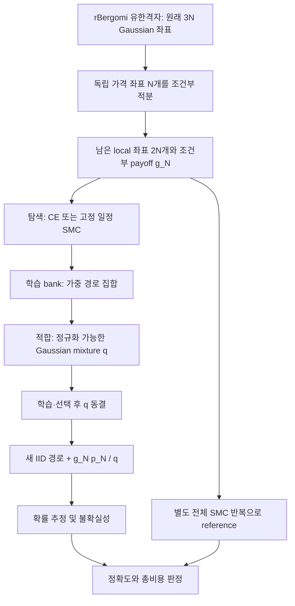

# 모델의 구조적 문제 재검토와 단계별 개선계획

작성일: 2026-10-07

검토 소스: `fe4bc79e801266e0279b20e3e27a93c7f56bf85d`

원격 main 병합 커밋: `45b59f4b03e1c2f85e0f0bf9a397dc5cb46f9006` — 검토 시작 시 두 커밋의 파일 내용은 동일

문서 성격: 코드·기존 결과·이론의 재검토 및 앞으로의 구현계획. 새 모델 학습이나 새 성능 실험의 완료 보고서가 아니다.

## 1. 연구 결정을 먼저 정리

현재 연구의 핵심 문제는 **중요한 경로를 찾고, 그 정보를 제안분포에 보존하고, 그 분포의 실제 오차와 비용을 검증하는 과정 전체의 신뢰성이 아직 부족하다**는 것이다.

이전 답변에서 강조한 낮은 학습 bank ESS는 실제 관측이다. 그러나 이번 코드 재검토에서는 실패 원인을 bank 하나로 축약하면 안 되는 이유도 확인했다.

1. 기존 ablation은 여러 Gaussian 성분을 가진 부모 proposal을 단일 평균이동 Gaussian으로 다시 적합한다. 발견한 경로 구조를 이 단계에서 잃었을 수 있다.
2. 이 ablation의 독립 반복은 고정된 부모 아래의 새 IID bank·새 fit 반복이다. 부모를 만드는 CE/SMC까지 매번 다시 실행한 전체 학습 반복은 아니다.
3. 최종 평가 8,192개와 RSE 5% 기준의 조합은, 기존 proposal을 524만 개 평가한 정밀도 결과와 직접 비교하기 어렵다. 정확도 자격 실패의 원인이 추정 오차인지, 분산인지, 평가 표본 부족인지 구분해야 한다.
4. 기존 mode 분석은 모든 경로를 기존 cluster 중 하나에 배정한다. 따라서 그 분석만으로는 기존 학습 영역 밖의 새로운 기여를 별도로 표시할 수 없다.
5. 사건확률에 기여하는 경로를 잘 학습하는 것과, 현재 proposal의 분산을 지배하는 경로를 잘 찾아내는 것은 서로 관련되지만 동일한 문제가 아니다.

따라서 다음 순서로 진행한다.

> **실패 원인 분리 → 기존 정보가 보존되는 최소 수정 → 독립적인 위험 탐색 → 전체 학습 반복의 정확도·비용 검증 → 새 task 확인 실험 → 논문 기여 확정**

새로운 operator나 차원 확장은 이 순서의 결과에 따라 결정한다. 현재 가장 유용한 다음 산출물은 큰 모델이 아니라, **어느 단계에서 성능을 잃는지 설명하는 실험과 그 원인 하나를 해결한 작은 알고리즘**이다.

## 2. 무엇을 만들고 있는가

### 2.1 금융모형, 추정기, 학습기, 검증기를 구분

| 층 | 현재 역할 | 우리의 연구 기여가 들어갈 위치 |
|---|---|---|
| 금융모형 | 기존 rough Bergomi 계열의 Gaussian Volterra 동역학 | 현재 새로운 시장 동역학을 제안한 것은 아님 |
| 조건부 계산 | 독립 가격 Brownian driver를 적분해 terminal event의 조건부 확률 계산 | 유지할 수학적·구현 기반 |
| 제안분포 학습 | CE/SMC로 중요한 경로를 찾고 Gaussian mixture를 적합 | 현재의 주요 개선 대상 |
| 최종 추정 | 새 표본과 전체 mixture 밀도로 ordinary IS 평균 계산 | exact-density·독립성 계약 유지 |
| 검증 | 독립 reference, 반복 학습, 위험 진단, 실제 비용 비교 | 과학적 결론의 신뢰도를 결정 |

경로적분 관점의 대상은 경로에 대한 기대값이다. 현재 구현의 핵심에 양자 진폭이나 복소 위상이 들어가지는 않는다. 신경망은 과거 action 초기화 실험에 존재하지만, 현재 R1.5 핵심 결과의 필수 구성요소가 아니다.

### 2.2 현재 계산 구조



`N=32`에서 원래 96개 난수 좌표 중 독립 가격 좌표 32개를 적분하고 64개 local 좌표를 남긴다. 두 local 좌표 묶음은 동일한 volatility Brownian의 셀 내 관측을 나타낸다. 서로 독립인 두 물리적 변동성 driver라는 뜻이 아니다.

현재 코드에서 구분할 두 계열은 다음과 같다.

- **V16 역사적 정책:** V14 residual, tempered target, CM action, hybrid를 task 파라미터에 따라 선택한다. 이후 감사에서 성능·이론 해석의 범위가 축소됐다.
- **R1.5 현재 개발 계열:** weighted SMC/CE bank와 exact Gaussian mixture를 사용해 탐색·학습·검증의 병목을 조사한다. 선택된 SMC 혼합 후보는 자연 Gaussian 질량 0.1과 두 개의 identity-covariance 이동 성분을 사용했다. 이는 확정된 최종 논문 모델이 아니다.

두 계열의 결과를 하나의 새로운 모델이 모두 달성한 성능으로 합쳐 쓰지 않는다.

### 2.3 보존해야 할 수학적 계약

표기를 간단히 하려고 이 절에서는 `p=p_N`, `g=g_N`, `μ=μ_N`로 쓴다. 상대오차와 q*를 다루는 부분에서는 현재 대상과 같이 `μ>0`을 가정한다.

\[
0\le g(z)\le1,\qquad \mu=\int g(z)p(z)\,dz,
\qquad
\widehat\mu=\frac1n\sum_{i=1}^{n}g(Z_i)\frac{p(Z_i)}{q(Z_i)},\quad Z_i\sim q.
\]

학습·선택이 끝난 `q`와 독립인 최종 IID 표본, 올바른 전체 밀도, support·적분 가능성 조건에서 `E[μhat | q]=μ`다. Gaussian mixture에서 선택된 성분의 밀도만 분모로 쓰면 안 된다.

`q≥δp`, `δ>0`이면 `0≤gp/q≤1/δ`와 `M₂(q)≤μ/δ`를 얻는다. 그러나

\[
\frac{\operatorname{Var}(\widehat\mu)}{\mu^2}
\le \frac{1/(\delta\mu)-1}{n}
\]

이므로 `δ=.1`, `μ≈5×10⁻⁸`, `n≈5×10⁶`에서 상대 SE 상한은 약 630%다. 방어적 성분은 support와 모멘트를 보호하지만, 이 bound만으로 5% 정밀도를 인증할 수 없다.

정확성의 대상은 선언한 유한격자 `μ_N`다. 연속시간 `μ`에 대한 mesh bias나 실제 시장 예측력을 동시에 보장하는 것은 아니다.

## 3. 현재 증거를 어떻게 읽어야 하는가

수치는 [R1.5 선행조건 보고서](POST_AUDIT_R15_R2_PREREQUISITES_2026-09-29_KO.md)와 연결된 JSON 산출물에 근거한다.

| 관측 | 확인된 사실 | 여기서 아직 결론 낼 수 없는 것 |
|---|---|---|
| 새 SMC reference RSE | canonical 2.09%, 높은 η 1.81% | reference가 오차 없는 참값이라는 주장 |
| 동결한 SMC-bank IS, 640×8192개 새 표본 | RSE 3.37%, 2.89%; 기존 동등성 gate 통과 | 새롭게 학습할 때마다 같은 품질을 얻는다는 주장 |
| SMC와 무관하게 학습한 CE-only IS | 동일 524만 표본에서 RSE 5.07%, 12.81% | 세 번째 학습 메커니즘까지 검증됐다는 주장 |
| IS 상위 1% 표본의 기여 | SMC-bank IS 약 67%/77%; 높은 η CE-only 약 93.6% | 미관측 tail 또는 mode가 없다는 주장 |
| 512개 IID bank를 20회 조사 | 좋은 median target ESS도 약 18.24/10.26, 하위 분위는 낮음 | 512개가 수백 개의 유효한 target 관측을 제공한다는 주장 |
| 96개 새-bank ablation fit | 복합 accuracy gate 통과 0개 | 96개 모두 편향됐거나 모든 rank/basis가 무효라는 주장 |
| 새로운 timed workflow의 canonical IS | RSE 8.07%로 자격 미달 | SMC 대비 속도 우위 |
| 높은 η timed workflow | SMC 82.74초·RSE 2.55%, IS 86.89초·RSE 3.60% | 같은 정밀도에서 최적 비용이 5% 나쁘다는 일반 결론 |
| V16의 과거 5.978 등 성능비 | 특정 개발 셀의 work-proxy 점추정 | 실제 시간 가속 배수·반복 학습 안정성 |

이번 재검토에서 `python -m experiments.post_audit_r15_audit`를 다시 실행했다. 10개 artifact의 산술·binding 검사와 합계 9,050개 seed ledger 검사는 통과했다. 현재 source-tree digest와 저장 digest는 10개 모두 다르다. 이번 턴에서는 전체 수치 replay를 다시 실행하지 않았다. 기존 보고서의 10/10 replay 기록과 이번 산술 감사는 서로 다른 증거다.

GitHub 병합 전후 CI의 Python 3.10/3.11 검사와 로컬 1,079개 테스트 통과 기록은 구현 품질의 근거다. 이것이 학습 안정성·희귀 꼬리 coverage·새 정리의 증명을 대신하지 않는다.

## 4. 큰 틀의 문제와 원인 가설

### 문제 A — 연구 목표와 성공 기준이 분산돼 있다

V16 routing, neural 초기화, 연속시간 효율 정리, 극단 tail 추정, 실무 pricing을 동시에 성공 목표로 삼으면 무엇을 개선한 것인지 흐려진다. 코드가 늘고 셀별 rule이 늘어도 하나의 학술적 기여로 연결되지 않을 수 있다.

이번 개선의 주 질문을 다음으로 좁힌다.

> 동일한 조건부 Gaussian Volterra target에서, 학습부터 최종 추정까지 반복 실행했을 때 신뢰 가능한 정확도를 더 적은 실제 비용으로 얻을 수 있는가? 그 차이를 만드는 경로 기하를 설명할 수 있는가?

신경망·연속시간 일반 정리·새 금융동역학은 이 질문과 별도 산출물로 관리한다. headline은 마지막에 증거를 보고 정한다.

### 문제 B — 탐색 다양성, weight ESS, 실제 정보량이 혼재돼 있다

SMC resampling은 조상 수를 줄이며 mutation은 경로의 위치를 바꾼다. 이미 사라진 초기 조상 ID는 mutation으로 복구되지 않으므로 조상 수만 최대화하면 좋은 mutation까지 잘못 평가할 수 있다.

| 지표 | 실제 측정 대상 | 주요 한계 |
|---|---|---|
| SMC 현재 weight ESS | 정규화 가중치 집중도 | 입자 간 의존성·미발견 mode를 반영하지 않음 |
| 초기 조상 수 | 초기 계보의 생존 수 | 현재 공간 탐색이나 독립 표본 수와 같지 않음 |
| pCN acceptance | 제안 이동의 수락률 | 작은 움직임만 수락해도 높아질 수 있음 |
| IID bank target ESS | 그 bank에서 `gp/G`의 집중도 | 아직 보지 못한 큰 기여에 낙관적일 수 있음 |
| 독립 전체 SMC 출력 변동 | SMC estimator의 실행 간 변동 | 유한 반복에서 tail 누락 가능 |
| 최종 IS 기여·위험 집중도 | 해당 proposal의 새 표본에서 관측한 위험 | 역시 유한 표본 진단이며 완전성 증명이 아님 |

개선 목표는 조상 수 증가 그 자체가 아니라 **동일 비용에서 새 proposal의 정확도·위험·실패율이 개선되는 것**으로 둔다.

### 문제 C — 발견한 정보를 proposal 적합 단계에서 잃을 수 있다

`post_audit_r15_fresh_ablation.py`는 과거 artifact의 CE/SMC 부모 mixture를 복원하고, 그 아래서 새 bank를 뽑는다. 이후 `fit_projected_mean_shift`는

\[
q_\theta=\delta p+(1-\delta)\mathcal N(B\theta,I)
\]

라는 단일 learned component family에 적합한다. 부모가 두 개 이상의 중요한 경로 집단을 표현했다면 단일 평균은 그 사이에 놓일 수 있다. rank를 늘려도 단일 component라는 제한은 남는다.

기존 실험에는 동일 평가 예산의 **부모 q 그대로 사용** 대조군이 없다. 따라서 낮은 bank ESS, 단일 component 압축, optimizer 미수렴의 영향을 분리하기 어렵다.

또한 weighted mixture fitting은 상위 PCA 4개 축으로 cluster를 나누고, 질량 1% 미만 또는 관측 2개 미만의 cluster를 버린다. 큰 공간 분산 방향이 큰 IS 위험 방향과 같다는 보장은 없다. 작은 target 질량의 cluster도 `p/q`가 크면 second moment에는 중요할 수 있다. 이는 확인해야 할 효율성 가설이며, density 보정이 틀렸다는 증거는 아니다.

### 문제 D — 최종 평가의 정밀도가 원인 진단을 제약한다

현재 새-bank ablation의 final count는 8,192이며 자격 조건은 RSE≤5%다. 반면 좋은 frozen SMC-bank proposal의 RSE 3.37%/2.89%는 640×8192개의 표본에서 관측했다.

같은 proposal의 분산이 그대로라는 계획용 가정을 두면 `SE∝n⁻¹ᐟ²`이므로, 8,192개에서 예상되는 RSE는 약 85%/73%다. 이는 실제 ablation의 예측값도 정확한 표본 수 인증도 아니다. **작은 final count에서 5% gate를 통과하려면 부모보다 수백 배 낮은 기여 분산이 필요할 수 있다**는 예산 감도 점검이다.

따라서 0/96 통과는 실패 결과로 유지하되, 이를 bank 원인 또는 rank 부족의 결정적 증거로 쓰지 않는다. 실패 사유를 `평균 차이 / RSE / reference 정밀도 / 수치 실패 / 예산 부족`으로 분리하고 독립 pilot으로 본 평가 allocation을 정해야 한다.

### 문제 E — target 학습과 candidate 위험 탐색의 차이가 충분히 반영되지 않았다

비음수 payoff의 이상적인 proposal은 `q*=pg/μ`이고,

\[
\frac{M_2(q)}{\mu^2}=1+\chi^2(q^*\Vert q),\qquad
M_2(q)=\int\frac{g^2p^2}{q}.
\]

이는 기존 IS 원리다. 유한 표본에서 `q*`의 대부분을 잘 설명해도, `q`가 매우 작은 작은 영역이 위험을 지배할 수 있다. KL 적합의 개선이 χ² 또는 M₂ 개선을 자동 보장하지 않는 이유다. 관련 일반 원리는 [Agapiou 등](https://arxiv.org/abs/1511.06196)과 비교한다.

IID bank `Z~G`의 target weight `w=gp/G`에 대해 적절한 모멘트 조건 아래

\[
\frac{\mathrm{ESS}_{target}}{m}\longrightarrow
\frac{\mu^2}{M_2(G)}.
\]

따라서 target ESS는 유용하다. 그러나 이는 `G`에 대한 지표이고, 새 candidate `qθ`의 위험은

\[
v_\theta(Z)=\frac{g(Z)^2p(Z)^2}{G(Z)q_\theta(Z)}
\]

로 별도 측정해야 한다. 현재 코드에는 이미 empirical M₂와 `risk_pca`가 있다. 문제는 이 계산들이 희귀 기여를 놓칠 수 있는 같은 bank에 의존한다는 것이다. 개선은 M₂를 새로 도입하는 일이 아니라 **위험 검증의 표본 원천과 탐색 범위를 넓히는 일**이다.

### 문제 F — 기존 cluster 밖 기여를 측정하지 못한다

`assign_saved_cluster_geometry`는 모든 새 경로에 최근접 cluster의 label을 준다. 분포에서 매우 멀리 떨어진 경로도 네 label 중 하나에 들어간다. 네 cluster의 기여가 모두 양수라는 관측은 학습한 네 영역 밖 기여를 배제하지 못한다.

추가할 진단은 중심까지의 거리, PCA 밖 잔차, 경로 함수값 `I_N`, `J_N`, 최대 변동성 및 그 시점 등의 training-only 좌표다. threshold는 독립 calibration에서 고정한다. Gaussian proposal의 support는 이미 전체 공간이므로 이를 수학적인 “support 밖”이라고 부르지 않고 **학습 geometry에서 벗어난 영역**이라고 부른다.

### 문제 G — 확인 실험의 통계 단위와 정확도 의미를 더 엄격히 구분해야 한다

고정 proposal의 640개 final batch는 640회 독립 학습이 아니다. 현재 ablation의 세 반복도 부모 CE/SMC 전체 재학습이 아니다. `parent_training_rep → refit_rep → final_batch`라는 계층을 기록해야 한다.

RSE≤5%와 25% equivalence margin을 동시에 통과했다는 것은 **상대 RMSE≤5%를 증명했다는 뜻이 아니다**. 비교한 두 방법의 실제 RSE도 다르므로 현재 timed 결과는 “공통 자격을 통과한 고정예산 workflow의 시간”으로 읽는다.

5회 독립 학습에서 실패가 없어도 독립 Bernoulli 가정의 실패율 단측 95% 상한은 `1−0.05^(1/5)≈45.1%`다. 20회는 약 13.9%이고, 실패율 5% 미만을 같은 방식으로 주장하려면 0/59 실패 정도가 필요하다. 모든 셀에 59회가 의무라는 뜻은 아니다. 주장할 신뢰도에 맞춰 반복 수를 정해야 한다.

### 문제 H — 연구 성과의 현재 설명과 저장소 첫 화면이 맞지 않는다

README는 아직 8월 V16을 current frontier로 설명하고 예전 work-proxy 우위를 중심에 둔다. 9월 감사와 R1.5의 R2/R3 보류 상태가 최상단에 반영되지 않았다. 이 불일치는 현재 성능과 이론 상태를 오해하게 한다.

최신 상태 안내, 역사적 결과, 미완료 이론을 연결하는 문서 정리가 필요하다. 과거 수치나 실패 기록을 지우지 않고 superseding 해석을 붙인다.

### 문제 I — 학술적 독창성과 실무 적용 범위가 미완성이다

조건부 Monte Carlo, CE, SMC, Gaussian mixture, 저차원 방향 선택은 각각 알려진 원리다. rough Bergomi의 조건부 계산 및 실행시간을 반영한 분산 감소는 [McCrickerd–Pakkanen](https://arxiv.org/abs/1708.02563), failure-informed 차원 축소 CE는 [Uribe 등](https://arxiv.org/abs/2006.05496)과 구체적으로 구분해야 한다.

현재 deep-tail 실험의 `S0=100, K=1`은 만기에 초기 가격의 1% 아래로 내려가는 stress target이다. 그 결과만으로 일반적인 옵션 pricing·calibration workload에서 실용성이 있다고 결론 낼 수 없다. 별도의 실무 task와 정확도·시간 비교가 필요하다.

## 5. 개선 후보와 우선순위

아래 순서는 성공 확률의 수치적 추정이 아니라, 현재 증거에서 얻을 정보와 구현·검증 비용을 고려한 우선순위다.

| 순서 | 후보 | 해결하려는 문제 | 채택에 필요한 증거 |
|---|---|---|---|
| 1 | 부모 proposal 보존 및 동일 family 대조 | mixture 압축·평가예산의 혼선 | 부모/동일 family/단일 shift의 독립 정확도·위험 차이 |
| 2 | 동일 예산 SMC bank 구성 변경 | 독립 시작점·mixing의 부족 | 전체 학습 반복의 위험·정확도·비용 개선 |
| 3 | 동결 q의 second-moment target 탐색 | 사건 mass에 덜 보이는 위험 경로 | 독립 M₂ 평가와 새 보정 proposal의 실제 이득 |
| 4 | 중요한 component 보존 및 소수 가중치 최적화 | 작은 mass지만 큰 risk인 영역의 삭제 | 같은 component 수 대조군 대비 개선 |
| 5 | rank/basis/covariance 확대 | 표현 능력 부족 | 위 원인이 정리된 이후의 같은 family ablation |
| 조건부 | 신경망·비선형 flow·operator | 여러 task 반복의 비용 또는 Gaussian family 한계 | 단일 task 해법·한계·재사용 workload가 먼저 확인됨 |

### 5.1 1순위: 부모를 포함한 원인 분리

같은 새 학습에서 다음을 모두 평가한다.

1. `parent_as_is`: 부모 q를 수정하지 않고 그대로 사용.
2. `same_family_refit`: 부모의 learned component 수·covariance family·defensive mass를 유지하고 새 bank로 재적합. 부모 파라미터를 초기값으로 기록.
3. `single_shift_compression`: 기존 단일 평균이동 ablation을 그대로 대조군으로 유지.

처음에는 SMC 부모의 두 개발 셀에서 시작한다. 먼저 셀당 부모 학습 1회와 위 세 표현으로 throughput·allocation pilot을 수행하고, 그 자료는 본 평가 집계에 넣지 않는다. 이후 봉인한 상한 안에서 셀당 전체 부모 학습 5회와 위 세 표현으로 확대하면 30개 proposal 평가다. 각 fit의 evaluation budget은 독립 pilot으로 먼저 정한다. 필요한 예산이 상한을 넘으면 표본 수를 임의로 줄여 같은 5% gate를 적용하지 않고, 해당 비교를 예산 부족에 따른 unresolved로 기록한다. 이 비교가 해석 가능해진 후 CE 부모에서도 필요한 대조를 수행한다.

학습 bank를 공유한 paired 비교와 부모 생성부터 독립인 반복을 구분한다. 물리적으로 부모·bank 계산을 공유하더라도 각 방법의 단독 배포 비용에는 필요한 학습·bank 비용 전액을 포함한다. 실제 공유 실험비와 방법별 배포 비용을 따로 기록한다. optimizer의 최종 loss·gradient norm·반복 수·초기값을 저장하고, 전체 rank에서 Adam의 회전좌표 의존성을 subspace 효과로 잘못 읽지 않는다.

**판정:** 부모는 적격인데 단일 shift만 악화되면 압축 손실이 유력하다. 부모부터 반복적으로 부적격이면 탐색·학습을 먼저 고친다. 모두 정밀도 부족이면 allocation 또는 reference 문제를 해결한 뒤 원인을 판정한다.

### 5.2 2순위: 같은 비용으로 SMC bank를 더 잘 생성

현재 출발점은 3개 독립 bank × 256 particles, 고정 48단계 bridge, 선택된 pCN/resampling 일정이다. 초기 particle 총수를 768로 맞춰 `1×768`, `3×256`, `6×128`을 대조할 수 있다. 같은 총 particle 수만으로 비용이 완전히 같지는 않으므로 potential 평가 수와 실제 wall time을 모두 기록한다.

그다음 학습용 bank에 한해 마지막 `β=1`에서 추가 pCN rejuvenation을 비교한다. 기존 코드는 마지막 단계에서 mutation을 생략한다. target 불변 kernel로 마지막 bank를 이동시키는 것은 저장한 normalizer 추정값을 변경하지 않지만, bank geometry에는 영향을 줄 수 있다. 추가 비용을 baseline의 같은 예산과 비교해야 한다.

여러 설정을 한꺼번에 바꾸지 않는다. 먼저 island 배분, 이어서 terminal rejuvenation을 조사한다. reference용 frozen SMC는 그대로 두고 학습용 변경의 효과를 구분한다. ancestry, weight ESS, acceptance, 이동 거리, 독립 bank 사이의 기여 분포를 함께 기록한다.

### 5.3 3순위: 동결 proposal의 위험을 직접 탐색하는 SMC

이 절은 **새 구현 후보**다. 현재 위험 탐색 누락의 가설을 시험하는 최소 확장으로 제안하며, 성능이나 독창성이 확인된 방법이 아니다.

먼저 `q₀≥δ₀p`를 동결한다. `g>0`인 현재 비퇴화 conditional Gaussian CDF 대상에서

\[
h_{q_0}(z)=\delta_0 g(z)^2\frac{p(z)}{q_0(z)},\qquad
0<h_{q_0}\le1,
\]

\[
E_p[h_{q_0}]=\delta_0 M_2(q_0),\qquad
\pi_{risk}(z)\propto\frac{g(z)^2p(z)^2}{q_0(z)}.
\]

따라서 기존 weighted SMC가 요구하는 bounded potential에 다음 값을 넣을 수 있다.

```text
log_h = log(delta_0) + 2 * log_g - log(q_0 / p)
bridge target at beta: p * h**beta
M2 estimate: SMC_normalizer / delta_0
```

고정 bridge/resampling 일정, 올바른 target 불변 pCN kernel, 동결 q₀와 독립인 SMC 난수 조건에서 normalizer의 기존 논증을 적용할 수 있다. SMC 기본 원리는 [Del Moral–Doucet–Jasra](https://www.stats.ox.ac.uk/~doucet/delmoral_doucet_jasra_sequentialmontecarlosamplersJRSSB.pdf), Gaussian reference를 보존하는 pCN은 [Cotter 등](https://arxiv.org/abs/1202.0709)과 대조한다.

이 구성은 현재 q₀가 충분히 샘플링하지 않는 큰 second-moment 기여 영역을 따로 찾아보는 역할이다. 두 가지 사용을 분리한다.

- **위험 진단:** 독립 전체 SMC 반복으로 M₂(q₀)를 추정하고, q₀에서 직접 얻은 기여 제곱 평균과 비교한다.
- **보정 후보 생성:** risk bank에 정규화 가능한 작은 Gaussian mixture r을 적합한다. SMC target의 미지 정규화 밀도를 최종 분모에 직접 쓰지 않는다.

보정은 `qα=(1−α)q₀+αr`로 두고, 처음에는 `α∈{0, .25, .5}`를 사전 고정한 작은 후보군으로 사용한다. q₀와 r 모두 `δ=.1`의 자연 성분을 가지면 qα도 같은 defensive bound를 유지한다. 일반적으로 정규화된 r만 가정하면 α<1에서

\[
M_2(q_\alpha)\le\frac{M_2(q_0)}{1-\alpha}
\]

가 성립한다. 이는 개선 보장이 아니라 악화 크기에 대한 한쪽 상한이다. α=0은 반드시 남긴다. frozen 성분 사이에서 M₂는 mixture weight에 대해 볼록하지만, 유한 bank에서 얻은 최적 weight는 실제 위험을 과적합할 수 있다.

**필수 대조:** 같은 추가 비용과 같은 component 수로 event-target bank에서 만든 r도 비교한다. 그래야 risk target의 효과와 단순한 component 추가 효과를 분리할 수 있다.

**표본 분리:** r을 만든 risk bank를 qα의 selection 평가에 재사용하지 않는다. qα 후보 전체를 동결한 뒤 별도 selection 표본 또는 독립 전체 SMC 반복으로 α를 선택한다. 선택과도 독립인 새 final IID 표본으로 μ를 추정하고, 선택된 후보의 최종 위험 보고에는 별도의 risk-evaluation 난수를 사용한다.

**한계:** μ≈10⁻⁸의 잘 맞는 q에서 `δM₂≈δμ²`는 매우 작다. 그러나 normalizer의 절대 크기만으로 탐색 난이도를 판단하면 안 된다. potential의 상수 배율은 정규화된 target에서 사라지며, 상수 potential은 normalizer가 작아도 쉽게 계산할 수 있다. 실제 난이도는 h의 상대적 집중도, bridge weight의 변동, mode 사이 이동, 독립 실행의 변동으로 평가한다. log-domain 계산은 underflow를 줄일 뿐, 어려운 target의 혼합을 보장하지 않는다. 이 risk-SMC가 기존 SMC보다 쉽거나 싸다고 가정하지 않는다. `log Zhat`와 `M2hat / muhat²`도 불편 추정량이 아니다. 해당 불확실성을 별도로 보고한다.

### 5.4 geometry 밖 기여 진단

학습 geometry, 거리 threshold calibration, discovery, 최종 평가를 서로 다른 표본 역할로 둔다. 기존 중심 거리와 PCA complement 잔차를 기본 score로 사용하고, 필요한 경우 경로 함수값을 추가한다. 각 score의 threshold와 다중 판정 방식을 pilot에서 동결한다.

새 표본에서 다음을 계산한다.

- 학습 geometry 안/밖의 표본 비중과 보정된 μ 기여 비중.
- 같은 구분의 M₂ 기여 비중.
- 상위 1%, 상위 0.1%, 최대 단일 기여의 비중.
- 독립 bank 간 geometry·기여 분포의 변동.

이 진단의 목적은 중요한 영역을 놓친 증거를 찾는 것이다. “밖의 경로가 관측되지 않았다”를 완전성 증명으로 쓰지 않는다. 학습 시 의도적으로 작은 고위험 mode를 뺀 synthetic 문제에서 detector의 민감도와 오탐을 먼저 검사한다.

## 6. 실행 단계와 진입 조건

이 문서의 S0–S6은 기존 R0–R5 계획을 실행하기 위한 세부 순서다. 과거 단계의 실패 판정을 바꾸는 새 명칭이 아니다.

표는 산출물의 의존관계를 나타낸다. S5의 선행연구 대조·유한격자 정리·toy/oracle 검토는 S0–S3와 병행한다. 비용이 큰 S4에 진입하기 전에 최소한의 논문 주장과 기존 연구와의 차이를 먼저 고정한다. 그 근거가 없으면 확인 실험의 규모를 키우지 않는다.

| 단계 | 구현·산출물 | 통과 또는 다음 결정 기준 |
|---|---|---|
| S0: 증거·역할 계약 | 최신 상태 안내, parent/refit/final 계층, 실패 사유 분해, source manifest | 과거 수치를 재산출하며 반복 단위·정확도 의미가 명확함 |
| S1: 원인 분리 | parent-as-is/동일 family/단일 shift와 독립 allocation | 탐색·압축·optimizer·평가부족 중 어느 원인이 지지되는지 설명 가능 |
| S2: 최소 개선 | SMC 배분 또는 정보 보존 변경 하나; risk-SMC는 toy 통과 후 소규모 | 새 표본에서 정확성 유지, 위험·총비용의 반복 개선 신호 |
| S3: 학습 안정성 | 최소 5회 개발 전체 학습, 이후 별도 20회 검증 | 실패율·하위 분위·비용 불확실성을 포함해 진행할 가치가 있음 |
| S4: 확인 실험 | 알고리즘 동결, 미사용 task, 강한 비교기, 실제 비용 | 사전 primary endpoint에 따라 성공/제한 성공/실패 판정 |
| S5: 수학·mesh·실무 | 유한격자 핵심 정리, 필요한 mesh 분석, 현실적 pricing workload | 수학 주장·추정 대상·실무 해석이 일치 |
| S6: 논문 결정 | novelty 표, 증명, 핵심 그림, 재현 패키지 | 결과와 기여에 맞는 투고 범위를 선택 |

### S0 — 먼저 고쳐야 할 실험 계약

1. source/config/task/proposal digest와 역할별 seed를 연결한다. 실행 코드는 clean commit 또는 변경 불가능한 source snapshot으로 묶는다. 실행 이후 결과 파일 추가를 source 변경으로 혼동하지 않도록 manifest 범위를 명시한다.
2. 기존 source mismatch artifact는 역사적으로 보존한다. 새 결과의 hash를 과거 artifact에 덮어써서 일치시키지 않는다.
3. `parent_training_rep`, `refit_rep`, `selection_rep`, `final_batch`, `reference_rep`를 결과 key에 구분한다.
4. accuracy 결과는 평균 차이·방법 RSE·reference RSE·수치 유효성·예산 초과를 별도 필드로 저장한다. `failed` 하나로 압축하지 않는다.
5. README의 최신 상태는 R1.5 기준으로 정리하고, V16 성능비는 역사적 work-proxy 기록으로 연결한다.

### S1 — 정밀도 allocation을 먼저 봉인

작은 독립 pilot으로 각 방법의 기여 분산과 실행비용을 측정한다. 목표 RSE r에 대한 `n≈CV²/r²`는 계획용 시작점으로만 사용한다. pilot의 불확실성에 대해 사전 고정한 여유계수를 적용하고, 표본 수와 최대 예산을 본 평가 전에 확정한다.

같은 n 비교는 분산을 비교하는 보조 실험이고, 같은 목표 정확도 비교는 비용을 평가하는 본 실험이다. 둘의 결론을 섞지 않는다. 관측 RSE가 낮아질 때까지 무제한 연장하는 종료 규칙은 사용하지 않는다. 순차 종료가 필요하면 별도의 유효한 순차추론 절차를 설계한다.

현재 25% equivalence margin은 느슨한 개발 자격으로 표기한다. 5% 상대 RMSE를 headline으로 사용하려면 전체 학습 반복에 걸친 상대 RMSE와 reference 불확실성을 평가해야 한다. 후보와 독립이고 불편인 reference의 경우, 평균 squared difference에는 reference variance도 더해진다. 이를 그대로 참 RMSE로 읽지 않는다. reference variance를 보정할 때는 보정값의 불확실성과 음수가 나올 가능성도 공개하고, 0으로 잘라 정확한 MSE인 것처럼 보고하지 않는다. reference 자체의 bias 가능성도 별도 검토한다. 기존 계획의 reference SE 목표는 비교 estimator SE의 1/5 이하이며, 비용상 달성하지 못하면 결론을 보류하거나 목표를 사전에 조정한다.

### S2 — 실험 수를 제한한 원인별 개선

S1에서 압축 손실이 지지되면 같은 component family 보존과 weight 적합을 먼저 진행한다. 부모부터 실패하면 island 배분·mutation을 먼저 진행한다. 직접 평가 위험이 bank 밖 독립 위험 평가보다 반복적으로 낮게 나오면 risk-SMC/독립 탐색 후보를 진행한다.

초기 비교는 두 개발 셀, 최대 세 개의 주 후보로 제한한다. 같은 학습 potential 평가 예산과 비슷한 model capacity를 맞추되, 실제 밀도 계산·clustering·selection 비용도 함께 보고한다. 서로 다른 원인을 결합할 때에는 `기존 / A만 / B만 / A+B` 대조를 남긴다.

개발 확대의 실용적 기준은 기존 계획의 약 20% 총비용 개선 신호다. 이는 저널 합격선이나 통계적 증명 기준이 아니다. baseline이 qualification에 실패하면 candidate 승리로 집계하지 않고 비교를 unresolved로 둔다.

### S3 — 전체 학습의 안정성

각 반복에서 CE/SMC 초기 난수부터 bank, fit, selection, final까지 새로 실행한다. 한 번 학습한 부모를 공유한 조건부 변동은 별도 실험으로 유지한다.

최소 보고 항목은 모든 반복의 μhat·SE·RSE, 독립 reference 차이, 위험 추정, 총시간, peak memory, qualification 실패·시간 초과다. 평균과 중앙값뿐 아니라 나쁜 쪽 성능 분위와 불확실성을 보고한다.

5회는 구현·개발 관문, 20회는 이후 확인 설계의 출발점이다. 실패율에 대한 더 강한 주장은 필요한 반복 수를 따로 계산한다. 실패한 학습을 지운 뒤 성공 seed만 재학습해 시간이나 정확도를 집계하지 않는다. 재시도가 배포 알고리즘의 일부라면 횟수·종료 정책·재시도 비용을 모두 포함한다.

### S4 — 미사용 task와 강한 baseline 확인

기존 전체 계획의 기본안인 24개 미사용 task(ID/경계/joint OOD 각 8개), task별 20개 전체 학습 반복을 출발점으로 삼는다. pilot 비용에 따라 축소한다면 결과 열람 전에 범위와 이유를 고정한다. 과거에 본 canonical/높은 η 셀은 development로 남긴다.

비교군은 같은 conditional payoff의 weighted CE, SMC, 충실한 FIS 계열, V14, conditional RQMC 중 최종 범위에 필요한 강한 집합을 봉인한다. gradient 행렬만 구현한 것을 문헌의 전체 iCEred 알고리즘 구현으로 쓰지 않는다.

총시간에는 offline·fit·selection·inference를 포함한다. warmup, load/I/O 포함 여부, method 순서, thread 수, 하드웨어·전력 설정을 고정하고 시간 측정은 순차 실행한다. independent reference 생성 비용은 공통 benchmark 비용으로 공개하되, 배포 알고리즘이 reference를 필요로 하면 그 의존 비용도 포함한다.

동일 reference를 공유한 비교는 공통 reference 오차와 pairing을 분석에 반영한다. 모든 실패와 불확실한 셀을 표에 남기며, 최종 결과를 보고 유리한 subgroup을 만든 경우 탐색 결과로만 보고한다.

### S5 — 논문의 수학적 기여와 실무성

고정 N에서 먼저 완결할 대상은 `경로 방향·학습 오차·표현 오차 → 상대 M₂ → 전체 비용`의 관계다. q* 항등식이나 defensive bound 자체는 새 정리가 아니다.

참조 complement를 유지하는 `q_U(u)p_V(v)` family에서는 `m₁(u)=E[g|U=u]`와 `s²(u)=Var(g|U=u)`를 사용해 잔여 분산을 분석할 수 있다. 독립 Gaussian 좌표 U/V에서 marginal q_U를 자유롭게 선택할 수 있는 이상적 KL projection은 `q_KL(u,v)=p_U(u)m₁(u)p_V(v)/μ`다. 이때 `X=gp/q_KL`로 두면 기존 계획의

\[
D_B=E[s^2(U)/m_1(U)],\qquad
\operatorname{Var}_{KL}(X)/\mu^2=D_B/\mu
\]

는 그 이상적 projection의 항등식이다. 현재의 제한된 Gaussian family 적합이나 defensive mixture에 그대로 성립하는 성능식은 아니다. `m₁=0`인 집합은 `g=0`이 조건부 거의 확실하므로 기여를 0으로 정의한다. 전체 Gaussian mixture에 바로 적용하지 않는다. 새 내용이 되려면 Volterra kernel·H·η·ρ·희귀도·rank로 이 양을 유용하게 제어하거나, 이를 낮추는 계산법과 비용을 입증해야 한다. noisy/complement 문제의 최적 proposal 해석은 [Llorente 등](https://arxiv.org/abs/2201.02432)과 대조한다.

Gaussian conditional Poincaré나 gradient bound를 사용할 때는 Sobolev 적분 가능성, 작은 integrated variance, 작은 m₁, |ρ|→1, 희귀도에 따른 상수 폭발을 확인한다. 의미 없는 상수만 남으면 유용한 효율 정리라고 쓰지 않는다.

연속시간 주장에는 별도 증명이 필요하다. T16-5의 ε-dependent payoff/Laplace 단계, T16-9의 norm·tail·uniform grid 제어, 이에 의존하는 T16-11은 현재 ledger에서 검토 미완료다. 새 bank 개선으로 이 문제가 해결되지는 않는다.

mesh 실험은 joint Brownian 관측의 covariance가 맞는 coupling으로 N=16/32부터 검증하고, 필요한 N=64/128로 확장한다. 인접 격자 차이가 작다는 관측만으로 연속시간 bias의 상한을 선언하지 않는다.

실무 task는 deep-tail stress와 별도로, 해석 가능한 strike ratio·maturity·forward variance에서 bounded digital pricing부터 정의한다. 실제 시장 calibration 데이터가 없으면 production calibration 성과로 표현하지 않는다. risk-neutral 확률을 현실 폭락 확률이나 physical VaR로 바꾸어 설명하지 않는다.

### S6 — 결과에 따른 논문 방향

| 최종 결과 | 적절한 연구 결정 |
|---|---|
| Volterra 특화 정리 + 반복 가능한 비용 개선 | 핵심 알고리즘·정리·유효 범위를 중심으로 상위 저널용 원고 구성 |
| 강한 수치 개선, 수학은 기존 원리의 적용 | 계산·응용 중심 기여로 범위를 명확히 함 |
| 개선 없음, family 한계나 실패 조건을 새롭게 증명 | 이론·한계 분석 중심의 논문 가능성 검토 |
| 새 task에서 개선 소멸·이론 기여도 불충분 | 구조 추가를 중단하고 문제·주장 범위 재선정 |

## 7. 구현 단위와 의미 있는 검증

아래 신규 파일은 제안 경로이며 이 문서 작성 시 생성하지 않았다. 기존 추상화로 충분한지 구현 전에 확인한다.

| 묶음 | 기존 출발점 | 제안 구현·산출물 |
|---|---|---|
| 반복 계층·실패 사유 | `research_result_contract.py`, `comparator_qualification.py` | parent/refit/selection/final schema와 failure trace |
| 압축 손실 진단 | `r1_bottleneck_diagnostics.py`, `weighted_bank_mixture.py` | `experiments/post_audit_r2_family_diagnosis.py` |
| SMC bank 개선 | `weighted_tempered_smc.py` | 선택적 terminal rejuvenation, island별 진단·정확한 비용 계수 |
| 위험 target | 기존 log-payoff·mixture density·weighted SMC | `src/path_integral/conditional_second_moment.py` |
| 독립 위험 대조 | R1.5 reference 실행기 | `experiments/post_audit_r2_risk_diagnostics.py` |
| geometry 밖 기여 | cluster assignment 코드 | `src/path_integral/path_geometry_diagnostics.py` |
| 전체 반복·비용 | R1.5 fixed-work 실행기 | `experiments/post_audit_r2_fit_stability.py` 및 `post_audit_r2_precision_work.py` |
| 설정·증거 | 기존 `configs/post_audit`, `results/post_audit` | `r2_*_v1` 이름의 새 config/result; 과거 v1 보존 |
| 감사 | `post_audit_r15_audit.py` | 새로운 schema의 수치 재계산·역할 분리·누락 실행·비용 검증 |

실제 동작과 수학을 확인할 검증은 다음에 집중한다.

1. **조건부 payoff:** 작은 Gaussian oracle와 raw 가격 noise 조건부 반복 평균이 일치하는지 확인한다.
2. **density:** 동일 mean/covariance의 독립 dense Gaussian 식, mixture label 경계, 자연 성분, 샘플링 모멘트와 비교한다.
3. **risk potential:** `q=p, g=c`에서 `h=δc²`, `M₂=c²`; 1차원 smooth Gaussian-CDF payoff에서는 독립 quadrature와 비교한다.
4. **SMC:** 가중치를 운반하는 일정, 상수 potential, mutation/resampling 없는 경우의 MC 일치, terminal rejuvenation 전후 normalizer 불변을 검사한다.
5. **수치 범위:** 극단 log-CDF와 log-density ratio에서 NaN/Inf/소실을 명시적으로 검출한다. positive potential 범위를 벗어나 hard zero를 허용하려면 MH의 `−∞−(−∞)` convention을 정의·검사한다. clipping으로 조용히 target을 바꾸지 않는다.
6. **geometry:** 학습에서 빠진 작은 고위험 영역이 있는 toy와 단일-mode toy에서 탐지율·오탐을 각각 확인한다.
7. **통계:** IID, 전체 SMC 반복, QMC scramble의 SE 단위를 구분하고, shared reference·paired comparison을 독립 oracle로 재계산한다.
8. **프로토콜:** seed 역할 중복, 부모 digest 재사용 오표기, stale pass, NaN, 누락 comparator, 실패 시간 누락을 거부한다.

작은 단위·oracle 검사를 통과한 뒤 관련 회귀와 전체 CI를 수행한다. 테스트 개수 증가를 수학적 증명이나 학술 기여로 집계하지 않는다.

## 8. 비용 운영과 중단 기준

현재 노트북에서 S0, toy/oracle, 작은 S1/S2 pilot까지 수행할 수 있도록 설계한다. 먼저 실제 throughput·메모리·예상 job 수를 측정하고 각 config에 `max_potential_evaluations`, `max_wall_seconds`, 표본 수·반복 수 상한을 봉인한다. 실행시간 숫자를 pilot 없이 확정하지 않는다.

시간 측정을 제외한 독립 감사·코드 검토는 병렬화할 수 있다. 노트북의 비교 timing 실험은 다른 무거운 작업과 동시에 돌리지 않는다. 큰 confirmation에서 외부 CPU/GPU를 사용할지는 pilot의 병목을 본 뒤 결정한다. CPU 위주의 현재 실험에 GPU가 자동으로 이득이라는 가정은 하지 않는다.

| 관측 | 중단·전환 조치 |
|---|---|
| target·밀도·seed 계약 위반 | 성능 비교 중단, 해당 정확성 구현부터 수정 |
| 부모는 좋은데 단일 shift만 악화 | 같은 mixture family 보존, rank 확대 우선순위 낮춤 |
| 부모 자체가 불안정 | bank 탐색·fitting부터 개선 |
| 모든 평가가 정밀도 부족 | 독립 allocation 재설계; family 실패로 단정하지 않음 |
| risk-SMC가 독립 반복에서도 불안정 | 새로운 oracle로 취급하지 않고 unresolved 기록 |
| ancestry만 개선되고 최종 위험·비용 동일 | 그 변경의 효율성 가설 미지원 |
| 위험 감소보다 fit·density 비용 증가가 큼 | 후보 단순화 또는 폐기 |
| 정해진 소수 개선 후보에서 신호 없음 | 같은 셀에 무한 튜닝하지 않고 scope/연구 질문 재검토 |
| 새 confirmation 결과를 보고 rule 변경 | 기존 세트는 development로 전환; 별도 새 확인 세트 필요 |

## 9. 최상위 저널 목표와의 연결

현재 가장 큰 장점은 유한격자 조건부 계산, 정확한 밀도, 실패를 보존한 실험 기반이다. 가장 큰 부족은 **새로운 경로 기하 원리를 설명하고, 그 원리가 반복 가능한 정확도·비용 개선으로 이어짐을 보이는 연결고리**다.

논문의 중심이 될 수 있는 질문은 다음과 같다.

> Gaussian Volterra 경로에서 사건 mass와 second-moment 기여가 어떻게 다른 방향에 집중되는가? 이 차이를 제한된 비용으로 진단·보정해, 학습 반복과 task 변화에도 신뢰할 수 있는 추정을 얻을 수 있는가?

이 질문에 대해 새 정리 또는 강한 메커니즘 증거, 공정한 baseline, 실패 영역, 실제 비용이 갖춰져야 한다. risk-SMC의 potential 변환이나 Gaussian mixture를 더했다는 사실만으로 그 요구가 충족되지는 않는다. 외부 문헌과의 비교는 아래 자료를 시작점으로 하되 원고 단계에서 최신 원문·수식·가정까지 다시 확인한다. 이번 검색은 독창성을 인증하는 체계적 문헌고찰이 아니다.

## 10. 근거 파일과 검토 범위

### 저장소 내부 근거

- [연구 재설계 보고서](RESEARCH_REORIENTATION_REVIEW_2026-09-27_KO.md): V16 성능·비교기·이론 주장 재해석.
- [기존 실행계획](../plans/POST_AUDIT_RESEARCH_EXECUTION_PLAN_2026-09-27_KO.md): R0–R5, 확인 실험, mesh 및 중단 기준.
- [R1 병목 진단](POST_AUDIT_R1_BOTTLENECK_DIAGNOSIS_2026-09-28_KO.md): bank·basis·objective·cost 가설.
- [R1.5 실행 보고서](POST_AUDIT_R15_R2_PREREQUISITES_2026-09-29_KO.md): 최신 reference·bank·ablation·timing 수치.
- [이론 상태표](../theory/POST_AUDIT_CLAIM_LEDGER_2026-09-28.md), [SMC/IS 정합성](../theory/POST_AUDIT_R15_SMC_IS_VALIDITY_2026-09-29_KO.md).
- [weighted SMC](../../src/path_integral/weighted_tempered_smc.py), [mixture fitting](../../src/path_integral/weighted_bank_mixture.py), [KL/M₂와 기하 진단](../../src/path_integral/r1_bottleneck_diagnostics.py).
- [fresh ablation 실행기](../../experiments/post_audit_r15_fresh_ablation.py), [그 설정](../../configs/post_audit/r15_fresh_ablation_v1.yaml), [timed workflow](../../experiments/post_audit_r15_fixed_precision_total_work.py), [산술 감사](../../experiments/post_audit_r15_audit.py).

### 외부 원문 확인

- [Agapiou 등: Importance Sampling — Intrinsic Dimension and Computational Cost](https://arxiv.org/abs/1511.06196): 상대 second moment·divergence·필요 계산량의 일반적 연결.
- [Uribe 등: Cross-entropy-based importance sampling with failure-informed dimension reduction](https://arxiv.org/abs/2006.05496): CE와 저차원 failure-informed geometry의 선행 경계.
- [Del Moral–Doucet–Jasra: Sequential Monte Carlo Samplers](https://www.stats.ox.ac.uk/~doucet/delmoral_doucet_jasra_sequentialmontecarlosamplersJRSSB.pdf): 연속된 target·normalizer·SMC 구성의 기존 원리.
- [Cotter 등: MCMC Methods for Functions](https://arxiv.org/abs/1202.0709): Gaussian reference를 보존하는 함수공간 MCMC/pCN.
- [McCrickerd–Pakkanen: Turbocharging Monte Carlo pricing for the rough Bergomi model](https://arxiv.org/abs/1708.02563): 조건부 계산과 runtime-adjusted variance의 선행 기준.
- [Llorente 등: Optimality in Noisy Importance Sampling](https://arxiv.org/abs/2201.02432): noisy integrand와 조건부 second moment에 따른 proposal 설계의 선행 경계.

### 이번 문서 작성 중의 검토

- 부모 재사용, 단일-component 압축, 무조건 최근접 cluster 배정, final count와 gate를 실제 코드·설정에서 대조했다.
- 별도 이론 검토에서 target ESS의 의미, risk potential의 boundedness·normalizer identity, mixture bound, 통계 단위를 교차 점검했다.
- 저장된 10개 artifact의 산술·binding 감사를 재실행했다. 전체 실험이나 전체 replay의 재실행은 수행하지 않았다.
- 새 risk-SMC/보정 mixture는 구현 전 후보로 명시했다. 대수적 정합성과 실제 효율·독창성의 입증을 구분했다.
- 이 문서가 발견 가능한 모든 코드·수학 오류를 배제하는 것은 아니다. 후속 단계마다 명시한 검증과 독립 확인으로 근거를 쌓는다.

**바로 다음 구현 묶음:** S0의 역할·실패 사유 정리와 S1의 parent-as-is 대조·allocation을 먼저 만들고, risk potential은 작은 독립 oracle에서 병행 검증한다. 이 결과로 S2의 주 개선안을 하나 선택한다.
